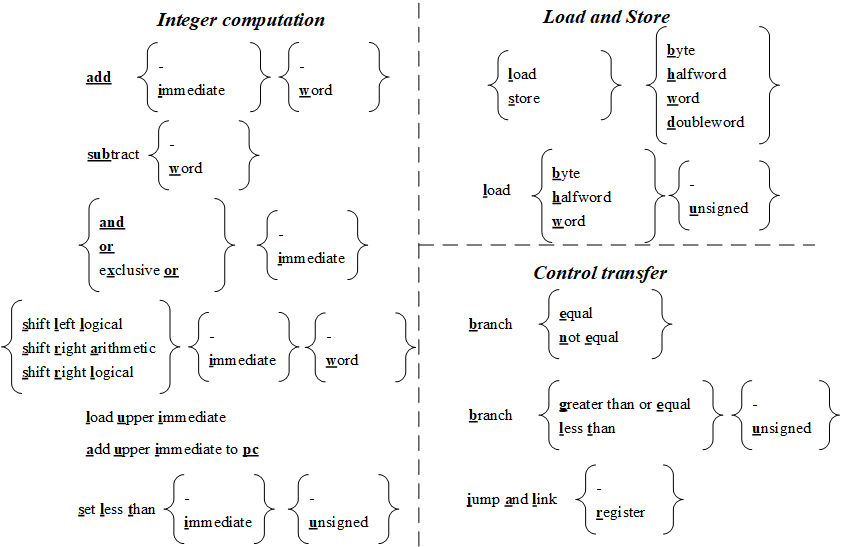
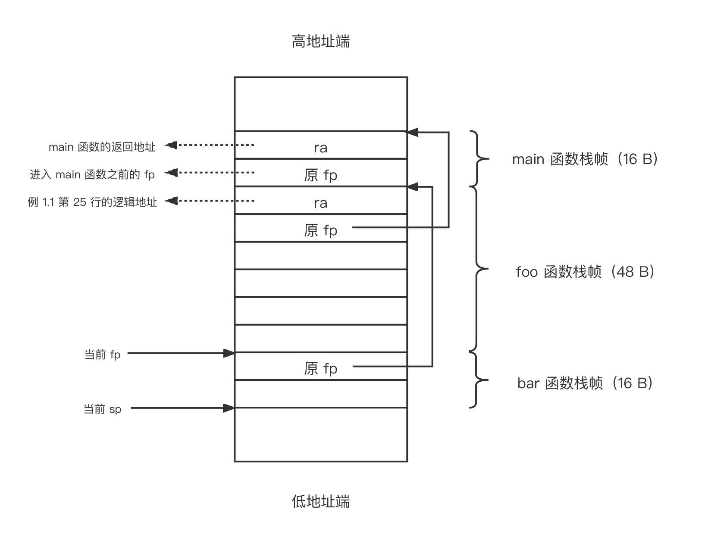
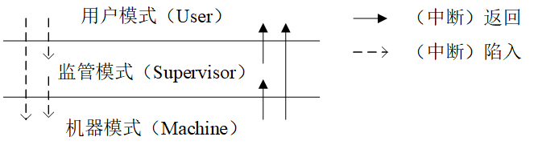
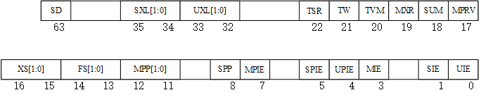
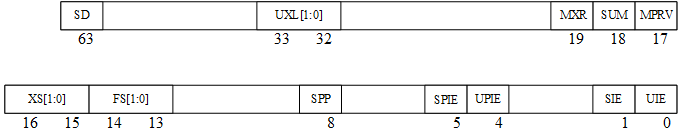
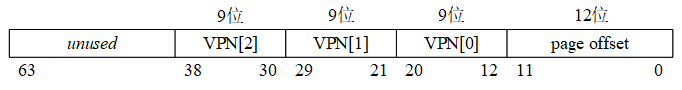
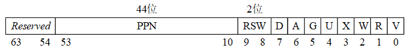
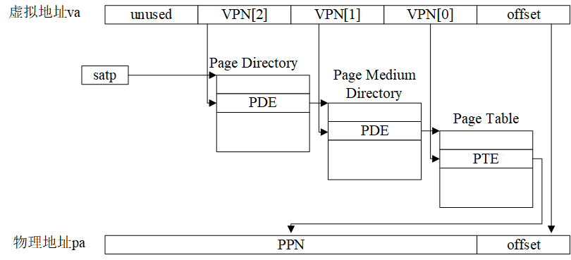
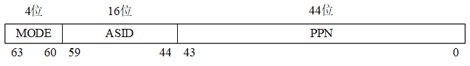
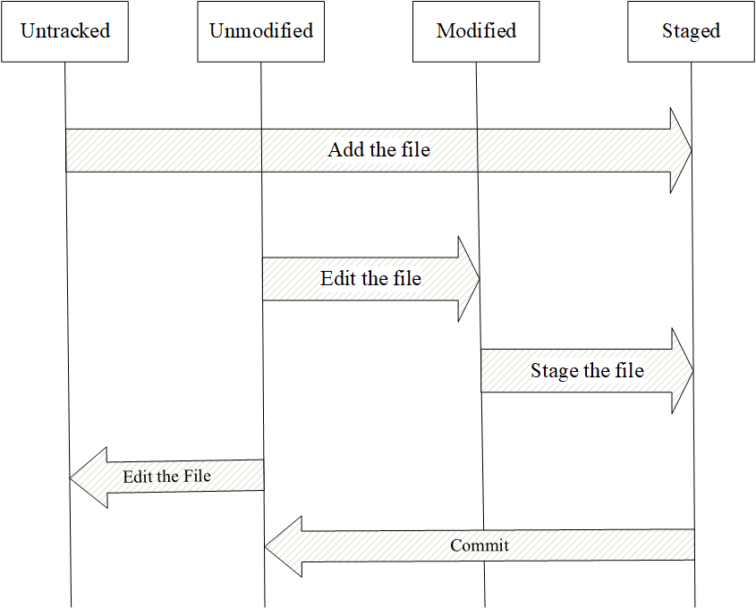

## 第一章．RISC-V体系结构

### 目录  
- [1.1 RISC-V发展历史](#history)  
- [1.2 RISC-V汇编语言](#assembly)  
- [1.3 机器的特权状态](#machinestates)  
- [1.4 中断和中断处理](#traps)  
- [1.5 页式虚存管理](#paging)  
- [1.6 相关工具软件](#toolsoftware)  

本章的1.1节将简单介绍RISC-V的诞生和发展历史，其后将介绍和讨论RISC-V体系结构的各个方面，如1.2节介绍汇编语言、1.3节讨论机器状态、1.4节分析中断和中断处理机制、1.5节讨论分页机制。最后，在1.6节介绍PKE实验涉及的工具软件，以及它们的使用方法。值得注意的是，RISC-V的体系结构本身就是一个庞大的知识体系，实际上是很难用一章的内容完全讲清楚的（我们鼓励对该体系结构感兴趣的读者延申阅读参考文献[开源指令集的指南](#references)以及[RISC-V instruction set manual](#references)）。然而，不懂体系结构又无法理解操作系统和开展PKE的实验，所以本章将重点阐述和讨论与操作系统设计有关的知识内容，力求精简和突出重点。

<a name="history"></a>
### 1.1 RISC-V发展历史

RISC-V（读做“risk-five”）是一种典型的精简（Reduced Instruction Set Computer，简写为RISC）指令集（Instruction Set Architecture，简写为ISA），它是加利福尼亚大学伯克利分校的David Patterson教授与Krste Asanovic教授研究团队于2010年提出的一个开放指令集架构。名称中的“V”指的是该ISA的第五个版本，有时“V”也被解读为向量（Vector）扩展。与之前的诸多商用指令集（如x86、ARM，以及MIPS等）不同的是，RISC-V是一个开放指令集，它的提出受到了全球工业界和学术界的广泛关注。在我国，RISC-V的发展、研究和应用同样得到了广泛关注，在网信办、工信部、中科院等多个国家部委支持和指导下，中国开放指令生态（RISC-V）联盟于2018年11月8日浙江乌镇举行的第五届互联网大会上正式宣布成立。

相比于传统的商用指令集架构，RISC-V指令集以及其背后的计算机架构具有以下优点：

● **后发优势**。RISC-V指令集的提出，是借鉴了之前的传统商业指令集，通过取长补短而得到的。相比于之前的指令集，RISC-V避免了很多前人踩过的非常多的坑。

● **开放架构**。RISC-V指令集是一个开放的指令集，意味着任何组织或个人都可以自由地设计硬件，以支撑采用RISC-V指令所编写的代码，而不会被起诉或收到法院传票。同时，对该指令集的使用不受美国的贸易管制约束。需要指出的是，RISC-V指令是开放的，但采用该指令集的具体设计（IP）确是受到版权保护的，这样做的目的是在开放的前提下鼓励创新和保护开发者的商业利益。

● **场景丰富**。RISC-V指令集的设计，综合考虑了多种应用场景（涵盖了从嵌入式低功耗应用到高性能服务器场景），为各种场景考虑并设计了多个不同但指令上接近的分支。在这一点上，RISC-V跟ARM类似，针对不同应用场景，RISC-V也都有对应版本。

● **开源参考**。自RISC-V提出以来，工业界和学术界都积极开展了对其的应用和研究，出现了大量的开源实现（参见[RISC-V开源项目列表](#refenences)）。这些开源实现，为具体应用领域的开发者提供了大量可借鉴的参考，同时也极大地降低了CPU的设计门槛。可以预见的是，随着大量基于该指令集的芯片开源项目的诞生，RISC-V的发展将像开源软件生态中的Linux那样，成为计算机芯片与系统领域创新的基石。

在本书所设计的实验中我们主要考虑通用计算场景，所以选择RV64G作为我们目标计算机的指令集。其中，RV64G中的“RV”代表RISC-V；“64”代表所支持的指令是64位的（实际上，交叉编译器在生成代码时可能会采用32位指令减小生成的目标代码长度），地址长度和寄存器长度都为64位；而“G”代表通用（general）计算平台。实际上，“G”等效于“IMAFD”，其中“I”代表整数（Integer）计算指令、整数load、整数store以及控制流（如分支跳转）指令，这些指令在任何RISC-V的实现中都是必须的；“M”代表乘法（Multiply），即平台支持乘法和除法运算；“A”代表原子（Atomic）扩展，支持对寄存器进行的原子读、修改和原子写操作，这些操作在多核设计中非常有用；“F”代表单精度浮点（Float）运算支持，“D”代表双精度浮点（Double）运算支持。

实际上，按照RISC-V的指令集规范，RISC-V的计算机可以设计为更低位数（如32位，甚至16位），也可以设计为更高位数（如128位），这些都取决于所设计的计算机所面向的目标领域。一般说来，如果计算机面向的目标领域是嵌入式领域，32位（甚至16位）就已经足够；如果目标领域为桌面的办公环境或者手机，64位应已足够；但如果目标领域为服务器，则可能128位的指令架构才是合适的。更高的指令集位数往往意味着更大规模的应用程序（更大的逻辑地址空间），以及管理更大规模的内存（注意：并不意味着更快的速度）。另外，指令集本身也是可以裁剪的，例如在为嵌入式环境设置的单核处理器上，我们可以只保留“IMF”而不支持“AD”，从而降低处理器设计的复杂度以及能耗。

考虑到今天64位电脑（x86_64）已广泛普及到桌面、服务器，我们通常接触到的操作系统（如Ubuntu、Windows10等）都是内置的64位编译器，编译出来的二进制代码（特别是我们将要用到的RISC-V模拟器）也都默认是64位，我们将PKE实验的目标平台类型设定为桌面电脑（采用通用版本RV64G）。

<a name="assembly"></a>
### 1.2 RISC-V汇编语言

关于RISC-V汇编语言，较好的中文参考资料有《RISC-V手册——一本开源指令集的指南》（参见[开源指令集的指南](#refenences)），里面完整列举和解释了RISC-V的所有汇编指令，感兴趣的读者可以通过阅读该书了解RISC-V汇编。在这里，我们不打算详细讨论RISC-V的汇编知识，只重点讨论RISC-V汇编与8086汇编的不同，以及PKE的代码涉及到的一些汇编语法和指令。

**1.2.1 寄存器**

表1.1列出了采用RV64G指令集的RISC-V计算机中的32个通用寄存器。

表1.1 RV64G的32个通用寄存器（寄存器的宽度都是64位）

| 寄存器 | 编程接口名称  （ABI） | 描述                             | 使用                                 |
| ------ | --------------------- | -------------------------------- | ------------------------------------ |
| x0     | zero                  | Hard-wired  zero                 | 硬件零                               |
| x1     | ra                    | Return  address                  | 常用于保存（函数的）返回地址         |
| x2     | sp                    | Stack  pointer                   | 栈顶指针                             |
| x3     | gp                    | Global  pointer                  | —                                    |
| x4     | tp                    | Thread  pointer                  | —                                    |
| x5-7   | t0-2                  | Temporary                        | 临时寄存器                           |
| x8     | s0/fp                 | Saved  Register/ Frame pointer   | （函数调用时）保存的寄存器和栈顶指针 |
| x9     | s1                    | Saved  register                  | （函数调用时）保存的寄存器           |
| x10-11 | a0-1                  | Function  argument/ return value | （函数调用时）的参数/函数的返回值    |
| x12-17 | a2-7                  | Function  argument               | （函数调用时）的参数                 |
| x18-27 | s2-11                 | Saved  register                  | （函数调用时）保存的寄存器           |
| x28-31 | t3-6                  | Temporary                        | 临时寄存器                           |

需要注意的是，同一个通用寄存器可以用不同的名字来对它进行访问。例如x0和zero对应的是同一个寄存器，且该寄存器是一个硬件零（hardware zero），也就是从该寄存器中读出来的数据永远是零。x8、s0、fp这些符号，对应的也是同一个寄存器。一般来说，汇编语言在书写时往往采用表1.1中的编程接口名称（ABI）来实现对寄存器的访问，以提高汇编代码的可读性。

除了表1.1中的通用寄存器外，RV64G处理器中还有一个重要的寄存器：program counter（pc）。它也是一个64位寄存器，但对它的读取需要采用特殊指令（如auipc指令）进行。另外，RISC-V计算机为这些通用寄存器赋予了不同的用途。例如，sp（stack pointer）寄存器用于指向栈顶（准确地讲是栈的低地址端。相应地，我们将栈的高物理地址端称为栈底），fp（frame pointer）寄存器则会在发生函数调用时被赋值为sp的内容并压栈；字母a开始（argument register）的寄存器常用于函数调用时的参数，以及返回值的传递；字母s开始（save register）的寄存器用于在发生函数调用时保存重要计算结果；字母t开始（temporary register）的寄存器则往往用于不重要的中间结果的保存。需要注意的是，在RISC-V计算机中除了硬件零寄存器zero、栈顶指针sp、函数返回地址ra外，其余寄存器的使用实际上取决于汇编程序员或者编译器（如我们将要用到的RISC-V版本的GCC交叉编译器）。例如，对于s开始的寄存器，虽然RISC-V规范要求在调用函数的时候，由被调用的函数将它们都保存（到栈中），但实际的函数代码为了追求更高的速度，往往只保存被函数使用过的寄存器。这一点，我们将在1.2.5节的例子中给予展示。

不同于8086，RISC-V中无法对“半个”寄存器进行直接访问（例如AL之于AX），指令始终需要访问完整的寄存器。另外，对于栈的访问，RISC-V处理器也并未提供类似push或者pop等指令来完成，而是采用load/store来实现对内存中栈的访问。

**1.2.2 指令格式**

图1.1列出了RV64I（RV64G的整数指令子集）的常用基础指令。

 

图1.1 RV64I的常用基础指令，带下划线的粗体字母从左到右连起来构成RV64I指令。

从图1.1中，我们看到RV64I的常用基础指令并不多，分为整数指令（Integer computation）、访存指令（Load and Store）和控制转移指令（即跳转指令，Control transfer），每条指令的名称取图中下划线和标黑的字母构成。例如，最基础的加法指令为add，如果累加的其中一个操作数为立即数，则指令为addi。实际上，除了列出的指令外，RV64I还包括很多其他的指令，例如用于机器状态控制的指令、内存墙指令等。我们将在1.4节中讨论机器状态控制指令，在1.5节讨论与虚拟存储相关的指令。

RISC-V汇编指令的格式与8086汇编是截然不同的。以最基础的加法指令为例，它的指令格式（以加法指令add为例）为：

`add rd, rs1, rs2`

或者

`addi rd, rs1, immediate`

其中，rd代表目标寄存器（register destination），rs1和rs2分别代表源寄存器1（register source）和源寄存器2，immediate代表立即数。前一条指令的执行效果是将两个源寄存器（rs1和rs2）中所存储的值进行求和，并将结果写到rd寄存器；后一条指令的执行，将源寄存器1中的值与立即数相加，结果写到rd寄存器（忽略算术溢出）。需要注意的是，由于我们采用了64位指令集，意味着以上指令中所有的操作数（无论是rd还是rs中的值，以及immediate）都是64位的。如果immediate不足64位，则对其进行符号位（最高位）扩展到64位。如果要操作更小一点的数，则需要用到addw，它最后的w符号表示操作数为一个字（32位）。

以上我们只是以add汇编指令作为例子，举例说明了RISC-V汇编语言。读者会发现跟8086汇编语言相比，RISC-V汇编语言在语法上有着根本的区别，源和目的寄存器的位置是不一样的。由于本书是操作系统课程的实验指导，无法完整地列举和解释所有RISC-V汇编指令，我们强烈建议读者继续阅读参考文献中的[开源指令集的指南](#refenences)，进一步了解RISC-V汇编语言。

**1.2.3访存和寻址模式**

在内存访问上，RISC-V提供的接口（相比于8086汇编）极其简单：读内存（load）和写内存（store）。而且所有其他指令都只与寄存器打交道，不能使用任何间接形式对内存进行访问。这样设计的好处是：避免了8086汇编里令人“眼花缭乱”的访存寻址模式，这也是RISC-V的重要“后发优势”之一。

我们以ld（load）指令和sw（store word）指令为例来说明RISC-V的访存指令，以下是ld指令的语法：

`ld rd, offset(rs1)`

执行ld指令的动作是将立即数offset进行符号扩展，与源寄存器rs1中的值进行求和，得到地址A，然后读出内存中A所对应地址的8个字节（64位），写到目的寄存器rd中。

以下是sw指令的语法：

`sw rs2, offset(rs1)`

它的作用是将立即数offset进行符号扩展，与源寄存器rs1中的值进行求和，得到地址A，然后将源寄存器rs2中的低位4字节（注意，不是8个字节，因为操纵的是word，即32位4字节）写到内存中以地址A开始的4个字节中。当RISC-V处理器采用s开始的指令（如例子中的sw、双字存储指令sd等）向内存中写入数据的时候，地址是从低端地址向高端地址发展的。同时，采用了小端对齐（little-endian）的字节序：当写入一个8字节的数值到内存中时，将该数值的低位部分放在低地址端。

以上的例子中，假设A=0x0000 0000 0000 0800，rs2寄存器中的低位4字节数值为0x1234ABCD，则sw指令执行完后内存中的数值为：

```
[0x0000 0000 0000 0800] = 0xCD
[0x0000 0000 0000 0801] = 0xAB
[0x0000 0000 0000 0802] = 0x34
[0x0000 0000 0000 0803] = 0x12
```

 

**1.2.4 C语言内嵌汇编**

为实现对硬件的“包装”，操作系统往往需要操纵硬件实现例如改变机器状态等动作，这些功能高级语言（如C）并未提供，往往需要汇编语言来完成。然而，纯粹用汇编语言来实现操作系统又会导致代码量太大，且代码的可读性不好。综合两者（汇编语言和C语言）长处的方案，是在C语言中实现汇编的嵌入，而PKE实验所选择的基于GCC的RISC-V交叉编译器就提供了两种形式的内嵌汇编的支持：基本内联汇编和扩展内联汇编。

**● 基本内联汇编语句**

基本行内汇编很容易理解，一般是按照下面的格式：

`asm(“statements”);`

该语句中“asm”也可以由“\_\_asm\_\_”来代替。在“asm”后面有时也会加上“\_\_volatile\_\_”表示编译器不要对括弧内的汇编代码进行任何优化，保持指令的原样。“asm”后面括号里面的便是汇编指令。例如：

```
asm(“li x17,81”);      //将立即数81存入x17寄存器
asm(“ecall”);         //调用ecall指令（作用类似8086上的int指令）
```

编译器碰到以上语句后，会将引号中的汇编语句直接翻译成对应的机器码，放到所生成的目标代码中。这两行代码的作用是调用81号软中断（即1.4节中的trap），但因为它们是相邻的汇编语句，所以可以用以下的形式书写：

```
asm(“li x17,81\n\t”
  “ecall”);`
```

也就是采用分隔符“\n\t”隔开多条汇编指令。对于编译器而言，以上两种写法是等效的。实际上GCC编译器在处理内联汇编语句时，是要把asm(…)的内容“打印”到汇编文件中，所以格式控制字符是必要的。

**● 扩展内联汇编**

扩展内联汇编使得嵌入在C语言中的代码能够带输入、输出参数，同时将被汇编代码块改变的寄存器“通知”给GCC编译器，作为后者在调度寄存器时的参考。扩展内联汇编的格式为：

```
asm volatile( 
"statements"（汇编语句模板）: 
output_regs（输出部分）: 
input_regs（输入部分）:
clobbered_regs（破坏描述部分）
) ；
```

其中asm 表示后面的代码为内嵌汇编，也可以写作__asm__；volatile 表示不想让编译器对里面的汇编代码进行优化，也可以写作__volatile__ 。"statements"是汇编语句模板；output_regs是内联汇编的输出部分，可以理解为将要被汇编语句修改的寄存器组；input_regs是内联汇编的输入部分，即语句执行所需要的输入寄存器；clobbered_regs是破坏描述部分，代表将要被汇编语句改变（破坏）的内容。扩展内联汇编中汇编语句模版是必须要的，其它3部分则都是可选内容，以下对这些部分分别进行解释：

**汇编代码模板**：汇编语句模板由汇编语句序列组成，语句之间使用“;”、“\n”或“\n\t”分开。指令中的操作数可以使用占位符引用C语言变量，操作数占位符最多10个，名称如下：%0，%1…，%9。指令中使用上述占位符表示的操作数，占位符从%0起，依次表示输出操作数、输入操作数。

**输出部分**：描述输出操作数，可以有多个约束，不同的操作数描述符之间用逗号格开，每个约束用“=”开头，接着用字母表示操作数的类型。常用约束有："=r"，表示相应操作数可以使用一个通用寄存器，"=m",表示操作数存放在内存单元中。例如:"=m" (ret)，在这里的ret是最终存放输出结果的C程序变量，而“=m”则是限定字符串，限定字符串表示了对它之后的变量的限制条件，这样GCC就可以根据这些条件决定如何分配寄存器，如何产生必要的代码处理指令，以及如何处理操作数与C表达式或C变量之间的关系。“=”后面所跟的字母以及含义见表1.2。

**输入部分**：输入部分与输出部分相似，但是没有“=”符号。

**破坏描述部分**：破坏描述符用于通知编译器我们使用了哪些寄存器或内存， 可以防止内嵌汇编在使用某些寄存器时导致错误。修改描述符是由逗号隔开的字符串组成的，每个字符串描述一种情况，一般是寄存器，有时也会有“memory”。具体的意思就是告诉编译器在编译内嵌汇编的时候不能使用某个寄存器或者不能使用内存的空间。

表1.2 内联汇编常用约束

| 字母 | 含义             |
| ---- | ---------------- |
| m、o | 内存单元         |
| r    | 动态分配的寄存器 |
| i    | 立即数           |
| f    | 浮点寄存器       |

我们来看一个C语言内嵌汇编代码的例子：

`int dest=0;`

`int value=1;`

`asm volatile (`

   `"lw t0,%1 \n\t"`

   `"add t0,t0,t0 \n\t"`

   `"sd t0,%0"`

   `:"=m"(dest)       //输出部分`

   `:"m" (value)      //输入部分`

   `: "memory");      //破坏描述部分`

在这个例子定义了两个局部变量dest和value，它们的初值分别为0和1。接下来的扩展内联汇编代码将value的值读入t0寄存器，作为输入；接着使用add指令使t0中的值自我相加（即t0=t0+t0）；最后再将结果写回dest局部变量。需要注意的是，这里%0对应输出部分的dest，而%1对应着输入部分的value，因为dest在汇编代码模板之后先出现的是dest，后出现的是value。

 

**1.2.5 一个例子**

我们再看一个稍微大一点的例子，通过这个例子我们希望能尽量把以上的知识点串起来，加深读者对RISC-V汇编语言的理解。假设有以下C语言程序test_asm.c，其源代码如例1.1所示：

```
 1 #include <stdio.h>
 2
 3 void bar()
 4 {
 5   asm volatile( "li s5, 300" );
 6 }
 7
 8 int foo( int foo_arg )
 9 {
 10   int x;
 11   asm volatile( "li s5, 500" );
 12   bar();
 13   asm volatile (
 14      "sd s5,%0"
 15      :"=m"(x)
 16      :
 17      : "memory");
 18   printf( "x=%d\n", x );
 19   return 10;
 20 }
 21
 22 int main()
 23 {
 24   foo( 10 );
 25   return 0;
 26 }
```

例1.1 test_asm.c代码列表

例1.1中的代码，除了main函数外，还定义了另外两个函数foo(int)和bar()，前者的返回值为整型而后者无返回值。主函数在执行过程中先调用foo(int)函数，而foo(int)函数在执行过程中调用bar()函数。代码在foo(int)函数中内嵌了两段汇编代码，第11行的基本汇编语句将寄存器s5的值赋值为500，而第13行至17行的扩展内联汇编则将寄存器s5的值读出到局部变量x，并在第18行打印出来。两端内嵌汇编之间被调用的bar()函数也执行了一个内嵌汇编语句，作用是将寄存器s5的值赋值为300。以上过程的目的在于验证s5寄存器在调用子函数的过程中，函数是否将寄存器的值进行了保留。按照RISC-V规范，对于名字为s开始的寄存器，在进行函数调用时应该对其值进行保留，如果这一点被严格遵守的话，例1.1在第18行的输出就应该输出500。

将例1.1采用RISC-V交叉编译器编译为二进制代码，使用以下命令行： 

`$riscv64-unknown-elf-gcc test_asm.c -march='rv64g' -o test`

编译时我们通过GCC的“-march”开关指定目标指令集是RV64G。接下来采用以下命令执行例1.1中的代码（其中spike为模拟器，pke为我们的PKE内核，test为例1.1所对应的二进制代码）：

`$ spike pke test`

以上命令的执行结果为“x=300”。

这说明编译器为了代码的效率，并未完全遵守RISC-V对寄存器使用的规范。我们可以对所生成的test文件进行反汇编：

`$riscv64-unknown-elf-objdump -D ./test | less`

得到以下输出：

```
00000000000101a4 <bar>:
  101a4:    ff010113        addi  sp,sp,-16
  101a8:    00813423        sd   s0,8(sp)
  101ac:    01010413        addi  s0,sp,16
  101b0:    12c00a93        li   s5,300
  101b4:    00000013        nop
  101b8:    00813403        ld    s0,8(sp)
  101bc:    01010113        addi  sp,sp,16
  101c0:    00008067        ret
00000000000101c4 <foo>:
  101c4:    fd010113        addi  sp,sp,-48
  101c8:    02113423        sd   ra,40(sp)
  101cc:    02813023        sd   s0,32(sp)
  101d0:    03010413        addi  s0,sp,48
  101d4:    00050793        mv   a5,a0
  101d8:    fcf42e23        sw   a5,-36(s0)
  101dc:    1f400a93        li   s5,500
  101e0:    fc5ff0ef        jal   ra,101a4 <bar>
  101e4:    ff543623        sd   s5,-20(s0)
  101e8:    fec42783        lw   a5,-20(s0)
  101ec:    00078593        mv   a1,a5
  101f0:    0001c7b7        lui   a5,0x1c
  101f4:    f7078513        addi  a0,a5,-144 # 1bf70 <__clzdi2+0x2e>
  101f8:    1e2000ef        jal   ra,103da <printf>
  101fc:    00a00793        li    a5,10
  10200:    00078513        mv   a0,a5
  10204:    02813083        ld   ra,40(sp)
  10208:    02013403        ld   s0,32(sp)
  1020c:    03010113        addi  sp,sp,48
  10210:    00008067        ret
0000000000010214 <main>:
  10214:    ff010113        addi  sp,sp,-16
  10218:    00113423        sd   ra,8(sp)
  1021c:    00813023        sd   s0,0(sp)
  10220:    01010413         addi  s0,sp,16
  10224:    00a00513        li   a0,10
  10228:    f9dff0ef        jal   ra,101c4 <foo>
  1022c:    00000793        li   a5,0
  10230:    00078513        mv   a0,a5
  10234:    00813083        ld   ra,8(sp)
  10238:    00013403        ld   s0,0(sp)
  1023c:    01010113        addi  sp,sp,16
  10240:    00008067        ret
```

输出的第一列是我们的程序地址（也称逻辑地址）；第二列是机器码，我们看到RV64G的机器码都是规整的32位（4个字节），这符合RISC指令集的特点；之后的列就是对应的汇编代码了。其中比较重要的指令是jal（jump and link），其作用是将返回地址（pc+4）写道ra寄存器中，且将pc赋值为第二个参数（即跳转到第二个参数所指向的逻辑地址）。另一个重要的指令是ret，其作用是将pc的赋值为ra寄存器的内容（即跳转到函数被调用之前保存的函数返回地址）。从反汇编的结果上来看，test中并未对s开始的寄存器进行任何的保护动作，这就是为什么我们得到“x=300”结果的原因。

我们仍然以例1.1为例分析RISC-V程序执行过程中，栈的变化。RISC-V并未提供push和pop指令，所以函数开始时对sp寄存器的操作都是RISC-V版本的入栈动作。例如，main函数中的“addi sp,sp,-16”指令，将sp减去16然后赋值给sp，其实质是在栈顶“空出”16个字节的空间，然后将必要的内容进行压栈。如后续的“sd ra,8(sp)”就是将返回地址（ra寄存器中的内容）压栈；而“sd s0,0(sp)”是将fp寄存器中的内容压栈（s0和fp是同一个寄存器，参见表1.1）。例1.1中程序从main函数到bar函数的函数调用过程中，它的程序栈将形成图1.2中所示的结构：

<a name="call_stack_structure"></a>

 

图1.2 例1.1程序的函数调用栈结构（从main函数到bar函数）

我们看到，不同的函数具有的栈帧（stack frame）的大小实际上是很不一样的，一般来说，简单的函数（如main和bar）的栈帧比较小都只有16个字节。这是因为对于函数来说，栈的作用在于保存进入时的现场、函数中被使用的寄存器，以及函数的局部变量。对于简单的函数而言，其使用的寄存器较少，同时也没啥局部变量，这些因素就导致了较小的栈帧。另外，这个函数调用过程中比较有趣的是ra和fp两个寄存器。ra寄存器指向函数的返回地址，一般会在函数入口处入栈。但是对于bar函数来说，因为它是叶子函数（leaf function）处于函数调用的最后一级，所以就无需将ra寄存器入栈。fp寄存器则指向上一级函数的栈帧，函数在入口处都需要将它存入栈中，因为只有这样函数才能够找到来时的路，在返回时做到有路可走。

<a name="machinestates"></a>
### 1.3 机器的特权状态

采用RV64G指令集的处理器，定义了三种特权模式：运行在最高特权级的机器模式（machine mode），运行在次高特权级的监管者模式（supervisor mode），以及最低特权级的用户模式（user mode）。机器模式是启动后，计算机所处的模式，在该模式下能够运行所有特权指令，访问所有内存空间。监管者模式所处的特权级略低于机器模式，但仍能够运行部分特权指令，以及访问机器模式所规定的所有内存空间。用户模式的特权级最低，无法执行改变机器状态的特权指令，和访问超过应用程序范围的内存空间。为后续讨论的方便，我们有时会简称机器模式为M模式，监管者模式为S模式，用户模式为U模式。

实际上，RISC-V指令集的设计综合考虑了从微型嵌入式设备到云服务器的多种应用场合，根据应用场合的不同，就出现了多种特权级的组合。例如，对于简单的嵌入式设备（例如我们的U盘控制器）只设计机器模式（M）就足够了；对于有安全性考虑的嵌入式设备（例如车辆的中控、路由器等），则需要搭配机器模式和用户模式的组合（M+U）；对于通用计算机（例如台式电脑、手机，以及云服务器），由于需要运行通用操作系统，则需要机器模式、监管模式以及用户模式的组合（M+S+U）。由于本书的主题是操作系统，在以后的实验中我们将假设我们的RISC-V计算机采用了M+S+U的组合。

 

图1.3 RISC-V机器的特权模式与特权级转换

通过《操作系统原理》课我们知道，**现代的处理器定义不同特权级的根本原因，是为了对操作系统进行保护**。例如，让操作系统运行在较高的特权模式，而用户代码则运行在较低的特权模式，以防止用户态代码执行恶意的动作破坏操作系统。然而，用户态的代码在它的生命周期里往往会要求做一些“合法”的特权模式行为（例如进行I/O，典型例子如常用的printf函数），这就意味着处理器同时需要支持特权模式的转换（control transfer）。在RISC-V处理器中，实现这种特权模式转换的工具就是中断，当执行在低特权模式的代码被中断时，处理器将进入更高特权模式执行中断处理例程来处理打断（低特权）代码执行的事件。中断处理完成后，处理器将从高特权模式返回低特权模式。这里的中断有时被称为异常或系统调用，我们将在1.4节详细讨论中断的分类、相关术语和处理过程。需要注意的是，RISC-V处理器可以实现跨特权模式的转换，例如从U模式直接进入M模式，或者从M模式返回U模式，这些转换的发生都取决于机器的状态寄存器的设置。

RISC-V为每一种特权模式定义了一组寄存器，用于控制机器的状态（status）以及实现状态的转换。对于操作系统而言，比较重要的是机器模式和监管模式的一组寄存器（Control and Status Registers，简写为CSRs），下面我们将分别讨论这两种模式下的CSR，以及状态转换的实现。需要说明的是，关于RISC-V机器的特权状态，[RISC-V instruction set manual](#refenences)是一个比较好的文档，这里我们将重点讨论与操作系统相关的内容。

**1.3.1 机器模式下的CSR**

表1.3列出了在机器模式下，RV64G处理中控制机器状态和与状态转换的主要寄存器：

表1.3 RV64G机器模式下的CSR（它们的长度都是64位）

| 寄存器   | 作用                                                         |
| -------- | ------------------------------------------------------------ |
| mscratch | Machine  Scratch。保存机器模式的栈顶指针，这一点在离开机器模式进入低特权级模式（如监管模式）时非常重要，因为一旦在低特权级模式发生异常，将可能会回到机器模式处理，这时机器模式需要有自己的栈来保存M模式下的执行所调用的函数参数和返回地址。 |
| mstatus  | Machine  Status。保存机器状态的寄存器。                      |
| mtvec    | Machine  Trap Vector。指向中断处理函数的入口地址。           |
| mepc     | Machine  Exception PC。指向发生异常的那条指令的地址。        |
| mcause   | Machine  Cause。发生中断的原因，如果发生的中断是异常，其最高位为0，低位为异常编号；如果发生的是其他类型的中断，则其最高位为1，低位为中断编号。 |
| mtval    | Machine  Trap Value。异常发生时，附带的参数值。例如，当缺页异常发生时，mtval的值就是程序想要访问的虚地址。 |
| mie      | Machine  Interrupt Enable。中断开启寄存器。                  |
| mip      | Machine  Interrupt Pending。中断等待寄存器。                 |
| mideleg  | Machine  Interrupt Delegation Registers。中断代理寄存器。    |
| medeleg  | Machine  Exception Delegation Registers。异常代理寄存器。    |

表1.3中的寄存器很多只是存放了一个指向内存地址的指针（如mscratch、mtvec、mepc），相对简单；而mcause、mtval、mideleg以及medeleg都与中断处理紧密相关，我们将在1.4节讨论中断时再对它们的作用进行讨论。M模式的CSR中比较特殊的是mstatus，它存放了机器的状态，其结构如下图所示：

 

图1.4 mstatus寄存器结构

以下是对mstatus中各个位的说明：

● MIE，SIE，UIE: 中断使能位。只有当这个位为1时，处理器才能够分别在机器模式、监管模式或者用户模式处理中断。实际上，处理器在M模式下处理中断，还要取决于对应特权模式的mie（即Machine Interrupt Enable）寄存器中对应的中断位是否设置，以及是否有中断产生（mip寄存器的值），即对应位是否被设置。RISC-V的中断并不一定非要在机器模式下处理，处理器可以将特定中断“代理”给其他特权模式（如监管模式或用户模式）处理，我们将在1.4节讨论这种中断代理的方法和相关寄存器（如表1.4中的mideleg和medeleg）的设置。

● MPIE，SPIE，UPIE：中断使能保存位。这些位的作用是保留或暂存MIE，SIE或UIE的值。例如，若中断发生且在机器模式处理，中断发生时MIE的值将自动保存到MPIE中，中断返回时，处理器将利用MPIE位的值恢复MIE位。

● SPP，MPP：发生中断异常之前的机器模式。MPP有两位，00表示用户模式，01表示监管模式，11则表示机器模式。这是因为机器模式具有最高特权级，当中断返回时（执行mret指令）从机器模式可以返回所有可能的模式。然而，具体返回到哪个模式，将将参考MPP的取值。例如，如果用户模式发生了中断，且中断例程在机器模式下执行，则进入中断时mstatus的MPP为00。在中断例程完成时，mret指令将让处理器返回到用户模式（目标模式保存在MPP中）。而SPP只有1位，因为从监管模式返回，可能到监管模式本身或者用户模式（不能返回机器模式）。

● FS，XS，SD：FS和XS这两个位，分别用于用户模式下的浮点扩展和内存页面标记扩展（脏数据等）。当处理器具备浮点运算单元，以及对应的用户态扩展时，这些位在mstatus中存在。根据它们的取值，处理器可以帮助操作系统判断在用户进程切换时是否需要保存上下文。例如，如果处理器认为操作系统在用户进程切换时需要保存更多的上下文（如浮点协处理器上的上下文，或内存中的页面），它将把SD位设置为1，否则为0。当然，如果处理器不具备浮点运算单元且不支持用户态扩展，则SD位的值恒定为0。

● MPRV，MXR，SUM：这几个位都与访存控制有关，关于RISC-V的页式内存管理机制将在1.5节讨论。MPRV（Modify PRiVilege）位用于控制load和store的访问权限，当MPRV=0时，load与store指令按照当前的特权模式进行地址转换与内存保护，当MPRV=1时，load和store将按照MPP中存储的特权模式的权限进行内存保护检查。例如发生中断前处理器处于U模式，中断后进入M模式处理，这时MPP的值为00。若此时MPRV=1，则在M模式的中断处理例程对内存访问的load和store依然按照U模式的权限进行。

MXR（Make eXecutable Readable）位用于修改load访存的权限。当MXR=0时，只能从标记为可读（页表项的R=1）的内存页面中读取数据；当MXR=1时，可以从标记为可读（页表项的R=1）或者可执行（页表项的X=1）的内存页面中读取数据。

SUM（permit Supervisor User Memory access）位用于控制S模式下的虚拟内存访问特权检查。当SUM=0时，系统将不允许S模式的代码对U模式下允许访问的页面的访问；当SUM = 1时，则允许这些访问。

● TVM（Trap Virtual Memory），TW（Timeout Wait），TSR（Trap SRET）：这三个域用于RISC-V的虚拟化支持。虽然虚拟化和操作系统之间有着非常紧密的联系，但由于属于更高级的话题，在这里中不做详细论述。

● SXL，UXL：可以通过设置这两个域，改变低特权级下CSR的长度（如将它们设置为32位）。为了简化讨论，我们忽略这两个域，认为CSR长度为机器的总线宽度（全部为64位）。

 

**1.3.2 监管模式下的CSR**

与机器模式类似，RISC-V处理器在监管模式也定义了一组CSR，如表1.4所示。

表1.4 RV64G监管模式下的重要CSR

| 寄存器   | 作用                                                         |
| -------- | ------------------------------------------------------------ |
| sscratch | Supervisor  Scratch。保存监管模式的栈顶指针，这一点在离开机器模式进入低特权级模式（如用户模式）时非常重要，因为一旦在低特权级模式发生异常，将可能会回到监管模式处理（假设已通过异常授权），这时监管模式需要用自己的栈保存程序执行的返回地址等。 |
| sstatus  | Supervisor  Status。保存监管状态的寄存器。                   |
| stvec    | Supervisor  Trap Vector。指向监管模式中断处理函数的入口地址。 |
| sepc     | Supervisor  Exception PC。指向发生异常的那条指令的地址。     |
| scause   | Supervisor  Cause。发生中断的原因，如果发生的中断是异常，其最高位为0，低位为异常编号；如果发生的是其他中断其最高位为1，低位为中断编号。 |
| stval    | Supervisor  Trap Value。异常发生时，附带的参数值。例如，当缺页异常发生时，mtval的值就是程序想要访问的虚地址。 |
| sie      | Supervisor  Interrupt Enable。中断开启寄存器。               |
| sip      | Supervisor  Interrupt Pending。中断等待寄存器。              |
| sideleg  | Supervisor  Interrupt Delegation Registers。中断代理寄存器。 |
| sedeleg  | Supervisor  Exception Delegation Registers。异常代理寄存器。 |

这些寄存器的长度实际上取决于M模式下mstatus寄存器中的SXL位的值。但为了简化后续讨论，我们仍假设它们的长度为64位。

比较表1.3和1.4，我们发现S模式下的CSR和M模式下的CSR是一一对应的。实际上，它们的作用也是一一对应的关系，不同的地方在于S模式的特权级别比M模式稍低，这也体现在状态寄存器sstatus上，它的结构如图1.5所示：

 

图1.5 sstatus寄存器

相比于图1.4中的mstatus，图1.5中的sstatus像是一个“缩水”版的mstatus。sstatus中与mstatus相同的位具有与mstatus模式中相同的作用（见1.3.1节中的讨论），如UIE和SIE的作用仍然是控制是否允许在U模式或S模式处理中断，UPIE和SPIE仍然是发挥保存UIE和SIE位的作用，等等。除sstatus外，scause、stval、sideleg以及sedeleg的作用也与M模式下对应的mcause、mtval、mideleg以及medeleg类似，对它们的讨论也放在1.4节。

相应的，RISC-V处理器在U模式也定义了如表1.3或表1.4的一套CSR。U模式下CSR的作用也跟M模式或S模式类似，只是U模式是最低特权级模式，它们的作用比M或S模式下对应的CSR更简单。我们的PKE实验并未用到U模式下的CSR，所以我们不再对它们进行讨论。

 

**1.3.3 CSR寄存器的读写指令**

在RISC-V处理器上，对于CSR寄存器的读写不能使用普通的load指令，而应采用csr开头的汇编指令。表1.5列出了我们采用的RISC-V交叉汇编器（riscv64-unknown-elf-as）所支持的CSR读写指令。

表1.5 常用的CSR读写指令

| 指令                | 功能                                                         |
| ------------------- | ------------------------------------------------------------ |
| csrr  rd, csr       | Control  and Status Register Read，**读**CSR指令。  把csr寄存器中的值写入到rd寄存器中。 |
| csrw  csr, rs1      | Control  and Status Register Write，**写**CSR指令。  把rs1的值写到csr寄存器中。 |
| csrs  csr, rs1      | Control  and Status Register Set，**设置**CSR指令。  对于rs1中每一个为1的位，将csr寄存器中对应位置位。 |
| csrc  csr, rs1      | Control  and Status Register Clear，**清除**CSR指令。  对于rs1中每一个为1的位，将csr寄存器中对应位清零。 |
| csrrs  rd, csr, rs1 | Control  and Status Register Read and Set，**读后置位**CSR指令。  记控制寄存器中的值为t，把t和寄存器rs1按位或的结果写入csr寄存器，再把t写入rd寄存器。 |
| csrrc  rd, csr, rs1 | Control  and Status Register Read and Clear，**读后清除**CSR指令。  记控制寄存器中的值为t，把t和寄存器rs1中的值按位与的结果写入csr寄存器，再把t写入rd寄存器。 |
| csrrw  rd, csr, rs1 | Control  and Status Register Read and Write，**读后写**CSR指令。  记控制寄存器中的值为t，把寄存器rs1的值写入csr寄存器，再把t写入rd寄存器。 |

需要注意的是，对于表1.5中的csrc、csrs、csrrs、csrrc以及csrrw指令，都有其立即数版本。例如csrci就是csrc的立即数版本，立即数版本将rs1替换为立即数，并取立即数的低5位参与运算。立即数版本的功能跟非立即数版本一致，但因为我们设计的实验（PKE）较少用到这类指令，所以我们并未把它们列入表1.5中。


<a name="traps"></a>
### 1.4 中断和中断处理

通过上一节的讨论，我们知道中断是处理器在实现特权级之间 “穿越”，特别是从低特权模式向高特权模式进行控制转移的重要工具和手段。由于历史或翻译的原因，各种文献（特别是原理课的教材）中与中断相关的名词多且繁杂，然而对中断概念的理解又是操作系统中非常重要的一环。我们将在1.4.1节对中断的概念和分类进行讨论，力求厘清与中断相关的各种表述，帮助读者形成对中断的准确理解和表达。在1.4.3节，我们将讨论RISC-V处理器的中断处理，并在1.4.4节介绍RISC-V平台的中断代理机制。

**1.4.1 中断的概念与分类**

对于中断，我们必须认识到：**它的本质是打断处理器上正在执行的程序，转而去执行另一段程序，并且在执行完这一段程序后，返回去执行原先在处理器上执行的之前被打断的程序的过程**。例如，某程序在（低特权级模式的）处理器上执行时，由于某事件的发生，处理器不得不转而（进入更高特权级）执行该事件的处理程序，并在执行完处理程序后返回之前的（低特权级模式）程序继续执行。

在RISC-V处理器上，中断并不一定意味着特权级的变迁（RISC-V支持平级中断，例如简单嵌入式设备上从M模式到M模式的中断），但是对于传统意义的操作系统而言，由于多个特权级（例如我们考虑的M+S+U模式的RISC-V机器）的存在，中断处理例程往往在比用户模式（也就是被中断的用户程序所运行的特权模式）更高级别的特权模式中（如监管模式或机器模式）执行。对操作系统而言，这样做也可以更好地对操作系统本身，以及计算机的内存资源以及I/O资源进行保护。

实际系统中导致中断发生的事件往往是比较复杂的，它们的来源、处理时机和返回方式都不尽相同。为了便于读者对中断的理解以及表达的准确性，我们借鉴参考文献[SiFive Interrupt](#refenences)的中断分类标准，将系统中发生的可能中断当前执行程序的事件分为3类：

● **Exception**（异常）：这类中断是处理器在执行某条指令时，由于条件不满足而产生的。典型的异常有缺页、执行当前特权级不支持的指令等。**相对于正在执行的程序而言，exception是同步（synchronous）发生的。exception产生的时机是指令执行的过程中（即处理器流水线的执行阶段），在exception处理完毕后，系统将返回发生exception的那条指令重新执行**。
● **Syscall**（系统调用）：这类中断是当前执行的程序主动发出的ecall指令（类似8086中的int指令）导致的，即我们通常理解的“系统调用”。实际上，RISC-V术语中称这类中断为trap，但是我们认为trap并不准确，且强烈不建议把它翻译为“陷阱”！因为“陷阱”这个词在中文语境的含义甚至和“中断”一样宽泛，**我们更推荐使用syscall（对应的中文翻译是“系统调用”）来指代这类中断**。典型的syscall有屏幕输出（printf）、磁盘文件读写（read/write）等，这些高级语言函数调用通过系统函数库（libc）的转换，在RISC-V平台都会转换成ecall指令。与exception类似，相对于正在执行的程序而言，**syscall也是同步（synchronous）发生的。但与exception不同的地方在于，syscall在处理完成后返回的是下一条指令**。
● **IRQ**（外部中断）：这类中断一般是由外部设备产生的事件而导致的。实际上，RISC-V术语中称这类中断为interrupt，但我们认为在操作系统语境下用这个词并不合适，因为interrupt（特别是它的中文翻译“中断”）往往导致指代范围太宽泛的问题。IRQ（Interrupt ReQuest）来源于Intel的术语，我们认为，用它来指代外部中断更加准确和不容易导致混淆。典型的IRQ有：可编程时钟计时器（PIT）所产生的timer事件、DMA控制器发出的I/O完成事件、声卡发出的缓存空间用完事件等。**相对于正在执行的程序而言，IRQ是异步（asynchronous）发生的**。另外，对于处理器流水线而言，IRQ的处理时机是指令的间隙。不同于exception但与syscall类似，**IRQ在处理完成后返回的是下一条指令**。

表1.6 中断的分类

| 中断类型            | 产生时机           | 处理时机     | 返回地址       |
| ------------------- | ------------------ | ------------ | -------------- |
| Exception（异常）   | 同步（于当前程序） | 指令执行阶段 | 发生异常的指令 |
| Syscall（系统调用） | 同步（于当前程序） | -            | 下一条指令     |
| IRQ（外部中断）     | 异步（于当前程序） | 指令执行间隙 | 下一条指令     |

表1.6对这3类中断进行了归纳和比较。需要注意的是，不同文献（特别是中文文献）对于某个类型的中断可能用了不同的名字，例如trap在很多文献和参考书中又被称为“陷阱”、“陷入”、“软件中断”或“系统调用”等等，具体指代往往不知所云。

面对纷繁复杂的术语，我们给读者的建议是：**描述某个确定的中断时，尽量用英文单词来表达（不要翻译成中文，特别是避免使用“中断”或“陷入”这类含义太宽泛的名词）**。实际上，当需要描述某个新类型的中断时，可以试着根据这个中断的产生、处理的时机，以及返回的位置来对它进行分类和归纳，并翻译成它对应的类名。这样，听众一听就知道该中断的类型以及对应的处理方式了，避免了很多不必要、啰嗦且含糊的解释。

 

**1.4.2中断向量表**

系统发生中断（我们用中文的“中断”这个名词来指代广义的中断，并非以上的interrupt）时执行的这段程序，往往被称为**中断例程**（interrupt routine）。因为事件的多样性，系统可能有多个这样的中断例程，通常的做法是把这些例程的入口放在一张表中，而这张表一般称为**中断向量表**（interrupt table）。RV64G处理器在发生中断后，会将发生的中断类型、编号自动记录（硬件完成）到目标模式的CSR中。假设发生中断的目标模式为M模式，则中断的这些信息会记录到mcause寄存器。表1.7列出了mcause的可能取值以及对应的中断信息（为简化讨论，我们只考虑为处理器配置本地中断控制器Core Local Interrupt即CLINT的情况[SiFive Interrupt](#refenences)）。

表1.7 mcause寄存器的取值（由Interrupt及Code字段拼接）及值的含义

| Interrupt | Code         | 中断描述                                 |
| --------- | ------------ | ---------------------------------------- |
| 1         | 0            | User  software interrupt                 |
| 1         | 1            | Superior  software interrupt             |
| 1         | 2            | 保留                                     |
| 1         | 3            | Machine  software interrupt              |
| 1         | 4            | User  timer interrupt                    |
| 1         | 5            | Supervisor  timer interrupt              |
| 1         | 6            | 保留                                     |
| 1         | 7            | Machine  timer interrupt                 |
| 1         | 8            | User  external interrupt                 |
| 1         | 9            | Supervisor  external interrupt           |
| 1         | 10           | 保留                                     |
| 1         | 11           | Machine  external interrupt              |
| 1         | >=12  && <16 | 保留                                     |
| 1         | >=16         | Implementation  defined local interrupts |
| 0         | 0            | Instruction  address misaligned          |
| 0         | 1            | Instruction  access fault                |
| 0         | 2            | Illegal  Instruction                     |
| 0         | 3            | Breakpoint                               |
| 0         | 4            | Load address  misaligned                 |
| 0         | 5            | Load  access fault                       |
| 0         | 6            | Store/AMO  address misaligned            |
| 0         | 7            | Store/AMO  access fault                  |
| 0         | 8            | Environment  call from U-mode            |
| 0         | 9            | Environment  call from S-mode            |
| 0         | 10           | 保留                                     |
| 0         | 11           | Environment  call from M-mode            |
| 0         | 12           | Instruction  page fault                  |
| 0         | 13           | Load  page fault                         |
| 0         | 14           | 保留                                     |
| 0         | 15           | Store/AMO  page fault                    |
| 0         | >=16         | 保留                                     |

从表1.7中，我们可以看到：首先，当发生的中断类型是interrupt时，mcause的高位为1，而如果发生的中断类型是exception（或trap）时，mcause的高位为0；其次，对于interrupt而言，一个特权模式只有一些可能的取值。例如，对于M模式，interrupt的code的可能（典型）取值和含义为：

● 3：Machine software interrupt。这种类型的中断是由软件产生的，但是却不是exception或者syscall！实际上，这类interrupt主要是指在多核（实际上，RISC-V中的硬件处理单元称作硬件线程，Hardware Threads简称Harts，一般情况下它等同于“处理器核”的概念）环境下，发生在处理器之间的中断。为了实现这类中断，RISC-V是通过让一个处理器核直接写另一个处理器核的本地中断控制器来实现的。

● 7：Machine timer interrupt。即时钟中断，它也是由处理器核所带的本地中断控制器产生的。

● 11：Machine external interrupt。即除了时钟中断之外的其他中断，例如键盘、其他外设等。

● >=16：Implementation defined local interrupts。与实现相关的其他中断源，对于RV64G指令集而言，这个数字可以到48（RV32G是16）。数字越大，意味着可以接更多的外部中断源。

最后，对于非interrupt（即表1.7的Interrupt=0）情况，Code=8时表示发生的是一个来自U模式的syscall（Environment call from U-mode）；Code=9时表示发生的是一个来自S模式的syscall（Environment call from S-mode）；而Code=11时表示发生的是一个来自M模式的syscall（Environment call from M-mode）。需要再次强调的是，这里的syscall就是我们平时所说的“系统调用”，在8086环境下它们由int指令产生，而在RISC-V环境下它们由ecall指令产生。

除了这几个取值外，表1.7中其他的Interrupt=0的情况就都是exception。例如，当Code=13（Load page fault）就是常见的所谓“缺页中断（实际上应该叫它缺页exception）”了；Code=15（Store/AMO page fault）就是访存（Store）或原子操作（AMO）异常，这些异常在我们的PKE实验中都能接触到，碰到这类异常往往意味着代码里存在写空指针错误。

仍然以机器模式为例，在RISC-V处理器中，中断向量表的组织和实现有两种方式，一种是直接模式（Direct Mode），另一种是向量模式（Vectored Mode）。前一种模式将CSR中的mtvec指向所有中断（包括表1.7中所有的interruption、trap和exception）的总入口函数，然后由该函数根据mcause中具体的值调用对应的中断例程。向量模式则严格按照表1.7所示的顺序，将所有中断例程的入口地址组织成一个向量（类似8086中的中断向量表），并将mtvec指向该表的首地址。当发生中断时，根据mcause中的值计算向量中的偏移并调用对应例程。RISC-V是根据mtvec的最低位（mtvec.mode）来判断系统具体采用了哪种模式：如果采用了直接模式，其最低位为0；如果采用了向量模式，则其最低位为1。在PKE实验中，我们在中断向量上使用的是直接模式（Direct Mode）。

 

**1.4.3中断处理例程**

当发生一个中断，假设其目标模式（即执行中断例程的模式）为机器模式，RISC-V处理器硬件将执行以下动作：

1）保存（进入中断处理例程之前的）pc（如果是syscall或者IRQ，则保存下一条指令的pc）到mepc寄存器；

2）将（进入中断处理例程之前的）特权级保存到mstatus寄存器的MPP字段；

3）将mstatus寄存器中的MIE字段保存到（它自己的）MPIE字段；

4）设置mcause，其值与表1.7中的Interrupt和Code值对应；

5）将pc设置为中断例程的入口，如果为直接模式则设置为mtvec的值；

6）将mstatus寄存器的MIE字段清零，转入机器模式。

在我们的PKE实验中，系统的中断实际上是代理给监管模式（S模式）处理的，在发生中断时处理器硬件的流程与以上的机器模式类似，只是mepc、mstatus、mcause以及mtvec换成了sepc、sstatus、scause以及stvec。

典型的中断处理流程如以下代码：

```
.align 6
.global handler_interrupt
handler_interrupt:
addi sp, sp, -32*REGBYTES
STORE x1, 1* REGBYTES(sp)
STORE x2, 2* REGBYTES(sp)
...
STORE x31, 31* REGBYTES(sp)
//call C code handler
call software_handler
//finished interrupt handling, ready to return
LOAD x1, 1* REGBYTES(sp)
LOAD x2, 2* REGBYTES(sp)
...
LOAD x31, 31* REGBYTES(sp)
addi sp, sp, 32*REGBYTES
mret
```

在以上的代码中，中断例程将首先对通用寄存器进行保存（x0因为是硬件零，没有保存的价值），接下来调用由C语言编写的中断处理函数“software_handler”，在处理函数执行完毕后恢复通用寄存器的值，并调用mret（S模式下对应sret）指令返回。

处理器在执行mret指令时，将执行以下动作：

1）将mstatus寄存器的MPIE字段恢复到该寄存器的MIE字段；

2）处理器转换到mstatus寄存器中MPP字段所对应的特权模式；

3）将mepc中的内容恢复到pc中。

从以上中断例程的处理流程可以看到，中断的处理实际上是硬件和软件共同完成的。硬件负责保存一部分的中断现场，而软件则主要根据所发生中断的类型选择适合的中断例程来进行处理，软件部分也需要负责保存一部分的现场，如通用寄存器部分。

 

**1.4.4 RISC-V的中断代理机制**

RISC-V在中断处理上有一个很有意思的设计，就是可以将系统中的特定中断或者异常，通过设置较高特权级的CSR寄存器，“代理”给某个更低的特权级处理。例如，我们可以设置机器模式的mideleg以及medeleg中的某些位，将系统中的部分中断（对应mideleg）或异常（对应medeleg）“代理”给较低特权级的监管模式来处理；同理，我们也可以设置监管模式的sideleg以及sedeleg中的某些位，将系统中的部分中断或异常“代理”给用户特权级的代码来处理。

例如，我们的PKE代码中，有以下的等效代码：

```
csrw mideleg, 1<<1 | 1<<5 | 1<<9
csrw medeleg, 1<<0 | 1<< 3 | 1<<8 | 1<<12 | 1<<13 | 1<<15 
```

这段代码的作用是将M模式中interrupt中的1、5和9号，分别对应Supervisor software interrupt，Supervisor timer interrupt和Supervisor external interrupt代理出去，到S模式处理；再将M模式中的exception（或syscall）中的0、3、8、12、13和15号，分别对应Instruction address misaligned，调试中断Breakpoint（3号），用户态系统调用Environment call from U-mode（8号），缺页或访存异常（12、13和15号）代理出去，到S模式处理。实际上，将这些重要的中断代理出去后，系统中产生的绝大部分中断事件将都在S模式处理。所以，在其后的PKE实验中，读者主要跟U模式以及S模式的代码打交道，除启动过程和一些简单的设置（如访存、中断代理等），实验也基本不涉及M模式的代码。

<a name="paging"></a>
### 1.5 页式虚存管理

我们知道，程序中的代码对数据进行访问（如使用load和store指令）时，采用的是数据的逻辑地址（即程序地址）。然而，将程序装入内存时，装载器无法保证数据的逻辑地址和物理地址（内存的编址）之间有完全相等的关系。实际上，由于操作系统往往是计算机装入物理内存的第一个程序，如果仔细规划逻辑地址空间，还能勉强建立（操作系统程序内部）逻辑地址到（其所装入的物理内存的）物理地址间的相等关系，但是这一点对于后续装入的应用程序，几乎是无法也不可能保证的。

为了实现程序逻辑地址到（其装入物理内存后的）物理地址的转换，保证程序对数据的正确寻址，采用RV64G指令集的RISC-V处理器在监管模式（即S模式，也就是我们的PKE操作系统代码运行的特权模式）提供了三种逻辑地址到物理地址的转换方式：Bare，Sv39和Sv48。由于逻辑地址到物理地址的转换与物理内存的管理有着紧密的关联，所以以上三种方式也被称为虚拟内存管理（Virtual Memory Management，简称VMM）方式。其中Bare模式是最简单的VMM方式，即寻址时不对虚拟地址进行任何转换，所访问的物理内存地址就等于虚拟内存地址，这种方式在操作系统启动和刚进入S模式时很有用，单任务模式（只执行一个应用）下仍然可用，但多任务模式（启动多个进程）下就没法用了；Sv39和Sv48是页式虚拟内存的管理方式，它们分别支持39位和48位的逻辑地址，且将物理内存以页面（page）的粒度进行管理。Sv39和Sv48这两种VMM用得较多的是Sv39，Sv48只是在Sv39上的一个简单扩展，所以在后续讨论中，我们将着重讨论Sv39。

 

**1.5.1 Sv39中的物理地址与逻辑地址**

首先我们来看物理地址。从RV64G的名字上来看，采用该指令集的处理器的物理地址应该有64位，但是目前的设计是不是把64个地址位都用了呢？答案是其实并没有！目前的设计只用到了其中的56个位。这意味着现有的设计能够支撑的物理内存空间大小已经高达2^56B=2^16TB，即65536个TB！这个数字在内存条仍然比较昂贵的今天，已经是一个惊人的数字了，因为即使对于今天的服务器而言，物理内存达到1TB以上依旧是一个比较富豪的配置。

接下来我们来讨论逻辑地址。对于Sv39而言，该虚存管理方案实际上只用到了64位中的39位（是的，也没有用到全部64位，不过相信读者理解了VMM的原理就能明白为什么无论是物理地址还是逻辑地址都未用满64位了）！有了这个数字，我们就可以计算出逻辑地址空间的大小为：2^39B=512GB，这意味着我们写的程序最大可以写到512GB！当然，这个数字对于我们在实验中所写的小程序没有什么意义（我们写的hello world之类的小程序，逻辑地址空间只有几个KB），但是这个数字对于大型游戏软件、以及部分大数据处理软件是有足够吸引力的，这其实也是为什么计算机工业“义无反顾”地抛弃32位去拥抱64位的根本原因！通过以上的讨论，我们发现一个有趣的现象，那就是：

**逻辑地址空间大小 ≠ 物理地址空间大小**

应该来说，这个现象对于今天广泛存在的64位系统，已经是一个司空见惯的现象了。同理，对于Sv48而言，其逻辑地址的长度是48位，跟物理地址长度的56位也不等长。

 

**1.5.2 Sv39中的页式地址空间管理与页表**

我们来分析Sv39虚存管理方案中逻辑地址到物理地址的转换。由于Sv39是一个页式虚存管理方法，我们首先需要搞清楚的问题就是页面（包括虚页virtual page和实页physical page）的大小。对于Sv39而言（实际上，包括Sv48），其基础页面大小是4KB。实际上Sv39也支持更大的页面，例如2MB的兆页（megapage）和1GB的吉页（gigapage），这些我们将在弄明白页式地址变换后讨论，现阶段读者可以只考虑4KB的基础页。

接下来，我们对39位的逻辑地址进行“切分”，如图1.6所示

 

图1.6 Sv39中逻辑地址的结构

从图1.6中，我们看到逻辑地址在切分后，从右到左依次的分布是：12位的page offset（即页内偏移）、9位的一级虚页号VPN[0]（Virtual Page Number）、9位的二级虚页号VPN[1]（Virtual Page Number）、9位的三级虚页号VPN[2]（Virtual Page Number）。其中的一级虚页号又常被称为页表（Page Table，简写为PT）编号，而二级和三级虚页号又常分别被称为页目录（Page Directory，简写为PD）和根目录编号。

页内偏移为12位，这很容易理解：因为我们的基础页的大小是4KB的，其地址长度就是12位。但是，为什么我们的VPN都是9位的呢？这是因为我们的页表（或者页目录）是需要保存在内存（物理）页面中的，而4KB大小的基础页能够保存的页表项（Page Table Entry，简称为PTE）或页目录项（Page Directory Entry，简称为PDE）的个数是512（=2^9）个！为了讲清楚这个问题，我们需要进一步观察图1.7中PTE或PDE的格式。

 

图1.7 Sv39中PDE/PTE格式

对图1.7中PDE/PTE格式的解释：

● V（Valid）位决定了该PDE/PTE是否有效（V=1时有效），即是否有对应的实页。

● R（Read）、W（Write）和X（eXecutable）位分别表示此页对应的实页是否可读、可写和可执行。这3个位只对PTE有意义，对于PDE而言这3个位都为0。

● U（User）位表示该页是不是一个用户模式页。如果U=1，表示用户模式下的代码可以访问该页，否则就表示不能访问。S模式下的代码对U=1页面的访问取决于sstatus寄存器中的SUM字段取值。

● G（Global）位表示该PDE/PTE是不是全局的。我们可以把操作系统中运行的一个进程，认为是一个独立的地址空间，有时会希望某个虚地址空间转换可以在一组进程中共享，这种情况下，就可以将某个PDE的G位设置为1，达到这种共享的效果。

● A（Access）位表示该页是否被访问过。

● D（Dirty）位表示该页的内容是否被修改。

● RSW位（2位）是保留位，一般由运行在S模式的代码（如操作系统）来使用。

● PPN（44位）是物理页号（Physical Page Number，简写为PPN）。

图1.7的PDE/PTE格式中有一个很重要的问题：为什么里面的PPN是44位的呢？通过1.5.1小节的介绍，我们知道目前阶段的RV64G处理器实际使用的物理内存地址是56个位，而这个2^56B的物理地址空间可以看成是多少个4KB的基础物理页呢？答案是2^(56-12)=2^44个！也就是PPN实际上就是我们在操作系统原理课中所学习到的“物理块号”，一个物理页编号而已，但如果我们知道一个物理页的编号，它的（64位）起始地址我们就可以通过将其低12位和高8位添加0而得到。

在知道Sv39的逻辑地址结构以及PDE/PTE格式后，我们就能够理解Sv39的逻辑地址到物理地址的变换过程了，这个过程如图1.8所示：

 

图1.8 Sv39中虚拟地址到物理地址的转换过程

地址变换机构首先获得逻辑地址va的VPN[2]，在页目录的根目录（根目录的地址由satp寄存器保存）中查找对应的PDE，依此得知以及页目录的PPN；进而找到页目录实际存储的基础物理页，再根据逻辑地址中的VPN[1]取得页目录内对应的PDE；接着找到页表实际存储的基础物理页，再根据逻辑地址中的VPN[0]取得页表内的PTE，最后获得给定虚拟地址的物理地址对应的PPN，再将PPN和虚拟地址中的page offset进行移位相加，最终得到物理地址pa。

**需要注意的是，图1.8中所示的地址变换过程是由RISC-V处理器硬件完成的，但是页表的构造却是操作系统完成的**！对于系统中运行的每个进程（操作系统本身也可以看作是一个特殊的进程），都应该有个一页表与其对应，当处理器需要执行某个进程时，就应该将satp指向想要执行的进程。另外，对于一个进程而言（例如我们的hello world程序），它可能用不满全部虚拟地址空间（Sv39的虚拟地址空间高达512GB！），这种情况下它的页表中可能只有非常少部分的PDE/PTE是有效的（V位为1），而其他PDE/PTE并不指向任何物理内存页面。

将一个进程的（部分）地址空间“共享”给另一个进程，是操作系统中的常规操作，例如将操作系统本身的地址空间部分开放给某用户进程。有了页表的帮助，这种共享也非常便捷，例如我们可以把某用户进程的PDE指向操作系统的PD或PT。但是，这种共享必须考虑到权限问题！例如，将用户进程的PDE或PTE中的权限位进行相应的设置，避免对操作系统代码可能的破坏（如不允许写或执行）。由于页面权限的限制，用户进程的执行可能会碰到访存方面的exception，如访问某个V=0的页面（缺页异常），或者执行X=0的页中的代码，这些exception都会导致当前程序的中断，并进入更高特权级（如PKE操作系统运行的S模式）中处理。

 

**1.5.3 satp、Sv48、TLB和非基础页**

在图1.8的虚拟地址变换中，一个重要的寄存器是satp，它的结构如图1.9所示。

 

图1.9 satp寄存器格式

satp寄存器包含一个44位的PPN，它指向了一个页表的根目录所存储的基础页；一个ASID（Address Space IDentifier），用于标识一个地址空间，当发生地址空间的切换时系统将需要调用SFENCE.VMA指令来刷新地址变换机构，如TLB（Translation Lookaside Buffer，即原理课所讲的“快表”），我们将在后续讨论中介绍TLB和SFENCE.VMA指令；和一个4位的模式MODE，表1.8列出了模式域可能的取值及含义。

表1.8 satp寄存器中MODE域的取值和含义

| 取值 | 虚存方案 | 说明                           |
| ---- | -------- | ------------------------------ |
| 0    | Bare     | 不对虚地址进行转换和内存保护   |
| 8    | Sv39     | 采用Sv39的方案对虚地址进行转换 |
| 9    | Sv48     | 采用Sv48的方案对虚地址进行转换 |

实际上除了Sv39和Sv48外，系统在未来的扩展中还可能支持更多的扩展，如Sv57以及Sv64（见[RISC-V instruction set manual](#refenences)）。从39、48以及57这几个数字，我们可以发现的规律是，它们之间两两的差是9！结合图1.9中的地址翻译过程，我们就很容易理解什么是Sv48了：它在Sv39的基础上，用上了虚地址中的39~47这9个位（一共用了虚地址中的48个位），作为第四级虚页号VPN[3]。这样做的结果是：在进行地址翻译的时候新增了一级地址翻译。显然，Sv48提供了比Sv39更大的虚拟地址空间（2^48B=256TB>512GB），从而能够支撑更大的应用程序的执行，那么选择Sv48是不是比选择Sv39更具优势呢？答案是：取决于是否真的有必要支撑超过512GB虚地址空间的应用，如果不需要，则Sv39是更合理的选择。从图1.9中的地址翻译过程，我们还可以看到，一次虚地址va到实地址pa的转换涉及到4次（根目录+页目录+页表+pa所在的页）访问内存操作！而相比于处理器内部进行的运算而言，访存显然是更为耗时的操作。可以想象，如果采用Sv48，这个转换所需要的访存操作是（5次）比Sv39更多的。

为了加快虚地址到实地址的转换，今天的处理器（RISC-V处理器也不例外，但取决于具体的设计）一般都内置了TLB（Translation Lookaside Buffer）单元，其速度接近寄存器。在进行地址转换时，将常用的PDE/PTE存储在TLB中以加速虚实地址的转换速度。然而，这又带来一个新的问题，即当发生进程切换时，TLB中很有可能还保留了上一个进程的地址变换所涉及的PDE/PTE！这时，我们就需要借助satp寄存器中的ASID（Application Specific ID）字段来判断是否发生了进程切换，如果发生了，操作系统就需要调用SFENCE.VMA指令来将TLB中的内容刷新。

由于今天应用对逻辑地址空间需求的膨胀（如逻辑地址空间达到了10GB，且相对连续），采用传统的4KB基础页来组织这类应用的虚地址空间显然会显得非常啰嗦（大量的PDE和PTE），且导致了地址翻译时的低效率。为了应对这类变化，Sv39虚拟内存管理方案提供了2MB的兆页（megapage）和1GB的吉页（gigapage）来消减图1.9所示的逻辑地址翻译层数，从而提高地址翻译的效率。实际上它们的原理非常简单：对于2MB的兆页，只需要将虚拟地址部分的VPN[0]部分作为页内偏移的一部分即可（12+9=21，2^21B=2MB）；而对于1GB的吉页，只需要将虚拟地址部分的VPN[0]和VPN[1]都当作页内偏移即可（21+9=30，2^30B=1GB）。

实际上，开启采用兆页或吉页的方法，在RISC-V规范中并未提供，应该是让各个设计RISC-V处理器的单位自行制定。考虑到我们的PKE实验并未涉及这些非基础页，所以在这里我们不打算对这部分内容进一步讨论。

<a name="toolsoftware"></a>

### 1.6 相关工具软件

PKE的实验将涉及Linux环境下较多工具软件的使用，以下列出一些我们认为比较重要的工具软件，并简要介绍其使用方法。详细的使用方法，希望读者通过阅读其使用手册进一步掌握。

 ● git

git是一个开源的分布式版本控制系统，对于一个本地仓库，你可以使用如下命令创建：

`$git init`

对已存在文件进行版本控制

`$git add *.c`

`$git add LICENSE`

`$git commit -m 'Initial project version'`

对于一个远程的git仓库，你想要把代码克隆到本地，需要使用git clone命令

`$git clone url`

当clone完成，你就会有本地的工作目录，进入该目录，每个文件都有两种状态：tracked or untracked。已跟踪的文件是指那些被纳入了版本控制的文件，在上一次快照中有它们的记录，在工作一段时间后，它们的状态可能是未修改，已修改或已放入暂存区。简而言之，已跟踪的文件就是 git 已经知道的文件。其状态转换如图：

 

图1.13 git仓库中文件的状态转换

使用git status可以查看目录下的文件状态

`$ git status`

使用add命令可以递归地跟踪该目录下的所有文件、或暂存已修改的文件

`$ git add fileName/directory`

使用commit命令可以提交更新

`$ git commit -m "commit information"`

◇ 分支相关命令

查看分支：

`$ git branch`

本地创建远端分支dev（dev为分支名，下同）：

`$ git checkout -b dev origin/de`

合并分支dev：

`$ git merge dev`

本地删除分支dev：

`$ git branch -D/d dev`

切换到已有分支dev：

`$ git checkout dev`

本地创建并切换到分支dev：

`$ git checkout -b dev`

推送分支dev到远端：

`$ git push origin`

◇ 调试相关命令

`$ git log`

显示每次提交提交日期的差异，-2选项来只显示最近的2次提交：

`$ git log -p -2`

每次提交的简略统计信息：

`$ git log --stat`

格式化log输出：

`$ git log --pretty=oneline [short、full、fuller]//用一行显示每一次提交`

`$ git log --pretty=format:"%h - %an, %ar : %s"`

 

● riscv64-unknown-elf-gcc

命令格式：riscv64-unknown-elf-gcc [options] file

常见参数：

-o <file>     Place the output into <file>（指定输出文件的名称）

-E      Preprocess only; do not compile, assemble or link（预处理）

-S     Compile only; do not assemble or link（编译）

-c      Compile and assemble, but do not link（汇编）

举例：

\1. -o选项指定输出文件名称为hello

`$ riscv64-unknown-elf-gcc  hello.cpp  -o hello`

\2. 使用-E选项，输出预处理阶段的hello.i文件

`$ riscv64-unknown-elf-gcc -E hello.cpp  -o hello.i`

\3. 使用-S选项，输出编译阶段的hello.s文件

`$ riscv64-unknown-elf-gcc -S hello.cpp -o hello.s`

\4. 使用-c选项，输出二进制文件hello.o

`$ riscv64-unknown-elf-gcc -c hello.s  -o hello.o`

 

● riscv64-unknown-elf-objdump

命令格式：riscv64-unknown-elf-objdump  <option(s)>  <file(s)>

常见参数：

-h,  Display the contents of the section headers（显示section header的内容）

-f Display the contents of the overall file header（显示整体file header的内容）

举例：

\1. 查看对象文件所有的节sections.

`$riscv64-unknown-elf-objdump -h  elf_file` 

输出如下：

```
hello_elf:   file format elf64-littleriscv

Sections:
Idx Name     Size   VMA        LMA        File off Algn
 0 .text     000024cc 00000000000100b0 00000000000100b0 000000b0 2**1
​         CONTENTS, ALLOC, LOAD, READONLY, CODE
 1 .rodata    0000000a 0000000000012580 0000000000012580 00002580 2**3
​         CONTENTS, ALLOC, LOAD, READONLY, DATA
 2 .eh_frame   00000004 000000000001358c 000000000001358c 0000258c 2**2
​         CONTENTS, ALLOC, LOAD, DATA
 3 .init_array  00000010 0000000000013590 0000000000013590 00002590 2**3
​         CONTENTS, ALLOC, LOAD, DATA
 4 .fini_array  00000008 00000000000135a0 00000000000135a0 000025a0 2**3
​         CONTENTS, ALLOC, LOAD, DATA
 5 .data     00000f58 00000000000135a8 00000000000135a8 000025a8 2**3
​         CONTENTS, ALLOC, LOAD, DATA
 6 .sdata    00000040 0000000000014500 0000000000014500 00003500 2**3
​         CONTENTS, ALLOC, LOAD, DATA
 7 .sbss     00000020 0000000000014540 0000000000014540 00003540 2**3
​         ALLOC
 8 .bss     00000068 0000000000014560 0000000000014560 00003540 2**3
​         ALLOC
 9 .comment   00000011 0000000000000000 0000000000000000 00003540 2**0
​         CONTENTS, READONLY
 10 .riscv.attributes 00000035 0000000000000000 0000000000000000 00003551 2**0
​         CONTENTS, READONLY
```

可以看得一个section在文件中对应的属性有六个，其中name为section的名字，size为section的大小，VMA为该section期望从中执行的内存地址，LAM为加载到内存的内存地址，File off为该section在文件中的偏移量，algn则为字节对齐。

\2. 显示文件的摘要信息，包括start address

`$riscv64-unknown-elf-objdump -f elf_file` 

例如我们使用：riscv64-unknown-elf-objdump -f hello_elf，输出如下：

```
hello_elf:   file format elf64-littleriscv
architecture: riscv:rv64, flags 0x00000112:
EXEC_P, HAS_SYMS, D_PAGED
start address 0x00000000000100c2
```

 

● riscv64-unknown-elf-as

命令格式：riscv64-unknown-elf-as [option...] [asmfile...]

编译汇编源文件到目标文件，例如：

`$ riscv64-unknown-elf-as hello.S -o hello.o`

 

● file

命令格式：file [OPTION...] [FILE...]

file命令用于辨识文件类型，例如：

`$ file app/elf/app1`

我们将看到以下输出：

```
app/elf/app1: ELF 64-bit LSB executable, UCB RISC-V, version 1 (SYSV), statically linked, with debug_info, not stripped
```

表明app/elf/app1文件是一个可执行的二进制代码（ELF）文件，采用了RISC-V指令集且为静态链接所生成。

 

● spike

命令格式：spike [host options] <target program> [target options]

常见参数：

-m <n>   Provide <n> MiB of target memory [default 2048]（提供<n>MiB内存）

--isa=<name> RISC-V ISA string [default RV64IMAFDC]（设置ISA）

spike是RISC-V仿真器，我们将需要使用它结合pke运行我们的二进制程序，例如：

`$ spike pke  helloworld`

得到输出如下：

```
Hello World! 
```

spike默认提供的内存为2048MiB，使用-m选项可以指定内存大小（单位是MiB），例如：

`$ spike -m1024  pke  helloworld`

就可以将模拟出来的RISC-V机器的内存大小指定为1024MiB。

RISC-V是一个可扩展指令集，spike默认支持的ISA为RV64IMAFDC，我们可以通过--isa选项设置模拟出来的机器的ISA，例如：

`$ spike --isa=RV64GCV  pke  helloworld`

我们将目标机器的ISA指定为RV64GCV。


<a name="refenences"></a>
参考文献：

[RISC-V开源项目列表]  RISC-V开源项目列表. https://riscv.org/risc-v-cores/

[开源指令集的指南] 勾凌睿、黄成、刘志刚，《RISC-V手册——一本开源指令集的指南》. Avail at: http://crva.ict.ac.cn/wjxz/202202/P020220217666841292320.pdf

[RISC-V instruction set manual] A. Waterman, Y. Lee, and et al. The RISC-V Instruction Set Manual Volume II: Privileged Architecture (version 20191213). Avail at: https://content.riscv.org/wp-content/uploads/2019/12/riscv-spec-20191213.pdf

[RISC-V User-Level ISA]   A. Waterman, K. Asanovi´c, and et al. The RISC-V Instruction Set Manual Volume I: Unprivileged ISA (version 20191213) Avail. at: https://content.riscv.org/wp-content/uploads/2019/06/riscv-spec.pdf

[SiFive Interrupt] SiFive, SiFive Interrupt Cookbook (version 1.0). Avail. at: https://sifive.cdn.prismic.io/sifive/0d163928-2128-42be-a75a-464df65e04e0_sifive-interrupt-cookbook.pdf

[Zedboard] Digilent Zedboard. https://reference.digilentinc.com/programmable-logic/zedboard/start

[Proxy Kernel] RISC-V Proxy Kernel and Boot Loader. https://github.com/riscv/riscv-pk

[fpga-zynq] Rocket Chip on Zynq FPGAs. https://github.com/ucb-bar/fpga-zynq

[Spike] Spike RISC-V ISA Simulator. https://github.com/riscv/riscv-isa-sim