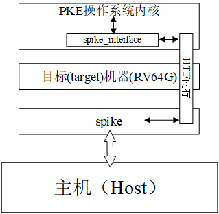

# 第三章．实验1：系统调用、异常和外部中断

### 目录  

- [第三章．实验1：系统调用、异常和外部中断](#第三章实验1系统调用异常和外部中断)
  - [目录](#目录)
  - [3.1 实验1的基础知识](#31-实验1的基础知识)
    - [3.1.1 RISC-V程序的编译和链接](#311-risc-v程序的编译和链接)
    - [3.1.2 指定符号的逻辑地址](#312-指定符号的逻辑地址)
    - [3.1.3 代理内核的构造过程](#313-代理内核的构造过程)
    - [3.1.4 代理内核的启动过程](#314-代理内核的启动过程)
    - [3.1.5 ELF文件（app）的加载过程](#315-elf文件app的加载过程)
    - [3.1.6 spike的HTIF接口](#316-spike的htif接口)
  - [3.2 lab1\_1 系统调用](#32-lab1_1-系统调用)
    - [**给定应用**](#给定应用)
    - [**实验内容**](#实验内容)
    - [**实验指导**](#实验指导)
  - [3.3 lab1\_2 异常处理](#33-lab1_2-异常处理)
    - [**给定应用**](#给定应用-1)
    - [**实验内容**](#实验内容-1)
    - [**实验指导**](#实验指导-1)
  - [3.4 lab1\_3 （外部）中断](#34-lab1_3-外部中断)
    - [**给定应用**](#给定应用-2)
    - [实验内容](#实验内容-2)
    - [实验指导](#实验指导-2)
  - [3.5 lab1\_challenge1 打印用户程序调用栈（难度：★★★☆☆）](#35-lab1_challenge1-打印用户程序调用栈难度)
    - [**给定应用**](#给定应用-3)
    - [实验内容](#实验内容-3)
    - [实验指导](#实验指导-3)
  - [3.6 lab1\_challenge2 打印异常代码行（难度：★★★☆☆）](#36-lab1_challenge2-打印异常代码行难度)
    - [**给定应用**](#给定应用-4)
    - [实验内容](#实验内容-4)
    - [实验指导](#实验指导-4)

<a name="fundamental"></a>

## 3.1 实验1的基础知识

本章我们将首先[获得代码](#subsec_preparecode)，接下来介绍[程序的编译链接和ELF文件](#subsec_elfload)的基础知识，接着讲述riscv-pke操作系统内核的[启动原理](#subsec_booting)，最后开始实验1的3个实验。

<a name="subsec_compileandlink"></a>

### 3.1.1 RISC-V程序的编译和链接

下面，我们将简要介绍RISC-V程序的编译和链接相关知识。这里，我们仍然假设你已经按照[第二章](chapter2_installation.md)的要求完成了基于Ubuntu或者openEular的开发环境构建，如果是在头歌平台，可以通过他们提供的交互??进入终端使用（里面的交叉编译器已经安装且已加入系统路径）。在PKE实验的开发环境中，我们通过模拟器（spike）所构建的目标机是risc-v机器，而主机一般采用的是采用x86指令集的Intel处理器（openEular可能采用的是基于ARM指令集的华为鲲鹏处理器），在这种配置下我们的程序，包括PKE操作系统内核以及应用都通过交叉编译器所提供的工具进行编译和链接。虽然risc-v交叉编译器和主机环境下的GCC是同一套体系，但它的使用和输出还是有些细微的不同，所以有必要对它进行一定的了解。

实际上，采用RV64G指令集的RISC-V体系结构（参见[第一章](chapter1_riscv.md)的内容）跟传统的x86或者ARM体系结构非常类似（从采用精简指令集这个角度，跟ARM更加类似一些），从软件层面上来看也没有什么不同。所以，为RISC-V体系结构编写、编译和链接程序，以及ELF文件的结构这些基础知识，读者可以从[《计算机系统基础》课程](https://book.douban.com/subject/30295940/)的第四章（采用x86指令集）里找到，以下的讲解我们将更侧重用我们的PKE实验里可能碰到的问题。

我们知道，采用C语言编写一个应用的过程大概可以归纳为：首先，**编辑（edit）**.c的源文件；接下来，**编译（compile）**为对象文件.o；最后，将对象文件**链接（link）**为可执行程序文件。当然，在从源代码编译为对象文件的过程中，可能会出现语法错误；再链接过程中，也可能出现符号找不到或函数未定义的错误，这些错误都需要我们回到源代码或者修改链接命令行来进行修正，并最终得到符合预期的应用程序。

- 编辑

例如，我们有以下简单Hello world!程序（在当前目录编辑helloworld.c文件）：

```c
  1 #include <stdio.h>
  2
  3 int main()
  4 {
  5   printf( "Hello world!\n" );
  6   return 0;
  7 }
```

- 编译

使用交叉编译器对以上程序进行编译：

`$ riscv64-unknown-elf-gcc -c ./helloworld.c`

以上命令中`-c`开关告诉riscv64-unknown-elf-gcc命令只对源代码做编译，即compile动作。如果不加该开关，gcc默认地将对源文件进行编译+链接动作，直接生成可执行程序。

该命令执行后，我们将在当前目录得到helloworld.o文件，使用file命令对该文件进行观察：

```bash
$ file ./helloworld.o
./helloworld.o: ELF 64-bit LSB relocatable, UCB RISC-V, version 1 (SYSV), not stripped
```

可以看到，helloworld.o文件的属性为：

1. ELF 64-bit: 64位的ELF文件；
2. LSB: 低位有效，即低地址存放最低有效字节。关于LSB和MSB参见[百度知道的解释](https://zhidao.baidu.com/question/155072477.html)；
3. relocatable：可浮动代码，意味着该ELF文件中的符号并无指定的逻辑地址；
4. UCB RISC-V：代码的目标指令集为RISC-V指令集；
5. version 1 (SYSV)：说明该ELF文件是SYSV版本的，即ELF头中的e_ident [EI_OSABI]字段设置为0；
6. not stripped：说明该ELF文件保留了程序中的符号表（symbol table）。符号（symbol）广泛存在于我们编写的源程序中，编译器会把所有函数名、变量名处理为符号。例如，helloworld.c中的main就是一个符号。

- 链接

最后，我们对生成的目标文件进行链接：

`$ riscv64-unknown-elf-gcc -o ./helloworld ./helloworld.o`

该命令将在当前目录生成helloworld文件，我们仍然用file命令查看该文件的信息：

```bash
$ file ./helloworld
./helloworld: ELF 64-bit LSB executable, UCB RISC-V, version 1 (SYSV), statically linked, not stripped
```

对比于helloworld.o文件，我们发现helloworld文件是可执行（executable）文件而不是可浮动代码，也就是说通过链接，已经给源代码中的符号指定好了逻辑地址。另外，statically linked说明helloworld程序是通过静态链接生成的。实际上，newlib版本的RISC-V交叉编译（也就是我们用的riscv64-unknown-elf-gcc）默认会将输入程序与它自带的静态库进行链接，从而生成直接可以在RISC-V机器上执行的可执行代码。具体到helloworld.c程序，它所调用的printf函数将从交叉编译器的静态库中获得，并在最终生成的./helloworld注入printf函数的实现。这样，./helloworld的执行将无需依赖其他动态库，避免二进制程序因缺少二进制库而无法执行的问题。PKE实验将全部采用静态链接的方法，生成所有二进制文件。

接下来，我们了解一下helloworld的结构。首先通过riscv64-unknown-elf-readelf -h命令，了解该ELF文件的文件头信息：

```bash
$ riscv64-unknown-elf-readelf -h ./helloworld
ELF Header:
  Magic:   7f 45 4c 46 02 01 01 00 00 00 00 00 00 00 00 00
  Class:                             ELF64
  Data:                              2's complement, little endian
  Version:                           1 (current)
  OS/ABI:                            UNIX - System V
  ABI Version:                       0
  Type:                              EXEC (Executable file)
  Machine:                           RISC-V
  Version:                           0x1
  Entry point address:               0x100c0
  Start of program headers:          64 (bytes into file)
  Start of section headers:          19440 (bytes into file)
  Flags:                             0x5, RVC, double-float ABI
  Size of this header:               64 (bytes)
  Size of program headers:           56 (bytes)
  Number of program headers:         2
  Size of section headers:           64 (bytes)
  Number of section headers:         15
  Section header string table index: 14
```

从以上输出我们可以看到，helloworld包含了2个程序段（segment），以及15个节（section），它的入口地址为0x100c0。

接下来，我们可以通过riscv64-unknown-elf-readelf -S命令了解helloworld可执行程序包含哪些程序节：

```bash
$ riscv64-unknown-elf-readelf -S ./helloworld
There are 15 section headers, starting at offset 0x4bf0:

Section Headers:
  [Nr] Name              Type             Address           Offset
       Size              EntSize          Flags  Link  Info  Align
  [ 0]                   NULL             0000000000000000  00000000
       0000000000000000  0000000000000000           0     0     0
  [ 1] .text             PROGBITS         00000000000100b0  000000b0
       00000000000024ca  0000000000000000  AX       0     0     2
  [ 2] .rodata           PROGBITS         0000000000012580  00002580
       0000000000000012  0000000000000000   A       0     0     8
  [ 3] .eh_frame         PROGBITS         0000000000013594  00002594
       0000000000000004  0000000000000000  WA       0     0     4
  [ 4] .init_array       INIT_ARRAY       0000000000013598  00002598
       0000000000000010  0000000000000008  WA       0     0     8
  [ 5] .fini_array       FINI_ARRAY       00000000000135a8  000025a8
       0000000000000008  0000000000000008  WA       0     0     8
  [ 6] .data             PROGBITS         00000000000135b0  000025b0
       0000000000000f58  0000000000000000  WA       0     0     8
  [ 7] .sdata            PROGBITS         0000000000014508  00003508
       0000000000000040  0000000000000000  WA       0     0     8
  [ 8] .sbss             NOBITS           0000000000014548  00003548
       0000000000000020  0000000000000000  WA       0     0     8
  [ 9] .bss              NOBITS           0000000000014568  00003548
       0000000000000068  0000000000000000  WA       0     0     8
  [10] .comment          PROGBITS         0000000000000000  00003548
       0000000000000011  0000000000000001  MS       0     0     1
  [11] .riscv.attributes RISCV_ATTRIBUTE  0000000000000000  00003559
       0000000000000035  0000000000000000           0     0     1
  [12] .symtab           SYMTAB           0000000000000000  00003590
       0000000000000f48  0000000000000018          13    78     8
  [13] .strtab           STRTAB           0000000000000000  000044d8
       0000000000000695  0000000000000000           0     0     1
  [14] .shstrtab         STRTAB           0000000000000000  00004b6d
       000000000000007e  0000000000000000           0     0     1
Key to Flags:
  W (write), A (alloc), X (execute), M (merge), S (strings), I (info),
  L (link order), O (extra OS processing required), G (group), T (TLS),
  C (compressed), x (unknown), o (OS specific), E (exclude),
  p (processor specific)
```

以上输出中比较重要的有：.text表示可执行节（section），.rodata节是只读数据节，.data，.sdata，.sbss以及.bss节都可以视为helloworld程序的数据段（.data是数据节，.sdata为精简数据节，.bss为未初始化数据节，.sbss则为精简未初始化数据节）。其他的节，如.symtab为符号节，即程序中出现的符号（如main函数）列表；.strtab节为程序中出现的字符串列表等。

由于helloworld是可执行程序，且根据riscv64-unknown-elf-readelf -h命令的输出，我们已知该程序有2个程序段（segment），接下来我们再通过riscv64-unknown-elf-readelf -l查看该可执行程序的程序段组成：

```bash
$ riscv64-unknown-elf-readelf -l ./helloworld

Elf file type is EXEC (Executable file)
Entry point 0x100c0
There are 2 program headers, starting at offset 64

Program Headers:
  Type           Offset             VirtAddr           PhysAddr
                 FileSiz            MemSiz              Flags  Align
  LOAD           0x0000000000000000 0x0000000000010000 0x0000000000010000
                 0x0000000000002592 0x0000000000002592  R E    0x1000
  LOAD           0x0000000000002594 0x0000000000013594 0x0000000000013594
                 0x0000000000000fb4 0x000000000000103c  RW     0x1000

 Section to Segment mapping:
  Segment Sections...
   00     .text .rodata
   01     .eh_frame .init_array .fini_array .data .sdata .sbss .bss
```

以上输出表明，helloworld的两个段，其中一个（00）是由.text节和.rodata节所组成的（可执行代码段），另一个（01）是由.eh_frame，.init_array，.fini_arry，.data，.sdata，.sbss以及.bss节所组成的（数据段）。**这里，读者可以思考：helloworld文件中为什么没有出现堆栈（.stack）段呢？**

为了对helloworld文件进行进一步理解，我们使用objdump命令将它进行反汇编处理（使用`-D`开关反汇编所有的段），并列出3个有效段（省略辅助段，也省略gcc加入的一些辅助函数和辅助数据结构）：

```bash
$ riscv64-unknown-elf-objdump -D ./helloworld | less

./helloworld:     file format elf64-littleriscv

Disassembly of section .text:

000000000001014e <main>:
   1014e:       1141                    addi    sp,sp,-16
   10150:       e406                    sd      ra,8(sp)
   10152:       e022                    sd      s0,0(sp)
   10154:       0800                    addi    s0,sp,16
   10156:       67c9                    lui     a5,0x12
   10158:       58078513                addi    a0,a5,1408 # 12580 <__errno+0xc>
   1015c:       1c0000ef                jal     ra,1031c <puts>
   10160:       4781                    li      a5,0
   10162:       853e                    mv      a0,a5
   10164:       60a2                    ld      ra,8(sp)
   10166:       6402                    ld      s0,0(sp)
   10168:       0141                    addi    sp,sp,16
   1016a:       8082                    ret
        ...
```

实际上，由于helloworld是静态链接文件，里面的内容非常繁杂，而以上输出中的main函数是我们在`riscv64-unknown-elf-objdump -D ./helloworld`的输出中抽取出来的，可以观察从helloworld.c中C源程序到RISC-V汇编的转换。首先，我们可以看到main函数对应的逻辑地址为000000000001014e，这里读者可以思考下为什么它不是`riscv64-unknown-elf-readelf -h ./helloworld`命令输出中的程序入口地址0x100c0？

另外，我们看到main函数中进行的printf调用实际上转换成了对puts函数的调用，而我们并未实现该函数。这是因为采用`riscv64-unknown-elf-gcc`对源程序进行的编译和链接，实际上是静态链接，也就是会将应用程序中的常用函数调用转换为编译器自带的程序库的调用，并在最终生成的ELF文件中带入自带程序库中的实现。对于printf，编译器在对其字符串参数进行转化后就自然转换为puts库函数调用了，这也是为什么我们在反汇编的代码中找不到printf的原因。

通过以上讲解，可以看到RISC-V程序的编译链接其实跟我们在x86平台上编写、编译和链接一个C语言程序的过程一摸一样，唯一的不同是将以上的命令加上了`riscv64-unknown-elf-`前缀而已，基本的过程是完全一样的。除此之外，我们生成的可执行代码（如以上的helloworld）采用是RISC-V指令集（更准确的说，是RV64G指令集），是不能在我们的x86开发电脑上直接执行的！也就是说，我们不能通过`./helloworld`命令直接执行之前编写的C语言程序。

为了执行helloworld文件，首先我们需要：1）一个支持RISC-V指令集的机器；2）一个能够在该RISC-V机器上运行的操作系统。在PKE实验中，我们采用spike模拟RISC-V机器以满足第一个要求；通过实验设计操作系统内核，以满足第二个要求。实际上，PKE的实验设计正是从应用出发，考虑为给定应用设计“刚刚好”的内核，使得给定应用能够在spike模拟的RISC-V机器上正确地执行。

<a name="subsec_lds"></a>

### 3.1.2 指定符号的逻辑地址

编译器在链接过程中，一个重要的任务就是为源程序中的符号（symbol）赋予逻辑地址。例如，在以上`sections`的例子中，我们通过`objdump`命令，得知helloworld.c源文件的main函数所对应的逻辑地址为0x000000000001014e，而且对于任意ELF中的段（segment）或节（section）而言，它的逻辑地址必然是从某个地址开始的一段连续地址空间。

那么，是否有办法指定某符号对应的逻辑地址呢？答案是可以，但只能指定符号所在的段的起始逻辑地址，方法是通过lds链接脚本。我们还是用以上的helloworld.c作为例子，另外创建和编辑一个lds链接脚本，即helloworld_lds.lds文件：

```bash
  1 OUTPUT_ARCH( "riscv" )
  2
  3 ENTRY(main)
  4
  5 SECTIONS
  6 {
  7   . = 0x81000000;
  8   . = ALIGN(0x1000);
  9   .text : { *(.text) }
 10   . = ALIGN(16);
 11   .data : { *(.data) }
 12   . = ALIGN(16);
 13   .bss : { *(.bss) }
 14 }
```

在该脚本中，我们规定了程序的目标指令集为RISC-V（第1行）；入口地址为main（第3行）。接下来，我们对程序的几个段地址进行了“规划”，其中代码段的首地址为0x81000000（如果目标平台是64位，编译器会对该逻辑地址的高地址位填0），.data段和.bss段跟在.text段之后；ALIGN(0x1000)表示按4KB对齐，ALIGN(16)表示按照16字节对齐。

为了避免库函数的“干扰”，我们将3.1.2中的helloworld.c代码进行了修改（helloworld_with_lds.c），去掉了printf的调用转用一个加法语句作为main函数的主体：

```c
  1 #include <stdio.h>
  2
  3 int main()
  4 {
  5   int global_var=0;
  6   global_var = 1;
  7   return 0;
  8 }
```

采用以下命令对helloworld_with_lds.c进行编译：

`$ riscv64-unknown-elf-gcc -nostartfiles helloworld_with_lds.c -T helloworld_lds.lds -o helloworld_with_lds`

并对重新生成的helloworld_with_lds文件进行观察：

```bash
$ riscv64-unknown-elf-readelf -h ./helloworld_with_lds
ELF Header:
  Magic:   7f 45 4c 46 02 01 01 00 00 00 00 00 00 00 00 00
  Class:                             ELF64
  Data:                              2's complement, little endian
  Version:                           1 (current)
  OS/ABI:                            UNIX - System V
  ABI Version:                       0
  Type:                              EXEC (Executable file)
  Machine:                           RISC-V
  Version:                           0x1
  Entry point address:               0x81000000
  Start of program headers:          64 (bytes into file)
  Start of section headers:          4424 (bytes into file)
  Flags:                             0x5, RVC, double-float ABI
  Size of this header:               64 (bytes)
  Size of program headers:           56 (bytes)
  Number of program headers:         1
  Size of section headers:           64 (bytes)
  Number of section headers:         7
  Section header string table index: 6
```

以上的输出表明，它的入口地址变成了0x81000000（也就是由helloworld_lds.lds所指定的地址），另外采用`riscv64-unknown-elf-objdump -D ./helloworld_with_lds`命令观察helloworld_with_lds文件中符号地址main所对应的逻辑地址，有以下输出：

```bash
$ riscv64-unknown-elf-objdump -D ./helloworld_with_lds | less

./helloworld_with_lds:     file format elf64-littleriscv

Disassembly of section .text:

0000000081000000 <main>:
    81000000:   1101                    addi    sp,sp,-32
    81000002:   ec22                    sd      s0,24(sp)
    81000004:   1000                    addi    s0,sp,32
    81000006:   fe042623                sw      zero,-20(s0)
    8100000a:   4785                    li      a5,1
    8100000c:   fef42623                sw      a5,-20(s0)
    81000010:   4781                    li      a5,0
    81000012:   853e                    mv      a0,a5
    81000014:   6462                    ld      s0,24(sp)
    81000016:   6105                    addi    sp,sp,32
    81000018:   8082                    ret
        ...
```

可以看到，main函数成为了helloworld_with_lds文件的真正入口（而不是3.1.2中的helloworld文件中main函数并不是该可执行程序的真正入口的情形）。

通过lds文件的办法控制程序中符号地址到逻辑地址的转换，对于PKE的第一组实验（lab1）而言，是一个很重要的知识点。因为在第一组实验中，我们将采用直接映射（Bare-mode mapping）的办法完成应用程序中虚地址到实际物理地址的转换（我们在第二组实验中才会打开RISC-V的SV39页式地址映射），所以需要提前对PKE的内核以及应用的逻辑地址进行“规划”。

<a name="subsec_building"></a>

### 3.1.3 代理内核的构造过程

这里我们讨论lab1_1中代理内核，以及其上运行的应用的构造（build）过程。PKE实验采用了Linux中广泛采用的make软件包完成内核、支撑库，以及应用的构造。关于Makefile的编写，我们建议读者阅读[这里](https://blog.csdn.net/foryourface/article/details/34058577)了解make文件的基础知识，这里仅讨论lab1_1的Makefile以及对应的构造过程。PKE的后续实验实际上采用的Makefile跟lab1_1的非常类似，所以我们在后续章节中不再对它们的构建过程进行讨论。

我们首先观察lab1_1中位于根目录的Makefile文件（摘取其中我们认为重要的内容）：

```makefile
  8 CROSS_PREFIX    := riscv64-unknown-elf-
  9 CC              := $(CROSS_PREFIX)gcc
 10 AR              := $(CROSS_PREFIX)ar
 11 RANLIB          := $(CROSS_PREFIX)ranlib
 12
 13 SRC_DIR         := .
 14 OBJ_DIR         := obj
 15 SPROJS_INCLUDE  := -I.
 16
 ...
 26 #---------------------  utils -----------------------
 27 UTIL_CPPS   := util/*.c
 28
 29 UTIL_CPPS  := $(wildcard $(UTIL_CPPS))
 30 UTIL_OBJS  :=  $(addprefix $(OBJ_DIR)/, $(patsubst %.c,%.o,$(UTIL_CPPS)))
 31
 32
 33 UTIL_LIB   := $(OBJ_DIR)/util.a
 34
 35 #---------------------  kernel -----------------------
 36 KERNEL_LDS      := kernel/kernel.lds
 37 KERNEL_CPPS     := \
 38     kernel/*.c \
 39     kernel/machine/*.c \
 40     kernel/util/*.c
 41
 42 KERNEL_ASMS     := \
 43     kernel/*.S \
 44     kernel/machine/*.S \
 45     kernel/util/*.S
 46
 47 KERNEL_CPPS     := $(wildcard $(KERNEL_CPPS))
 48 KERNEL_ASMS     := $(wildcard $(KERNEL_ASMS))
 49 KERNEL_OBJS     :=  $(addprefix $(OBJ_DIR)/, $(patsubst %.c,%.o,$(KERNEL_CPPS)))
 50 KERNEL_OBJS     +=  $(addprefix $(OBJ_DIR)/, $(patsubst %.S,%.o,$(KERNEL_ASMS)))
 51
 52 KERNEL_TARGET = $(OBJ_DIR)/riscv-pke
 53
 54
 55 #---------------------  spike interface library -----------------------
 56 SPIKE_INF_CPPS  := spike_interface/*.c
 57
 58 SPIKE_INF_CPPS  := $(wildcard $(SPIKE_INF_CPPS))
 59 SPIKE_INF_OBJS  :=  $(addprefix $(OBJ_DIR)/, $(patsubst %.c,%.o,$(SPIKE_INF_CPPS)))
 60
 61
 62 SPIKE_INF_LIB   := $(OBJ_DIR)/spike_interface.a
 63
 64
 65 #---------------------  user   -----------------------
 66 USER_LDS  := user/user.lds
 67 USER_CPPS       := user/*.c
 68
 70 USER_OBJS       := $(addprefix $(OBJ_DIR)/, $(patsubst %.c,%.o,$(USER_CPPS)))
 71
 72 USER_TARGET     := $(OBJ_DIR)/app_helloworld
 73
 74 #------------------------targets------------------------
 75 $(OBJ_DIR):
 76     @-mkdir -p $(OBJ_DIR)
 77     @-mkdir -p $(dir $(UTIL_OBJS))
 78     @-mkdir -p $(dir $(SPIKE_INF_OBJS))
 79     @-mkdir -p $(dir $(KERNEL_OBJS))
 80     @-mkdir -p $(dir $(USER_OBJS))
 81
 82 $(OBJ_DIR)/%.o : %.c
 83     @echo "compiling" $<
 84     @$(COMPILE) -c $< -o $@
 85
 86 $(OBJ_DIR)/%.o : %.S
 87     @echo "compiling" $<
 88     @$(COMPILE) -c $< -o $@
 89
 90 $(UTIL_LIB): $(OBJ_DIR) $(UTIL_OBJS)
 91     @echo "linking " $@ ...
 92     @$(AR) -rcs $@ $(UTIL_OBJS)
 93     @echo "Util lib has been build into" \"$@\"
 94
 95 $(SPIKE_INF_LIB): $(OBJ_DIR) $(UTIL_OBJS) $(SPIKE_INF_OBJS)
 96     @echo "linking " $@ ...
 97     @$(AR) -rcs $@ $(SPIKE_INF_OBJS) $(UTIL_OBJS)
 98     @echo "Spike lib has been build into" \"$@\"
 99
100 $(KERNEL_TARGET): $(OBJ_DIR) $(UTIL_LIB) $(SPIKE_INF_LIB) $(KERNEL_OBJS) $(KERNEL_LDS)
101     @echo "linking" $@ ...
102     @$(COMPILE) $(KERNEL_OBJS) $(UTIL_LIB) $(SPIKE_INF_LIB) -o $@ -T $(KERNEL_LDS)
103     @echo "PKE core has been built into" \"$@\"
104
105 $(USER_TARGET): $(OBJ_DIR) $(UTIL_LIB) $(USER_OBJS) $(USER_LDS)
106     @echo "linking" $@  ...
107     @$(COMPILE) $(USER_OBJS) $(UTIL_LIB) -o $@ -T $(USER_LDS)
108     @echo "User app has been built into" \"$@\"
109
...
113 .DEFAULT_GOAL := $(all)
114
115 all: $(KERNEL_TARGET) $(USER_TARGET)
116 .PHONY:all
...
```

通过阅读该文件，我们看到构建过程的最终目标是第115行的all，而它有两个依赖目标：`$(KERNEL_TARGET)`和`$(USER_TARGET)`。我们从右往左看，`$(USER_TARGET)`的定义在72行，对应的是`$(OBJ_DIR)/app_helloworld` （即./obj/app_helloworld）。构建`$(USER_TARGET)`的规则在第105--108行，其中第105行说明`$(USER_TARGET)`的构建依赖`$(OBJ_DIR)`，`$(UTIL_LIB)`，`$(USER_OBJS)`以及`$(USER_LDS)`这4个目标。

- `$(OBJ_DIR)`：它对应的动作是建立5个目录（第75--80行）：./obj，./obj/util，./obj/spike_interface，./obj/user以及./obj/kernel；
- `$(UTIL_LIB)`：它的定义在第33行，它对应的是`$(OBJ_DIR)/util.a`，而它的编译规则在第90行--第93行，依赖`$(UTIL_OBJS)`的处理。而后者的定义在第30行，对应`$(addprefix $(OBJ_DIR)/, $(patsubst %.c,%.o,$(UTIL_CPPS)))` ，需要将`$(UTIL_CPPS)`也就是util/*.c（见第27行）全部编译成.o文件，并链接为静态库（第92行的动作）；
- `$(USER_OBJS)`：它对应（第70行）的是`$(addprefix $(OBJ_DIR)/, $(patsubst %.c,%.o,$(USER_CPPS)))`，需要将`$(USER_CPPS)`也就是user/*.c都编译为.o文件（具体的编译动作由82--84行完成）；
- `$(USER_LDS)`：它对应（见第66行）user/user.lds，由于后者已经存在于源代码树中，所以不会导致任何动作。

以上构造`$(USER_TARGET)`所依赖的目标全部完成后，构造过程将执行第105--108行的动作，即将user/目录下通过编译出来的.o文件与util中编译和链接出来的静态库文件一起链接，生成采用RISC-V指令集的可执行文件。同时，链接过程采用user/user.lds脚本以指定生成的可执行文件中的符号所对应的逻辑地址。

完成`$(USER_TARGET)`的构造后，我们回到第115行，继续$(KERNEL_TARGET)目标的构造。它的定义在100-103行，可以看到它又有5个依赖目标：`$(OBJ_DIR)`，`$(UTIL_LIB)`，`$(SPIKE_INF_LIB)`，`$(KERNEL_OBJS)`和`$(KERNEL_LDS)`。其中`$(OBJ_DIR)`、`$(UTIL_LIB)`在构造`$(USER_TARGET)`目标时就已经顺带地实现了，剩下的`$(KERNEL_LDS)`也是已经存在的文件。这样，就剩下两个“新”目标：

- `$(SPIKE_INF_LIB)`：它的定义在第62行，对应`$(OBJ_DIR)/spike_interface.a`文件，对应的构造动作在第95--98行，又依赖`$(OBJ_DIR)`、`$(UTIL_OBJS)`和`$(SPIKE_INF_OBJS)`这3个目标。其中`$(OBJ_DIR)`和`$(UTIL_OBJS)`两个目标我们在之前构造`$(USER_TARGET)`时已经解决，剩下的`$(SPIKE_INF_OBJS)`目标对应的是`$(addprefix $(OBJ_DIR)/, $(patsubst %.c,%.o,$(SPIKE_INF_CPPS)))`将导致`$(SPIKE_INF_CPPS)`，也就是spike_interface/*.c被对应地编译成.o文件。最后，第96--98行的动作，会将编译spike_interface目录下文件生成的.o文件链接为静态库（`$(OBJ_DIR)/spike_interface.a`）文件；
- `$(KERNEL_OBJS)`：它对应的定义在第49--50行，内容很简单，就是kernel下的所有汇编.S文件和所有的.c文件。处理该依赖构造目标，会将kernel子目录下的所有汇编和C源文件编译成对应的.o文件。

以上依赖目标全部构造完毕后，回到第101--103行的`$(KERNEL_TARGET)`目标所对应的动作，将编译kernel目录下的源文件所得到的.o文件与`$(OBJ_DIR)/spike_interface.a`进行链接，并最终生成我们的代理内核`$(OBJ_DIR)/riscv-pke`。至此，PKE实验所需要的代码构造完毕。总结一下，这个构造过程是：

- 1）构造util目录下的静态库文件`$(OBJ_DIR)/util.a`；
- 2）构造应用程序，得到`$(OBJ_DIR)/app_helloworld`；
- 3）构造`$(OBJ_DIR)/spike_interface.a`，即spike所提供的工具库文件；
- 4）最后构造代理内核`$(OBJ_DIR)/riscv-pke`。

<a name="subsec_booting"></a>

### 3.1.4 代理内核的启动过程

在3.1.1中，我们获取riscv-pke的代码并完成构造步骤后，我们将通过以下命令开始lab1_1所给定的应用的执行：

```bash
$ spike ./obj/riscv-pke ./obj/app_helloworld
In m_start, hartid:0
HTIF is available!
(Emulated) memory size: 2048 MB
Enter supervisor mode...
Application: ./obj/app_helloworld
Application program entry point (virtual address): 0x0000000081000000
Switching to user mode...
call do_syscall to accomplish the syscall and lab1_1 here.

System is shutting down with exit code -1.
```

可以看到，该命令有3个部分组成：spike、./obj/riscv-pke以及./obj/app_helloworld。其中spike是我们在[第二章](chapter2_installation.md)安装的RISC-V模拟器，执行它的效果是模拟出一个支持RV64G指令集的RISC-V机器；./obj/riscv-pke是我们的PKE代理内核；而./obj/app_helloworld是我们在lab1_1中给定的应用。

那么代理内核是如何在spike模拟的RISC-V机器上启动的呢？实际上，这个启动过程比我们实际的物理机的启动过程简单得多，*代理内核实际上是spike模拟器将其当作是一个标准ELF文件载入的*。那么既然是“可执行”的ELF文件，我们就可以用交叉编译器里提供的工具观察它的结构：

```bash
$ riscv64-unknown-elf-readelf -h ./obj/riscv-pke
ELF Header:
  Magic:   7f 45 4c 46 02 01 01 00 00 00 00 00 00 00 00 00
  Class:                             ELF64
  Data:                              2's complement, little endian
  Version:                           1 (current)
  OS/ABI:                            UNIX - System V
  ABI Version:                       0
  Type:                              EXEC (Executable file)
  Machine:                           RISC-V
  Version:                           0x1
  Entry point address:               0x80000548
  Start of program headers:          64 (bytes into file)
  Start of section headers:          130760 (bytes into file)
  Flags:                             0x5, RVC, double-float ABI
  Size of this header:               64 (bytes)
  Size of program headers:           56 (bytes)
  Number of program headers:         2
  Size of section headers:           64 (bytes)
  Number of section headers:         18
  Section header string table index: 17

$ riscv64-unknown-elf-readelf -l ./obj/riscv-pke

Elf file type is EXEC (Executable file)
Entry point 0x80000548
There are 2 program headers, starting at offset 64

Program Headers:
  Type           Offset             VirtAddr           PhysAddr
                 FileSiz            MemSiz              Flags  Align
  LOAD           0x0000000000001000 0x0000000080000000 0x0000000080000000
                 0x0000000000003564 0x0000000000003564  R E    0x1000
  LOAD           0x0000000000005000 0x0000000080004000 0x0000000080004000
                 0x0000000000001411 0x00000000000098b8  RW     0x1000

 Section to Segment mapping:
  Segment Sections...
   00     .text .rodata
   01     .htif .data .bss
```

通过以上命令和输出，我们可以得知./obj/riscv-pke这个ELF文件的入口地址是0x80000548，且它有两个程序段（segment），分别是00号代码段和01号数据段。其中00号代码段的段首地址是0x80000000，长度是0x3564；01号数据段的段首地址是0x80004000，长度是0x98b8。

那么为什么./obj/riscv-pke的段首地址是0x80000000呢？这是问题通过阅读kernel/kernel.lds就一目了然了，因为后者规定了`. = 0x80000000`即所有虚地址从0x80000000开始。更进一步，为什么要通过将逻辑地址的开始固定在0x80000000这个位置呢？这是因为spike在模拟一个RISC-V机器时，会将其模拟的内存（可通过spike的-m开关指定大小）放置在0x80000000这个物理地址开始的地方。例如，默认情况下spike会为它创建的RISC-V机器模拟2GB（2^31，0x80000000）内存，此时，有效物理内存的范围就为[0x80000000, 0xffffffff]。这样，我们就发现了一个“巧合”，即代理内核的虚地址起始地址=物理内存的起始地址！有了这个巧合，spike就只需要将代理内核的两个段加载到RISC-V机器内存开始的地方，最后将控制权交给代理内核（将代理内核的入口地址写到epc中）即可。同时，由于代理内核在编译的时候默认的起始地址也是0x80000000，所以它的执行无需做任何虚拟地址到物理地址的转换，且不会发生错误。

另外，./obj/riscv-pke的入口地址0x80000548对应代码中的哪个函数呢？这给我们也可以通过阅读kernel/kernel.lds得知：

```bash
  1 /* See LICENSE for license details. */
  2
  3 OUTPUT_ARCH( "riscv" )
  4
  5 ENTRY( _mentry )
  6
  7 SECTIONS
  8 {
  9
 10   /*--------------------------------------------------------------------*/
 11   /* Code and read-only segment                                         */
 12   /*--------------------------------------------------------------------*/
 13
 14   /* Begining of code and text segment, starts from DRAM_BASE to be effective before enabling paging */
 15   . = 0x80000000;
 16   _ftext = .;
 17
 18   /* text: Program code section */
 19   .text :
 20   {
 21     *(.text)
 22     *(.text.*)
 23     *(.gnu.linkonce.t.*)
 24     . = ALIGN(0x1000);
 25
 26     _trap_sec_start = .;
 27     *(trapsec)
 28     . = ALIGN(0x1000);
 29   /*   ASSERT(. - _trap_sec_start == 0x1000, "error: trap section larger than one page");   */
 30   }
```

以上列出了部分kernel/kernel.lds的内容，从第5行可知内核的入口地址是_mentry 函数，通过:

```bash
$ riscv64-unknown-elf-objdump -D ./obj/riscv-pke | grep _mentry
0000000080000548 <_mentry>:
```

我们进一步确定了代理内核的入口，即_mentry函数。

实际上_mentry函数是在kernel/machine/mentry.S文件中定义的：

```assembly
 13   .globl _mentry
 14 _mentry:
 15     # [mscratch] = 0; mscratch points the stack bottom of machine mode computer
 16     csrw mscratch, x0
 17
 18     # following codes allocate a 4096-byte stack for each HART, although we use only
 19     # ONE HART in this lab.
 20     la sp, stack0       # stack0 is statically defined in kernel/machine/minit.c
 21     li a3, 4096         # 4096-byte stack
 22     csrr a4, mhartid    # [mhartid] = core ID
 23     addi a4, a4, 1
 24     mul a3, a3, a4
 25     add sp, sp, a3      # re-arrange the stack points so that they don't overlap
 26
 27     # jump to mstart(), i.e., machine state start function in kernel/machine/minit.c
 28     call m_start
```

它的执行将机器复位（16行）为在不同处理器上（我们在PKE的基础实验中只考虑单个处理器的情况）运行的内核分配大小为4KB的栈（20--25行），并在最后（28行）调用m_start函数。m_start函数是在kernel/machine/minit.c文件中定义的：

```c
 77 void m_start(uintptr_t hartid, uintptr_t dtb) {
 78   // init the spike file interface (stdin,stdout,stderr)
 79   // functions with "spike_" prefix are all defined in codes under spike_interface/,
 80   // sprint is also defined in spike_interface/spike_utils.c
 81   spike_file_init();
 82   sprint("In m_start, hartid:%d\n", hartid);
 83
 84   // init HTIF (Host-Target InterFace) and memory by using the Device Table Blob (DTB)
 85   // init_dtb() is defined above.
 86   init_dtb(dtb);
 87
 88   // set previous privilege mode to S (Supervisor), and will enter S mode after 'mret'
 89   // write_csr is a macro defined in kernel/riscv.h
 90   write_csr(mstatus, ((read_csr(mstatus) & ~MSTATUS_MPP_MASK) | MSTATUS_MPP_S));
 91
 92   // set M Exception Program Counter to sstart, for mret (requires gcc -mcmodel=medany)
 93   write_csr(mepc, (uint64)s_start);
 94
 95   // delegate all interrupts and exceptions to supervisor mode.
 96   // delegate_traps() is defined above.
 97   delegate_traps();
 98
 99   // switch to supervisor mode (S mode) and jump to s_start(), i.e., set pc to mepc
100   asm volatile("mret");
101 }
```

它的作用是首先初始化spike的客户机-主机接口（Host-Target InterFace，简称HTIF），以及承载于其上的文件接口（81-86行）；人为的将上一个状态（机器启动时的状态为M态，即Machine态）设置为S（Supervisor）态，并将“退回”到S态的函数指针s_start写到mepc寄存器中（90--93行）；接下来，将中断异常处理“代理”给S态（97行）；最后，执行返回动作（100行）。由于之前人为地将上一个状态设置为S态，所以第100行的返回动作将“返回”S态，并进入s_start函数执行。

s_start函数在kernel/kernel.c文件中定义：

```c
 34 int s_start(void) {
 35   sprint("Enter supervisor mode...\n");
 36   // Note: we use direct (i.e., Bare mode) for memory mapping in lab1.
 37   // which means: Virtual Address = Physical Address
 38   // therefore, we need to set satp to be 0 for now. we will enable paging in lab2_x.
 39   //
 40   // write_csr is a macro defined in kernel/riscv.h
 41   write_csr(satp, 0);
 42
 43   // the application code (elf) is first loaded into memory, and then put into execution
 44   load_user_program(&user_app);
 45
 46   sprint("Switch to user mode...\n");
 47   // switch_to() is defined in kernel/process.c
 48   switch_to(&user_app);
 49
 50   // we should never reach here.
 51   return 0;
 52 }
```

该函数的动作也非常简单：首先将地址映射模式置为（41行）直映射模式（Bare mode），接下来调用（44行）load_user_program()函数，将应用（也就是最开始的命令行中的./obj/app_helloworld）载入内存，封装成一个最简单的“进程（process）”，最终调用switch_to()函数，将这个简单得不能再简单的进程投入运行。

以上过程中，load_user_program()函数的作用是将我们的给定应用（user/app_helloworld.c）所对应的可执行ELF文件（即./obj/app_helloworld文件）载入spike虚拟内存，这个过程我们将在3.1.5中详细讨论。另一个函数是switch_to()，为了理解这个函数的行为，需要先对lab1中“进程”的定义有一定的了解（kernel/process.h）：

```c
 19 typedef struct process {
 20   // pointing to the stack used in trap handling.
 21   uint64 kstack;
 22   // trapframe storing the context of a (User mode) process.
 23   trapframe* trapframe;
 24 }process;
```

可以看到，lab1中定义的“进程”非常简单，它只包含了一个栈指针（kstack）以及一个指向trapframe结构的指针。trapframe结构也在kernel/process.h文件中被定义：

```C
  6 typedef struct trapframe {
  7   // space to store context (all common registers)
  8   /* offset:0   */ riscv_regs regs;
  9
 10   // process's "user kernel" stack
 11   /* offset:248 */ uint64 kernel_sp;
 12   // pointer to smode_trap_handler
 13   /* offset:256 */ uint64 kernel_trap;
 14   // saved user process counter
 15   /* offset:264 */ uint64 epc;
 16 }trapframe;
```

该结构除了记录进程上下文的RISC-V机器的通用寄存器组（regs成员）外，还包括很少的其他成员（如指向内核态栈顶的kernel_sp，指向内核态trap处理函数入口的kernel_trap指针，进程执行的当前位置epc）。

回到switch_to()函数，它在kernel/process.c文件中定义：

```c
 28 void switch_to(process* proc) {
 29   assert(proc);
 30   current = proc;
 31
 32   // write the smode_trap_vector (64-bit func. address) defined in kernel/strap_vector.S
 33   // to the stvec privilege register, such that trap handler pointed by smode_trap_vector
 34   // will be triggered when an interrupt occurs in S mode.
 35   write_csr(stvec, (uint64)smode_trap_vector);
 36
 37   // set up trapframe values (in process structure) that smode_trap_vector will need when
 38   // the process next re-enters the kernel.
 39   proc->trapframe->kernel_sp = proc->kstack;  // process's kernel stack
 40   proc->trapframe->kernel_trap = (uint64)smode_trap_handler;
 41
 42   // SSTATUS_SPP and SSTATUS_SPIE are defined in kernel/riscv.h
 43   // set S Previous Privilege mode (the SSTATUS_SPP bit in sstatus register) to User mode.
 44   unsigned long x = read_csr(sstatus);
 45   x &= ~SSTATUS_SPP;  // clear SPP to 0 for user mode
 46   x |= SSTATUS_SPIE;  // enable interrupts in user mode
 47
 48   // write x back to 'sstatus' register to enable interrupts, and sret destination mode.
 49   write_csr(sstatus, x);
 50
 51   // set S Exception Program Counter (sepc register) to the elf entry pc.
 52   write_csr(sepc, proc->trapframe->epc);
 53
 54   // return_to_user() is defined in kernel/strap_vector.S. switch to user mode with sret.
 55   return_to_user(proc->trapframe);
 56 }
```

可以看到，该函数的作用是初始化进程的process结构体，并最终调用return_to_user(proc->trapframe)函数将载入的应用（所封装的进程）投入运行。return_to_user()函数在kernel/strap_vector.S文件中定义：

```assembly
 49 .globl return_to_user
 50 return_to_user:
 51     # [sscratch]=[a0], save a0 in sscratch, so sscratch points to a trapframe now.
 52     csrw sscratch, a0
 53
 54     # let [t6]=[a0]
 55     addi t6, a0, 0
 56
 57     # restore_all_registers is a assembly macro defined in util/load_store.S.
 58     # the macro restores all registers from trapframe started from [t6] to all general
 59     # purpose registers, so as to resort the execution of a process.
 60     restore_all_registers
 61
 62     # return to user mode and user pc.
 63     sret
```

其作用是恢复进程的上下文（60行）到RISC-V机器的所有寄存器，并调用sret指令，从S模式“返回”应用模式（即U模式）。这样，所载入的应用程序（即obj/app_helloworld所对应的“进程”）就投入运行了。

<a name="subsec_elf"></a>

### 3.1.5 ELF文件（app）的加载过程

这里我们对load_user_program()函数进行讨论，它在kernel/kernel.c中定义：

```c
 19 void load_user_program(process *proc) {
 20   // USER_TRAP_FRAME is a physical address defined in kernel/config.h
 21   proc->trapframe = (trapframe *)USER_TRAP_FRAME;
 22   memset(proc->trapframe, 0, sizeof(trapframe));
 23   // USER_KSTACK is also a physical address defined in kernel/config.h
 24   proc->kstack = USER_KSTACK;
 25   proc->trapframe->regs.sp = USER_STACK;
 26
 27   // load_bincode_from_host_elf() is defined in kernel/elf.c
 28   load_bincode_from_host_elf(proc);
 29 }
```

我们看到，它的作用是首先对进程壳做了一定的初始化，最后调用load_bincode_from_host_elf()函数将应用程序对应的二进制代码实际地载入。load_bincode_from_host_elf()函数在kernel/elf.c文件中实际定义：

```c
107 void load_bincode_from_host_elf(process *p) {
108   arg_buf arg_bug_msg;
109
110   // retrieve command line arguements
111   size_t argc = parse_args(&arg_bug_msg);
112   if (!argc) panic("You need to specify the application program!\n");
113
114   sprint("Application: %s\n", arg_bug_msg.argv[0]);
115
116   //elf loading. elf_ctx is defined in kernel/elf.h, used to track the loading process.
117   elf_ctx elfloader;
118   // elf_info is defined above, used to tie the elf file and its corresponding process.
119   elf_info info;
120
121   info.f = spike_file_open(arg_bug_msg.argv[0], O_RDONLY, 0);
122   info.p = p;
123   // IS_ERR_VALUE is a macro defined in spike_interface/spike_htif.h
124   if (IS_ERR_VALUE(info.f)) panic("Fail on openning the input application program.\n");
125
126   // init elfloader context. elf_init() is defined above.
127   if (elf_init(&elfloader, &info) != EL_OK)
128     panic("fail to init elfloader.\n");
129
130   // load elf. elf_load() is defined above.
131   if (elf_load(&elfloader) != EL_OK) panic("Fail on loading elf.\n");
132
133   // entry (virtual, also physical in lab1_x) address
134   p->trapframe->epc = elfloader.ehdr.entry;
135
136   // close the host spike file
137   spike_file_close( info.f );
138
139   sprint("Application program entry point (virtual address): 0x%lx\n", p->trapframe->epc);
140 }
```

该函数的大致过程是：

- （108--114行）首先，解析命令行参数，获得需要加载的ELF文件文件名；
- （117--128行）接下来，初始化ELF加载数据结构，并打开即将被加载的ELF文件；
- （131行）加载ELF文件；
- （134行）通过ELF文件提供的入口地址设置进程的trapframe->epc，保证“返回”用户态的时候，所加载的ELF文件被执行；
- （137--139行）关闭ELF文件并返回。

该函数用到了同文件中的诸多工具函数，这些函数的细节请读者自行阅读相关代码，这里我们只贴我们认为重要的代码：

- spike_file_open/spike_file_close：这两个函数在spike_interface/spike_file.c文件中定义，它的作用是通过spike的HTIF接口打开/关闭位于主机上的ELF文件。spike的HTIF接口相关知识，我们将在3.1.7中做简要的讨论；
- elf_init：该函数的作用是初始化elf_ctx类型的elfloader结构体。该初始化过程将读取给定ELF的文件头，确保它是一个正确的ELF文件；
- elf_load：读入ELF文件中所包含的程序段（segment）到给定的内存地址中。elf_load的具体实现如下：

```c
 53 elf_status elf_load(elf_ctx *ctx) {
 54   // elf_prog_header structure is defined in kernel/elf.h
 55   elf_prog_header ph_addr;
 56   int i, off;
 57
 58   // traverse the elf program segment headers
 59   for (i = 0, off = ctx->ehdr.phoff; i < ctx->ehdr.phnum; i++, off += sizeof(ph_addr)) {
 60     // read segment headers
 61     if (elf_fpread(ctx, (void *)&ph_addr, sizeof(ph_addr), off) != sizeof(ph_addr)) return EL    _EIO;
 62
 63     if (ph_addr.type != ELF_PROG_LOAD) continue;
 64     if (ph_addr.memsz < ph_addr.filesz) return EL_ERR;
 65     if (ph_addr.vaddr + ph_addr.memsz < ph_addr.vaddr) return EL_ERR;
 66
 67     // allocate memory block before elf loading
 68     void *dest = elf_alloc_mb(ctx, ph_addr.vaddr, ph_addr.vaddr, ph_addr.memsz);
 69
 70     // actual loading
 71     if (elf_fpread(ctx, dest, ph_addr.memsz, ph_addr.off) != ph_addr.memsz)
 72       return EL_EIO;
 73   }
 74
 75   return EL_OK;
 76 }
```

这个函数里，我们需要说一下elf_alloc_mb()函数，该函数返回代码段将要加载进入的地址dest。由于我们在lab1全面采用了直地址映射模式（Bare mode，也就是说：逻辑地址=物理地址），对于lab1全系列的实验来说，elf_alloc_mb()返回的装载地址实际上就是物理地址。

```c
 19 static void *elf_alloc_mb(elf_ctx *ctx, uint64 elf_pa, uint64 elf_va, uint64 size) {
 20   // directly returns the virtual address as we are in the Bare mode in lab1
 21   return (void *)elf_va;
 22 }
```

但是，到了实验二（lab2系列），我们将开启RISC-V的分页模式（sv39），届时elf_alloc_mb函数将发生变化。

<a name="subsec_htif"></a>

### 3.1.6 spike的HTIF接口

spike提供的HTIF（Host-Target InterFace）接口的原理可以用下图说明：



图2.1 HTIF的原理

我们知道spike是运行在主机（host）上的，在创建目标（target）机器的时候，spike模拟器将自身的一段内存（图中的HTIF内存段）提供给目标机。PKE操作系统内核在构造时引入了这段内存（参考kernel/kernel.lds文件），在启动时通过目标机器传给PKE操作系统内核的设备参数（DTS，Device Tree String）中发现这段内存；接下来通过spike_interface目录中的代码对这段内存进行初始化和封装动作，将其包装成一组可以由操作系统调用的函数调用，典型的如sprint、spike_file_open、spike_file_close这些；最后PKE操作系统内核就能够直接使用这些封装后的函数调用完成对模拟硬件的操纵，如打印字符串到屏幕、访问主机上的文件或设备这些动作。

spike基于HTIF内存的传递，定义了一组HTIF调用（类似于操作系统的系统调用的概念），每个HTIF调用实现一个既定的功能。在使用时，PKE内核可以通过设定往HTIF内存中写入特定的HTIF调用号，spike在从HTIF内存中获得调用号后就会执行调用号对应的动作，并传递返回值到HTIF内存中。最后，PKE操作系统内核通过读取HTIF中的信息获得返回值的内容。

对于PKE实验而言，利用HTIF接口可以屏蔽一些操作系统底层功能（如设备操纵）的实现，这些功能往往是跟具体的硬件实现有关（不同平台还不一样），往往用汇编语言书写，阅读起来非常枯燥也很难读懂。更重要的，这些实现细节跟操作系统可能并无关系！采用HTIF这种形式，用高级语言（C语言）来书写这段代码（spike_interface目录下的文件）会简单易懂，满足操作系统原理课程的教学要求。

另外需要注意的是，**HTIF机制并不是纯粹为满足教学要求而写的“玩具”**。我们在ZedBoard这种开发板的PL（Programmable Logic）部分部署我们开发的RISC-V处理器时，为了检验所开发的处理器对操作系统的支持能力，往往会在RISC-V处理器上启动代理内核（可以直接用我们在实验中开发的PKE代理内核），而后者就是通过HTIF的机制完成与主机（即在PS上运行的ARM Linux）的交互的。

<a name="syscall"></a>

## 3.2 lab1_1 系统调用

<a name="lab1_1_app"></a>

#### **给定应用**

- user/app_helloworld.c

```c
  1 /*
  2  * Below is the given application for lab1_1.
  3  *
  4  * You can build this app (as well as our PKE OS kernel) by command:
  5  * $ make
  6  *
  7  * Or run this app (with the support from PKE OS kernel) by command:
  8  * $ make run
  9  */
 10
 11 #include "user_lib.h"
 12
 13 int main(void) {
 14   printu("Hello world!\n");
 15
 16   exit(0);
 17 }
```

应用实现的功能非常简单，即在屏幕上打印"Hello world!\n"。

- make后的直接运行结果：

```bash
$ spike ./obj/riscv-pke ./obj/app_helloworld
In m_start, hartid:0
HTIF is available!
(Emulated) memory size: 2048 MB
Enter supervisor mode...
Application: ./obj/app_helloworld
elf_load: ctx->ehdr.phoff = 64, ctx->ehdr.phnum =1, sizeof(ph_addr)=56.
elf_load: ph_addr.memsz = 744, ph_addr.off =4096.
Application program entry point (virtual address): 0x0000000081000000
Switching to user mode...
call do_syscall to accomplish the syscall and lab1_1 here.

System is shutting down with exit code -1.
```

从结果上来看，并未达到我们的预期结果，即在屏幕上输出"Hello world!\n"。

<a name="lab1_1_content"></a>

#### **实验内容**

如输出提示所表示的那样，需要找到并完成对do_syscall的调用，并获得以下预期结果：

```bash
$ spike ./obj/riscv-pke ./obj/app_helloworld
In m_start, hartid:0
HTIF is available!
(Emulated) memory size: 2048 MB
Enter supervisor mode...
Application: ./obj/app_helloworld
Application program entry point (virtual address): 0x0000000081000000
Switching to user mode...
Hello world!
User exit with code:0.
System is shutting down with exit code 0.
```

<a name="lab1_1_guide"></a>

#### **实验指导**

lab1_1实验需要读者了解和掌握操作系统中系统调用机制的实现原理。从应用出发，我们发现user/app_helloworld.c文件中有两个函数调用：printu和exit。对代码进行跟踪，我们发现这两个函数都在user/user_lib.c中进行了实现，同时，这两个函数最后都转换成了对do_user_call的调用。查看do_user_call函数的实现：

```c
 13 int do_user_call(uint64 sysnum, uint64 a1, uint64 a2, uint64 a3, uint64 a4, uint64 a5, uint64 a6,
 14                  uint64 a7) {
 15   int ret;
 16
 17   // before invoking the syscall, arguments of do_user_call are already loaded into the argument
 18   // registers (a0-a7) of our (emulated) risc-v machine.
 19   asm volatile(
 20       "ecall\n"
 21       "sw a0, %0"  // returns a 32-bit value
 22       : "=m"(ret)
 23       :
 24       : "memory");
 25
 26   return ret;
 27 }
```

我们发现，do_user_call函数是通过ecall指令完成系统调用的，且在执行ecall指令前，所有的参数（即do_user_call函数的8个参数）实际上都已经载入到RISC-V机器的a0到a7，这8个寄存器中（这一步是我们的编译器生成的代码帮我们完成的）。ecall指令的执行将根据a0寄存器中的值获得系统调用号，并使RISC-V转到S模式（因为我们的操作系统内核启动时将所有的中断、异常、系统调用都代理给了S模式）的trap处理入口执行（在kernel/strap_vector.S文件中定义）：

```assembly
 16 .globl smode_trap_vector
 17 .align 4
 18 smode_trap_vector:
 19     # swap a0 and sscratch, so that points a0 to the trapframe of current process
 20     csrrw a0, sscratch, a0
 21
 22     # save the context (user registers) of current process in its trapframe.
 23     addi t6, a0 , 0
 24
 25     # store_all_registers is a macro defined in util/load_store.S, it stores contents
 26     # of all general purpose registers into a piece of memory started from [t6].
 27     store_all_registers
 28
 29     # come back to save a0 register before entering trap handling in trapframe
 30     # [t0]=[sscratch]
 31     csrr t0, sscratch
 32     sd t0, 72(a0)
 33
 34     # use the "user kernel" stack (whose pointer stored in p->trapframe->kernel_sp)
 35     ld sp, 248(a0)
 36
 37     # load the address of smode_trap_handler() from p->trapframe->kernel_trap
 38     ld t0, 256(a0)
 39
 40     # jump to smode_trap_handler() that is defined in kernel/trap.c
 41     jr t0
```

从以上代码我们可以看到，trap的入口处理函数首先将“进程”（即我们的obj/app_helloworld的运行现场）进行保存（第27行）；接下来将a0寄存器中的系统调用号保存到内核堆栈（第31--32行），再将p->trapframe->kernel_sp指向的为应用进程分配的内核栈设置到sp寄存器（第35行），**该过程实际上完成了栈的切换**。完整的切换过程为：

- 1）应用程序在U模式即应用态执行，这个时候是使用的操作系统为其分配的栈（称为用户栈），这一部分参见`kernel/kernel.c`文件中`load_user_program`的实现；
- 2）应用程序调用ecall，后陷入内核，开始执行`smode_trap_vector`函数，此时使用的是操作系统内核的栈。参见`kernel/machine/mentry.S`文件中的PKE入口`_mentry`；
- 3）中断处理例程`smode_trap_vector`函数执行到第35行时，将栈切换到用户进程“自带”的“用户内核栈“，也就是`kernel/process.c`文件中`switch_to`函数的第39行所引用的`proc->kstack`，而不使用PKE内核自己的栈，**这里请读者思考为何要这样安排**？

后续的执行将使用应用进程所附带的内核栈来保存执行的上下文，如函数调用、临时变量这些；最后，将应用进程中的p->trapframe->kernel_trap写入t0寄存器（第38行），并最后（第41行）调用p->trapframe->kernel_trap所指向的smode_trap_handler()函数。

smode_trap_handler()函数的定义在kernel/strap.c文件中，采用C语言编写：

```c
 33 void smode_trap_handler(void) {
 34   // make sure we are in User mode before entering the trap handling.
 35   // we will consider other previous case in lab1_3 (interrupt).
 36   if ((read_csr(sstatus) & SSTATUS_SPP) != 0) panic("usertrap: not from user mode");
 37
 38   assert(current);
 39   // save user process counter.
 40   current->trapframe->epc = read_csr(sepc);
 41
 42   // if the cause of trap is syscall from user application.
 43   // read_csr() and CAUSE_USER_ECALL are macros defined in kernel/riscv.h
 44   if (read_csr(scause) == CAUSE_USER_ECALL) {
 45     handle_syscall(current->trapframe);
 46   } else {
 47     sprint("smode_trap_handler(): unexpected scause %p\n", read_csr(scause));
 48     sprint("            sepc=%p stval=%p\n", read_csr(sepc), read_csr(stval));
 49     panic( "unexpected exception happened.\n" );
 50   }
 51
 52   // continue (come back to) the execution of current process.
 53   switch_to(current);
 54 }
```

该函数首先在第36行，对进入当前特权级模式（S模式）之前的模式进行判断，确保进入前是用户模式（U模式）；接下来在第40行，保存发生系统调用的指令地址；进一步判断（第44--50行的if...else...语句）导致进入当前模式的原因，如果是系统调用的话（read_csr(scause) == CAUSE_USER_ECALL）就执行handle_syscall()函数，但如果是其他原因（对于其他原因的处理，我们将在后续实验中进一步完善）的话，就打印出错信息并推出；最后，在第53行调用switch_to()函数返回当前进程。

handle_syscall()函数的定义也在kernel/strap.c文件中：

```c
 15 static void handle_syscall(trapframe *tf) {
 16   // tf->epc points to the address that our computer will jump to after the trap handling.
 17   // for a syscall, we should return to the NEXT instruction after its handling.
 18   // in RV64G, each instruction occupies exactly 32 bits (i.e., 4 Bytes)
 19   tf->epc += 4;
 20
 21   // TODO (lab1_1): remove the panic call below, and call do_syscall (defined in
 22   // kernel/syscall.c) to conduct real operations of the kernel side for a syscall.
 23   // IMPORTANT: return value should be returned to user app, or else, you will encounter
 24   // problems in later experiments!
 25   panic( "call do_syscall to accomplish the syscall and lab1_1 here.\n" );
 26
 27 }
```

看到第25行，我们就应该明白为什么在make后的直接运行结果中出现`call do_syscall to accomplish the syscall and lab1_1 here.`这行的输出了，那是panic的输出结果。所以为了完成lab1_1，就应该把panic语句删掉，换成对do_syscall()函数的调用！其实完成这个实验非常简单，但需要读者完成以上所述的代码跟踪，了解PKE操作系统内核处理系统调用的流程。

那么do_syscall()函数是在哪里定义的呢？实际上这个函数在kernel/syscall.c文件中，已经帮大家写好了：

```c
 38 long do_syscall(long a0, long a1, long a2, long a3, long a4, long a5, long a6, long a7) {
 39   switch (a0) {
 40     case SYS_user_print:
 41       return sys_user_print((const char*)a1, a2);
 42     case SYS_user_exit:
 43       return sys_user_exit(a1);
 44     default:
 45       panic("Unknown syscall %ld \n", a0);
 46   }
 47 }
```

但是，做实验的时候，需要读者思考在handle_syscall()函数中调用do_syscall()函数，后者的参数怎么办？毕竟有8个long类型（因为我们的机器是RV64G，long类型占据8个字节）的参数，另外，do_syscall()函数的返回值怎么处理？毕竟do_syscall()函数有一个long类型的返回值，而这个返回值是要通知应用程序它发出的系统调用是否成功的。

除了实验内容之外，在handle_syscall()函数的第19行，有一个`tf->epc += 4;`语句，**这里请读者思考为什么要将tf->epc的值进行加4处理**？这个问题请结合你对RISC-V指令集架构的理解，以及系统调用的原理回答。另外，**我们的PKE操作系统内核是如何得到应用程序中“hello world!”字符串的地址的呢**？

完成以上实验后，就能够获得以下结果输出了：

```bash
$ spike ./obj/riscv-pke ./obj/app_helloworld
In m_start, hartid:0
HTIF is available!
(Emulated) memory size: 2048 MB
Enter supervisor mode...
Application: ./obj/app_helloworld
Application program entry point (virtual address): 0x0000000081000000
Switching to user mode...
Hello world!
User exit with code:0.
System is shutting down with exit code 0.
```

**实验完毕后，记得提交修改（命令行中-m后的字符串可自行确定），以便在后续实验中继承lab1_1中所做的工作**：

```bash
git commit -a -m "my work on lab1_1 is done."
```

<a name="exception"></a>

## 3.3 lab1_2 异常处理

<a name="lab1_2_app"></a>

#### **给定应用**

- user/app_illegal_instruction.c

```c
  1 /*
  2  * Below is the given application for lab1_2.
  3  * This app attempts to issue M-mode instruction in U-mode, and consequently raises an exception.
  4  */
  5
  6 #include "user_lib.h"
  7 #include "util/types.h"
  8
  9 int main(void) {
 10   printu("Going to hack the system by running privilege instructions.\n");
 11   // we are now in U(user)-mode, but the "csrw" instruction requires M-mode privilege.
 12   // Attempting to execute such instruction will raise illegal instruction exception.
 13   asm volatile("csrw sscratch, 0");
 14   exit(0);
 15 }
```

（在用户U模式下执行的）应用企图执行RISC-V的特权指令csrw sscratch, 0。该指令会修改S模式的栈指针，如果允许该指令的执行，执行的结果可能会导致系统崩溃。

- （先提交lab1_1的答案，然后）切换到lab1_2、继承lab1_1中所做修改，并make后的直接运行结果：

```bash
//切换到lab1_2
$ git checkout lab1_2_exception

//继承lab1_1的答案
$ git merge lab1_1_syscall -m "continue to work on lab1_2"

//重新构造
$ make clean; make

//运行构造结果
$ spike ./obj/riscv-pke ./obj/app_illegal_instruction
In m_start, hartid:0
HTIF is available!
(Emulated) memory size: 2048 MB
Enter supervisor mode...
Application: ./obj/app_illegal_instruction
elf_load: ctx->ehdr.phoff = 64, ctx->ehdr.phnum =1, sizeof(ph_addr)=56.
elf_load: ph_addr.memsz = 800, ph_addr.off =4096.
Application program entry point (virtual address): 0x0000000081000000
Switching to user mode...
Going to hack the system by running privilege instructions.
call handle_illegal_instruction to accomplish illegal instruction interception of lab1_2.

System is shutting down with exit code -1.
```

以上输出中，由于篇幅的关系，我们隐藏了前三个命令的输出结果。

<a name="lab1_2_content"></a>

#### **实验内容**

如输出所提示的那样，通过调用handle_illegal_instruction函数完成异常指令处理，阻止app_illegal_instruction的执行。

```bash
$ spike ./obj/riscv-pke ./obj/app_illegal_instruction
In m_start, hartid:0
HTIF is available!
(Emulated) memory size: 2048 MB
Enter supervisor mode...
Application: ./obj/app_illegal_instruction
Application program entry point (virtual address): 0x0000000081000000
Switching to user mode...
Going to hack the system by running privilege instructions.
Illegal instruction!
System is shutting down with exit code -1.
```

<a name="lab1_2_guide"></a>

#### **实验指导**

lab1_2实验需要读者了解和掌握操作系统中异常（exception）的产生原理以及处理的原则。从应用出发，我们发现user/app_illegal_instruction.c文件中，我们的应用程序“企图”执行不能在用户模式（U模式）运行的特权级指令：`csrw sscratch, 0`

显然，这种企图破坏了RISC-V机器以及操作系统的设计原则，对于机器而言该事件并不是它期望（它期望在用户模式下执行的都是用户模式的指令）发生的“异常事件”，需要介入和破坏该应用程序的执行。查找RISC-V体系结构的相关文档，我们知道，这类异常属于非法指令异常，即CAUSE_ILLEGAL_INSTRUCTION，它对应的异常码是02（见kernel/riscv.h中的定义）。那么，当RISC-V机器截获了这类异常后，该将它交付给谁来处理呢？

通过[3.1.5](#subsec_booting)节的阅读，我们知道PKE操作系统内核在启动时会将部分异常和中断“代理”给S模式处理，但是它是否将CAUSE_ILLEGAL_INSTRUCTION这类异常也进行了代理呢？这就要研究m_start()函数在执行delegate_traps()函数时设置的代理规则了，我们先查看delegate_traps()函数的代码，在kernel/machine/minit.c文件中找到它对应的代码：

```c
 55 static void delegate_traps() {
 56   // supports_extension macro is defined in kernel/riscv.h
 57   if (!supports_extension('S')) {
 58     // confirm that our processor supports supervisor mode. abort if it does not.
 59     sprint("S mode is not supported.\n");
 60     return;
 61   }
 62
 63   // macros used in following two statements are defined in kernel/riscv.h
 64   uintptr_t interrupts = MIP_SSIP | MIP_STIP | MIP_SEIP;
 65   uintptr_t exceptions = (1U << CAUSE_MISALIGNED_FETCH) | (1U << CAUSE_FETCH_PAGE_FAULT) |
 66                          (1U << CAUSE_BREAKPOINT) | (1U << CAUSE_LOAD_PAGE_FAULT) |
 67                          (1U << CAUSE_STORE_PAGE_FAULT) | (1U << CAUSE_USER_ECALL);
 68
 69   // writes 64-bit values (interrupts and exceptions) to 'mideleg' and 'medeleg' (two
 70   // priviledged registers of RV64G machine) respectively.
 71   //
 72   // write_csr and read_csr are macros defined in kernel/riscv.h
 73   write_csr(mideleg, interrupts);
 74   write_csr(medeleg, exceptions);
 75   assert(read_csr(mideleg) == interrupts);
 76   assert(read_csr(medeleg) == exceptions);
 77 }
```

在第64--67行的代码中，delegate_traps()函数确实将部分异常代理给了S模式处理，但是里面并没有我们关心的CAUSE_ILLEGAL_INSTRUCTION异常，这说明该异常的处理还是交给M模式来处理（实际上，对于spike模拟的RISC-V平台而言，CAUSE_ILLEGAL_INSTRUCTION异常*必须*在M态处理）！所以，我们需要了解M模式的trap处理入口，以便继续跟踪其后的处理过程。M模式的trap处理入口在kernel/machine/mtrap_vector.S文件中（PKE操作系统内核在启动时（kernel/machine/minit.c文件的第104行`write_csr(mtvec, (uint64)mtrapvec);`）已经将M模式的中断处理入口指向了该函数）：

```assembly
  8 mtrapvec:
  9     # mscratch -> g_itrframe (cf. kernel/machine/minit.c line 94)
 10     # swap a0 and mscratch, so that a0 points to interrupt frame,
 11     # i.e., [a0] = &g_itrframe
 12     csrrw a0, mscratch, a0
 13
 14     # save the registers in g_itrframe
 15     addi t6, a0, 0
 16     store_all_registers
 17     # save the original content of a0 in g_itrframe
 18     csrr t0, mscratch
 19     sd t0, 72(a0)
 20
 21     # switch stack (to use stack0) for the rest of machine mode
 22     # trap handling.
 23     la sp, stack0
 24     li a3, 4096
 25     csrr a4, mhartid
 26     addi a4, a4, 1
 27     mul a3, a3, a4
 28     add sp, sp, a3
 29
 30     # pointing mscratch back to g_itrframe
 31     csrw mscratch, a0
 32
 33     # call machine mode trap handling function
 34     call handle_mtrap
 35
 36     # restore all registers, come back to the status before entering
 37     # machine mode handling.
 38     csrr t6, mscratch
 39     restore_all_registers
 40
 41     mret
```

可以看到，mtrapvec汇编函数首先会将a0和mscratch交换，而mscratch之前保护的是g_itrframe的地址（g_itrframe的定义在kernel/machine/minit.c的第31行`riscv_regs g_itrframe;`，也就是说g_itrframe是一个包含所有RISC-V通用寄存器的栈帧）。接下来，将t6赋值为a0的值（第15行），并将所有通用寄存器保存到t6寄存器所指定首地址的内存区域（该动作由第16行的store_all_registers完成）。这里因为t0=a0=mstratch，所以通用寄存器最终是保存到了mstratch所指向的内存区域，也就是g_itrframe中。第18-19行是保护进入中断处理前a0寄存器的值到g_itrframe。

接下来，mtrapvec汇编函数在第23--28行切换栈到stack0（即PKE内核启动时用过的栈），并在34行调用handle_mtrap()函数。handle_mtrap()函数在kernel/machine/mtrap.c文件中定义：

```c
 20 void handle_mtrap() {
 21   uint64 mcause = read_csr(mcause);
 22   switch (mcause) {
 23     case CAUSE_FETCH_ACCESS:
 24       handle_instruction_access_fault();
 25       break;
 26     case CAUSE_LOAD_ACCESS:
 27       handle_load_access_fault();
 28     case CAUSE_STORE_ACCESS:
 29       handle_store_access_fault();
 30       break;
 31     case CAUSE_ILLEGAL_INSTRUCTION:
 32       // TODO (lab1_2): call handle_illegal_instruction to implement illegal instruction
 33       // interception, and finish lab1_2.
 34       panic( "call handle_illegal_instruction to accomplish illegal instruction interception for lab1_2.\n" );
 35
 36       break;
 37     case CAUSE_MISALIGNED_LOAD:
 38       handle_misaligned_load();
 39       break;
 40     case CAUSE_MISALIGNED_STORE:
 41       handle_misaligned_store();
 42       break;
 43
 44     default:
 45       sprint("machine trap(): unexpected mscause %p\n", mcause);
 46       sprint("            mepc=%p mtval=%p\n", read_csr(mepc), read_csr(mtval));
 47       panic( "unexpected exception happened in M-mode.\n" );
 48       break;
 49   }
 50 }
```

可以看到，handle_mtrap()函数对在M态处理的多项异常都进行了处理，处理的方式几乎全部是调用panic函数，让（模拟）机器停机。对于CAUSE_ILLEGAL_INSTRUCTION尚未处理，所以这里你可以将第34行的panic函数替换成对handle_illegal_instruction()函数的调用，已完成lab1_2。

需要注意的是，因为对于PKE而言，它只需要一次执行一个应用程序即可，所以我们可以调用panic让（模拟）RISC-V机器停机，但是如果是实际的硬件机器场景，就要想办法将发生被handle_mtrap()函数所处理异常的应用进程销毁掉。

**实验完毕后，记得提交修改（命令行中-m后的字符串可自行确定），以便在后续实验中继承lab1_2中所做的工作**：

```bash
git commit -a -m "my work on lab1_2 is done."
```

<a name="irq"></a>

## 3.4 lab1_3 （外部）中断

<a name="lab1_3_app"></a>

#### **给定应用**

- user/app_long_loop.c

```c
  1 /*
  2  * Below is the given application for lab1_3.
  3  * This app performs a long loop, during which, timers are
  4  * generated and pop messages to our screen.
  5  */
  6
  7 #include "user_lib.h"
  8 #include "util/types.h"
  9
 10 int main(void) {
 11   printu("Hello world!\n");
 12   int i;
 13   for (i = 0; i < 100000000; ++i) {
 14     if (i % 5000000 == 0) printu("wait %d\n", i);
 15   }
 16
 17   exit(0);
 18
 19   return 0;
 20 }
```

应用的程序逻辑包含一个长度为100000000次的循环，循环每次将整型变量i加一，当i的值是5000000的整数倍时，输出"wait i的值\n"。这个循环程序在我们的（模拟）RISC-V平台上运行，显然将消耗一定时间（实际上，你也可以把这个程序改成死循环，但并不会死机！**请读者做完lab1_3的实验后思考为什么死循环并不会导致死机**。）。

- （先提交lab1_2的答案，然后）切换到lab1_3、继承lab1_2中所做修改，并make后的直接运行结果：

```bash
//切换到lab1_3
$ git checkout lab1_3_irq

//继承lab1_2以及之前的答案
$ git merge lab1_2_exception -m "continue to work on lab1_3"

//重新构造
$ make clean; make

//运行构造结果
$ spike ./obj/riscv-pke ./obj/app_long_loop
In m_start, hartid:0
HTIF is available!
(Emulated) memory size: 2048 MB
Enter supervisor mode...
Application: ./obj/app_long_loop
Application program entry point (virtual address): 0x000000008100007e
Switching to user mode...
Hello world!
wait 0
wait 5000000
wait 10000000
Ticks 0
lab1_3: increase g_ticks by one, and clear SIP field in sip register.

System is shutting down with exit code -1.
```

以上输出中，由于篇幅的关系，我们隐藏了前三个命令的输出结果。

从以上程序的运行结果来看，给定的程序并不是“不受干扰”地从开始运行到最终结束的，而是在运行过程中受到了系统的外部时钟中断（timer irq）的“干扰”！而我们在这个实验中给出的PKE操作系统内核，在时钟中断部分并未完全做好，导致（模拟）RISC-V机器碰到第一个时钟中断后就会出现崩溃。

<a name="lab1_3_content"></a>

#### 实验内容

完成PKE操作系统内核未完成的时钟中断处理过程，使得它能够完整地处理时钟中断。

实验完成后的运行结果：

```bash
$ spike ./obj/riscv-pke ./obj/app_long_loop
In m_start, hartid:0
HTIF is available!
(Emulated) memory size: 2048 MB
Enter supervisor mode...
Application: obj/app_long_loop
Application program entry point (virtual address): 0x000000008100007e
Switching to user mode...
Hello world!
wait 0
wait 5000000
wait 10000000
Ticks 0
wait 15000000
wait 20000000
Ticks 1
wait 25000000
wait 30000000
wait 35000000
Ticks 2
wait 40000000
wait 45000000
Ticks 3
wait 50000000
wait 55000000
wait 60000000
Ticks 4
wait 65000000
wait 70000000
Ticks 5
wait 75000000
wait 80000000
wait 85000000
Ticks 6
wait 90000000
wait 95000000
Ticks 7
User exit with code:0.
System is shutting down with exit code 0.
```

<a name="lab1_3_guide"></a>

#### 实验指导

在[上一个实验](#exception)中，我们已经接触了机器模式（M-mode）下的中断处理。在本实验中，我们接触的时钟中断也是在机器模式下触发的。为了处理时钟中断，我们的PKE代码在lab1_2的基础上，新增了以下内容：

- 在m_start函数（也就是机器模式的初始化函数）中新增了timerinit()函数，后者的函数定义在kernel/machine/minit.c文件：

```c
 82 void timerinit(uintptr_t hartid) {
 83   // fire timer irq after TIMER_INTERVAL from now.
 84   *(uint64*)CLINT_MTIMECMP(hartid) = *(uint64*)CLINT_MTIME + TIMER_INTERVAL;
 85
 86   // enable machine-mode timer irq in MIE (Machine Interrupt Enable) csr.
 87   write_csr(mie, read_csr(mie) | MIE_MTIE);
 88 }
```

该函数首先在84行设置了下一次timer触发的时间，即当前时间的TIMER_INTERVAL（即1000000周期后，见kernel/config.h中的定义）之后。另外，在87行设置了MIE（Machine Interrupt Enable，见本书的第一章的[1.3节](chapter1_riscv.md#machinestates)和[1.4节](chapter1_riscv.md#traps)）寄存器中的MIE_MTIE位，即允许我们的（模拟）RISC-V机器在M模式处理timer中断。

时钟中断触发后，kernel/machine/mtrap_vector.S文件中的mtrapvec函数将被调用：

```assembly
  8 mtrapvec:
  9     # mscratch -> g_itrframe (cf. kernel/machine/minit.c line 94)
 10     # swap a0 and mscratch, so that a0 points to interrupt frame,
 11     # i.e., [a0] = &g_itrframe
 12     csrrw a0, mscratch, a0
 13
 14     # save the registers in g_itrframe
 15     addi t6, a0, 0
 16     store_all_registers
 17     # save the original content of a0 in g_itrframe
 18     csrr t0, mscratch
 19     sd t0, 72(a0)
 20
 21     # switch stack (to use stack0) for the rest of machine mode
 22     # trap handling.
 23     la sp, stack0
 24     li a3, 4096
 25     csrr a4, mhartid
 26     addi a4, a4, 1
 27     mul a3, a3, a4
 28     add sp, sp, a3
 29
 30     # pointing mscratch back to g_itrframe
 31     csrw mscratch, a0
 32
 33     # call machine mode trap handling function
 34     call handle_mtrap
 35
 36     # restore all registers, come back to the status before entering
 37     # machine mode handling.
 38     csrr t6, mscratch
 39     restore_all_registers
 40
 41     mret
```

和lab1_2一样，最终将进入handle_mtrap函数继续处理。handle_mtrap函数将通过对mcause寄存器的值进行判断，确认是时钟中断（CAUSE_MTIMER）后，将调用handle_timer()函数进行进一步处理：

```c
 18 static void handle_timer() {
 19   int cpuid = 0;
 20   // setup the timer fired at next time (TIMER_INTERVAL from now)
 21   *(uint64*)CLINT_MTIMECMP(cpuid) = *(uint64*)CLINT_MTIMECMP(cpuid) + TIMER_INTERVAL;
 22
 23   // setup a soft interrupt in sip (S-mode Interrupt Pending) to be handled in S-mode
 24   write_csr(sip, SIP_SSIP);
 25 }
 26
 27 //
 28 // handle_mtrap calls a handling function according to the type of a machine mode interrupt (    trap).
 29 //
 30 void handle_mtrap() {
 31   uint64 mcause = read_csr(mcause);
 32   switch (mcause) {
 33     case CAUSE_MTIMER:
 34       handle_timer();
 35       break;
 36     case CAUSE_FETCH_ACCESS:
 37       handle_instruction_access_fault();
 38       break;
 39     case CAUSE_LOAD_ACCESS:
 40       handle_load_access_fault();
 41     case CAUSE_STORE_ACCESS:
 42       handle_store_access_fault();
 43       break;
 44     case CAUSE_ILLEGAL_INSTRUCTION:
 45       // TODO (lab1_2): call handle_illegal_instruction to implement illegal instruction
 46       // interception, and finish lab1_2.
 47       panic( "call handle_illegal_instruction to accomplish illegal instruction interception     for lab1_2.\n" );
 48
 49       break;
 50     case CAUSE_MISALIGNED_LOAD:
 51       handle_misaligned_load();
 52       break;
 53     case CAUSE_MISALIGNED_STORE:
 54       handle_misaligned_store();
 55       break;
 56
 57     default:
 58       sprint("machine trap(): unexpected mscause %p\n", mcause);
 59       sprint("            mepc=%p mtval=%p\n", read_csr(mepc), read_csr(mtval));
 60       panic( "unexpected exception happened in M-mode.\n" );
 61       break;
 62   }
 63 }
```

而handle_timer()函数会（在第21行）先设置下一次timer（再次）触发的时间为当前时间+TIMER_INTERVAL，并在24行对SIP（Supervisor Interrupt Pending，即S模式的中断等待寄存器）寄存器进行设置，将其中的SIP_SSIP位进行设置，完成后返回。至此，时钟中断在M态的处理就结束了，剩下的动作交给S态继续处理。而handle_timer()在第23行的动作，会导致PKE操作系统内核在S模式收到一个来自M态的时钟中断请求（CAUSE_MTIMER_S_TRAP）。

那么为什么操作系统内核不在M态就完成对时钟中断的处理，而一定要将它“接力”给S态呢？这是因为，对于一个操作系统来说，timer事件对它的意义在于，它是标记时间片的重要（甚至是唯一）手段，而将CPU事件分成若干时间片的作用很大程度上是为了做进程的调度（我们将在lab2_3中接触），同时，操作系统的功能大多数是在S态完成的。如果在M态处理时钟中断，虽然说特权级上允许这样的操作，但是处于M态的程序可能并不是非常清楚S态的操作系统的状态。如果贸然采取动作，可能会破坏操作系统本身的设计。

接下来，我们继续讨论时钟中断在S态的处理。我们直接来到S态的C处理函数，即位于kernel/strap.c中的 smode_trap_handler函数：

```c
 48 void smode_trap_handler(void) {
 49   // make sure we are in User mode before entering the trap handling.
 50   // we will consider other previous case in lab1_3 (interrupt).
 51   if ((read_csr(sstatus) & SSTATUS_SPP) != 0) panic("usertrap: not from user mode");
 52
 53   assert(current);
 54   // save user process counter.
 55   current->trapframe->epc = read_csr(sepc);
 56
 57   // if the cause of trap is syscall from user application.
 58   // read_csr() and CAUSE_USER_ECALL are macros defined in kernel/riscv.h
 59   uint64 cause = read_csr(scause);
 60
 61   // we need to handle the timer trap @lab1_3.
 62   if (cause == CAUSE_USER_ECALL) {
 63     handle_syscall(current->trapframe);
 64   } else if (cause == CAUSE_MTIMER_S_TRAP) {  //soft trap generated by timer interrupt in M m    ode
 65     handle_mtimer_trap();
 66   } else {
 67     sprint("smode_trap_handler(): unexpected scause %p\n", read_csr(scause));
 68     sprint("            sepc=%p stval=%p\n", read_csr(sepc), read_csr(stval));
 69     panic( "unexpected exception happened.\n" );
 70   }
 71
 72   // continue (come back to) the execution of current process.
 73   switch_to(current);
 74 }
```

我们看到，该函数首先读取scause寄存器的内容，如果内容等于CAUSE_MTIMER_S_TRAP的话，说明是M态传递上来的时钟中断动作，就调用handle_mtimer_trap()函数进行处理，而handle_mtimer_trap()函数的定义为:

```c
 31 static uint64 g_ticks = 0;
 32 //
 33 // added @lab1_3
 34 //
 35 void handle_mtimer_trap() {
 36   sprint("Ticks %d\n", g_ticks);
 37   // TODO (lab1_3): increase g_ticks to record this "tick", and then clear the "SIP"
 38   // field in sip register.
 39   // hint: use write_csr to disable the SIP_SSIP bit in sip.
 40   panic( "lab1_3: increase g_ticks by one, and clear SIP field in sip register.\n" );
 41
 42 }
```

至此，我们就知道为什么会在之前看到`lab1_3: increase g_ticks by one, and clear SIP field in sip register.`这样的输出了，显然这是因为handle_mtimer_trap()并未完成。

那么handle_mtimer_trap()需要完成哪些“后续动作”呢？首先，我们看到在该函数上面定义了一个全局变量g_ticks，用它来对时钟中断的次数进行计数，而第36行会输出该计数。为了确保我们的系统持续正常运行，该计数应每次都会完成加一操作。所以，handle_mtimer_trap()首先需要对g_ticks进行加一；其次，由于处理完中断后，SIP（Supervisor Interrupt Pending，即S模式的中断等待寄存器）寄存器中的SIP_SSIP位仍然为1（由M态的中断处理函数设置），如果该位持续为1的话会导致我们的模拟RISC-V机器始终处于中断状态。所以，handle_mtimer_trap()还需要对SIP的SIP_SSIP位清零，以保证下次再发生时钟中断时，M态的函数将该位置一会导致S模式的下一次中断。

**实验完毕后，记得提交修改（命令行中-m后的字符串可自行确定），以便在后续实验中继承lab1_3中所做的工作**：

```bash
git commit -a -m "my work on lab1_3 is done."
```

<a name="lab1_challenge1_backtrace"></a>

## 3.5 lab1_challenge1 打印用户程序调用栈（难度：&#9733;&#9733;&#9733;&#9734;&#9734;）

<a name="lab1_challenge1_app"></a>

#### **给定应用**

- user/app_print_backtrace.c

```c
  1 /*
  2  * Below is the given application for lab1_challenge1_backtrace.
  3  * This app prints all functions before calling print_backtrace().
  4  */
  5
  6 #include "user_lib.h"
  7 #include "util/types.h"
  8
  9 void f8() { print_backtrace(7); }
 10 void f7() { f8(); }
 11 void f6() { f7(); }
 12 void f5() { f6(); }
 13 void f4() { f5(); }
 14 void f3() { f4(); }
 15 void f2() { f3(); }
 16 void f1() { f2(); }
 17
 18 int main(void) {
 19   printu("back trace the user app in the following:\n");
 20   f1();
 21   exit(0);
 22   return 0;
 23 }
```

以上程序在真正调用系统调用print_backtrace(7)之前的函数调用关系比复杂，图示起来有以下关系：

main -> f1 -> f2 -> f3 -> f4 -> f5 -> f6 -> f7 -> f8

print_backtrace(7)的作用是将以上用户程序的函数调用关系，从最后的f8向上打印7层，预期的输出为：

```bash
In m_start, hartid:0
HTIF is available!
(Emulated) memory size: 2048 MB
Enter supervisor mode...
Application: obj/app_print_backtrace
Application program entry point (virtual address): 0x0000000081000072
Switching to user mode...
back trace the user app in the following:
f8
f7
f6
f5
f4
f3
f2
User exit with code:0.
System is shutting down with exit code 0.
```

<a name="lab1_challenge1_content"></a>

#### 实验内容

本实验为挑战实验，基础代码将继承和使用lab1_3完成后的代码：

- （先提交lab1_3的答案，然后）切换到lab1_challenge1_backtrace、继承lab1_3中所做修改：

```bash
//切换到lab1_challenge1_backtrace
$ git checkout lab1_challenge1_backtrace 

//继承lab1_3以及之前的答案
$ git merge lab1_3_irq -m "continue to work on lab1_challenge1"
```

注意：**不同于基础实验，挑战实验的基础代码具有更大的不完整性，可能无法直接通过构造过程** 例如，由于以上的用户代码中print_backtrace()系统调用并未实现，所以构造时就会报错。同样，不同于基础实验，我们在代码中也并未专门地哪些地方的代码需要填写，哪些地方的代码无须填写。这样，我们留给读者更大的“想象空间”。

- 本实验的具体要求为：

通过修改PKE内核，来实现从给定应用（user/app_print_backtrace.c）到预期输出的转换。

对于print_backtrace()函数的实现要求：

应用程序调用print_backtrace()时，应能够通过控制输入的参数（如例子user/app_print_backtrace.c中的7）控制回溯的层数。例如，如果调用print_backtrace(5)则只输出5层回溯；如果调用print_backtrace(100)，则应只回溯到main函数就停止回溯（因为调用的深度小于100）。

<a name="lab1_challenge1_guide"></a>

#### 实验指导

为完成该挑战，PKE内核的完善应包含以下内容：

- 系统调用路径上的完善，可参见[3.2](#syscall)中的知识；
- 在操作系统内核中获取用户程序的栈。这里需要注意的是，PKE系统中当用户程序通过系统调用陷入到内核时，会切换到S模式的“用户内核”栈，而不是在用户栈上继续操作。我们的print_backtrace()函数的设计目标是回溯并打印用户进程的函数调用情况，所以，进入操作系统内核后，需要找到用户进程的用户态栈来开始回溯；
- 找到用户态栈后，我们需要了解用户态栈的结构。实际上，这一点在我们的第一章就有[举例](chapter1_riscv.md#call_stack_structure)来说明，读者可以回顾一下第一章的例子；
- 通过用户栈找到函数的返回地址后，需要将虚拟地址转换为源程序中的符号。这一点，读者需要了解ELF文件中的符号节（.symtab section），以及字符串节（.strtab section）的相关知识，了解这两个节（section）里存储的内容以及存储的格式等内容。对ELF的这两个节，网上有大量的介绍，例如[这里](https://blog.csdn.net/edonlii/article/details/8779075)，或阅读[Linux Man Page](https://man7.org/linux/man-pages/man5/elf.5.html)。

提示：

理论上，我们希望你了解函数调用时栈帧的结构，通过fp寄存器(s0)寻找各个栈帧；然而，编译器一般会优化掉fp，使得它的值始终为0，在发生函数调用时也不保存这个寄存器，实验的Makefile已经使用`-fno-omit-frame-pointer`禁止了此项优化。

第一章中的 [举例](chapter1_riscv.md#call_stack_structure) 程序中，函数调用的栈帧（此时 bar 函数作为叶子调用函数）类似下图：


注意，函数调用的叶子结点一般不会将ra保存到栈中；

如果你发现使用fp追踪栈底难度太大，可以假设用户程序的函数调用产生的栈帧总是定长的；为了获得这个长度，你可以：

```bash
riscv64-unknown-elf-objdump -d obj/app_print_backtrace
```

观察`f1`~ `f8`开始时的汇编代码，特别注意用户态函数`do_user_call`，它的栈帧与`f1` 等略有不同。

使用这种方法虽然在局部变量太多，或者函数参数较多时无法正确实现 backtrace 功能，也不是我们预期的做法，但我们进行测试时确实会使用简单的测试用例（没有参数，局部变量），因此可以通过 :)

理论上，完成该实验需要同学们掌握对于ELF文件的结构，其主体结构如图所示:


由图得知，一个 ELF 头在文件的开始，保存了路线图(road map)，描述了该文件的组织情况。可以说， ELF 头是整个ELF文件的“灵魂”所在。所以说我们要对ELF头进行研究。

在`elf.h`中我们看到了ELF头存储的内容:本文档只提示与实验内容息息相关的成员:`shoff`记录了第一个Section Header的位置，`shentsize`代表了一个Section Header的大小，`shnum`代表一共有多少个Section Header，`shstrndx`代表了String Table的索引值，同学们可以试着打印一下`shstrndx`的值是多少。

```C
9  // elf header structure
10 typedef struct elf_header_t {
11   uint32 magic;
12   uint8 elf[12];
13   uint16 type;      /* Object file type */
14   uint16 machine;   /* Architecture */
15   uint32 version;   /* Object file version */
16   uint64 entry;     /* Entry point virtual address */
17   uint64 phoff;     /* Program header table file offset */
18   uint64 shoff;     /* Section header table file offset */
19   uint32 flags;     /* Processor-specific flags */
20   uint16 ehsize;    /* ELF header size in bytes */
21   uint16 phentsize; /* Program header table entry size */
22   uint16 phnum;     /* Program header table entry count */
23   uint16 shentsize; /* Section header table entry size */
24   uint16 shnum;     /* Section header table entry count */
25   uint16 shstrndx;  /* Section header string table index */
26 } elf_header;
```

在`elf_init`函数中完成了`elf header`的加载:

```C
41  // load the elf header
42  if (elf_fpread(ctx, &ctx->ehdr, sizeof(ctx->ehdr), 0) != sizeof(ctx->ehdr)) return EL_EIO;
```

Section Header Table可以认为是一个线性结构，也就是说对于每一个Section Header，地址的寻找是线性的，换句话说，每个Section Header都是都是紧密相连的。

下一步同学们需要在网上找到Section Header的结构，同学们如果有查询，你会发现其中的`name`是一个`uint32`类型的变量，而并不是一个`char*`类型的变量。这是因为`name`本质上来说是相对于某一个地址的偏移，查询一下String Table的结构，读取String Table的内容，你就会找到答案。

通过String Table可以读取出每个Section Header对应的Section的名字，通过C语言的字符串比较函数，可以读取我们想要的Section的内容。

对于`.symtab`和`.strtab`，大家需要查询`.symtab`表中每一个symbols的结构定义，你突然发现其中的`name`竟然又是一个`uint32`类型的变量，但是经历了那么多的你一定明白`name`的含义，试试看如何结合`.strtab`找到这个符号对应的名字。

读取出`.symtab`和`.strtab`的信息之后就可以开始打印了，在进入中断之前其实所有的信息已经进入到了trapframe里面，所以说可以读取trapframe里面的信息读取某个寄存器在进入S态之前的值。

理论上，大家还需要了解一个函数的使用方法。

```C
uint64 elf_fpread(elf_ctx *ctx, void *dest, uint64 nb, uint64 offset)
```

这个函数从offset这个地址中取出nb字节的数据放入到dest对应的地址中。

**注意：完成实验内容后，请读者另外编写应用，通过调用print_backtrace()函数，并带入不同的深度参数，对自己的实现进行检测。**

**另外，后续的基础实验代码并不依赖挑战实验，所以读者可自行决定是否将自己的工作提交到本地代码仓库中（当然，提交到本地仓库是个好习惯，至少能保存自己的“作品”）。**

<a name="lab1_challenge2_errorline"></a>

## 3.6 lab1_challenge2 打印异常代码行（难度：&#9733;&#9733;&#9733;&#9734;&#9734;）

<a name="lab1_challenge2_app"></a>

#### **给定应用**

- user/app_errorline.c（和lab1_2的应用一致）

```c
  1 /*                                                                             
  2  * Below is the given application for lab1_challenge2 (same as lab1_2).
  3  * This app attempts to issue M-mode instruction in U-mode, and consequently raises an exception.
  4  */
  5 
  6 #include "user_lib.h"
  7 #include "util/types.h"
  8 
  9 int main(void) {
 10   printu("Going to hack the system by running privilege instructions.\n");
 11   // we are now in U(user)-mode, but the "csrw" instruction requires M-mode privilege.
 12   // Attempting to execute such instruction will raise illegal instruction exception.
 13   asm volatile("csrw sscratch, 0");
 14   exit(0);
 15 }
 16 
```

以上程序试图在用户态读取在内核态才能读取的寄存器sscratch，因此此处会触发illegal instruction异常，你的任务是**修改内核（包括machine文件夹下）的代码，使得用户程序在发生异常时，内核能够输出触发异常的用户程序的源文件名和对应代码行**，如上面的应用预期输出如下：

```bash
In m_start, hartid:0
HTIF is available!
(Emulated) memory size: 2048 MB
Enter supervisor mode...
Application: obj/app_errorline
Application program entry point (virtual address): 0x0000000081000000
Switch to user mode...
Going to hack the system by running privilege instructions.
Runtime error at user/app_errorline.c:13
  asm volatile("csrw sscratch, 0");
Illegal instruction!
System is shutting down with exit code -1.
```

<a name="lab1_challenge2_content"></a>

#### 实验内容

本实验为挑战实验，基础代码将继承和使用lab1_3完成后的代码：

- （先提交lab1_3的答案，然后）切换到lab1_challenge2_errorline、继承**lab1_3**（注意，不是继承lab1_challenge1_backtrace！**PKE的挑战实验之间无继承关联**）中所做修改：

```bash
//切换到lab1_challenge2_errorline
$ git checkout lab1_challenge2_errorline

//继承lab1_3以及之前的答案
$ git merge lab1_3_irq -m "continue to work on lab1_challenge1"
```

注意：**不同于基础实验，挑战实验的基础代码具有更大的不完整性，可能无法直接通过构造过程。**同样，不同于基础实验，我们在代码中也并未专门地哪些地方的代码需要填写，哪些地方的代码无须填写。这样，我们留给读者更大的“想象空间”。

- 本实验的具体要求为：通过修改PKE内核（包括machine文件夹下的代码），使得用户程序在发生异常时，内核能够输出触发异常的用户程序的源文件名和对应代码行。
- 注意：虽然在示例的app_errorline.c中只触发了非法指令异常，但最终测试时你的内核也应能够对其他会导致panic的异常和其他源文件输出正确的结果。
- 文件名规范：需要包含路径，如果是用户源程序发生的错误，路径为相对路径，如果是调用的标准库内发生的错误，路径为绝对路径。
- 为了降低挑战的难度，本实验在elf.c中给出了debug_line段的解析函数make_addr_line。这个函数接受三个参数，ctx为elf文件的上下文指针，这个可以参考文件中的其他函数；debug_line为指向.debug_line段数据的指针，你需要读取elf文件中名为.debug_line的段保存到缓冲区中，然后将缓冲区指针传入这个参数；length为.debug_line段数据的长度。
- 函数调用结束后，process结构体的dir、file、line三个指针会各指向一个数组，dir数组存储所有代码文件的文件夹路径字符串指针，如/home/abc/bcd的文件夹路径为/home/abc，本项目user文件夹下的app_errorline.c文件夹路径为user；file数组存储所有代码文件的文件名字符串指针以及其文件夹路径在dir数组中的索引；line数组存储所有指令地址，代码行号，文件名在file数组中的索引三者的映射关系。如某文件第3行为a = 0，被编译成地址为0x1234处的汇编代码li ax, 0和0x1238处的汇编代码sd 0(s0), ax。那么file数组中就包含两项，addr属性分别为0x1234和0x1238，line属性为3，file属性为“某文件”的文件名在file数组中的索引。
- 注意：dir、file、line三个数组会依次存储在debug_line数据缓冲区之后，dir数组和file数组的大小为64。所以如果你用静态数组来存储debug_line段数据，那么这个数组必须足够大；或者你也可以把debug_line直接放在程序所有需映射的段数据之后，这样可以保证有足够大的动态空间。

<a name="lab1_challenge2_guide"></a>

#### 实验指导

- 为完成该挑战，需要利用用户程序编译时产生的**调试信息**，目前最广泛使用的调试信息格式是DWARF，可以参考[这里](https://wiki.osdev.org/DWARF)了解其格式，该网站的参考文献中也给出了DWARF的完整文档地址，必要时可参考。
- 你对内核代码的修改可能包含以下内容：
  - 修改读取elf文件的代码，找到包含调试信息的段，将其内容保存起来（可以保存在用户程序的地址空间中）
  - 在适当的位置调用debug_line段解析函数，对调试信息进行解析，构造指令地址-源代码行号-源代码文件名的对应表，注意，连续行号对应的不一定是连续的地址，因为一条源代码可以对应多条指令。
  - 在异常中断处理函数中，通过相应寄存器找到触发异常的指令地址，然后在上述表中查找地址对应的源代码行号和文件名输出

**另外，后续的基础实验代码并不依赖挑战实验，所以读者可自行决定是否将自己的工作提交到本地代码仓库中（当然，提交到本地仓库是个好习惯，至少能保存自己的“作品”）。**
