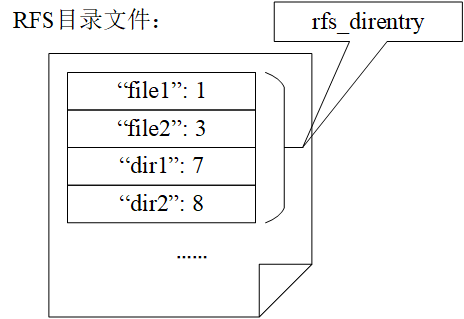
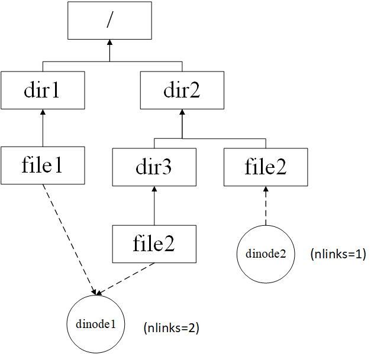

#                              第六章．实验4：文件系统

### 目录

- [6.1 实验4的基础知识](#fundamental) 
  - [6.1.1 文件系统概述](#filesystem)
  - [6.1.2 PKE的文件系统架构](#pke_fs)
  - [6.1.3 文件系统提供的接口](#fs_interface)
  - [6.1.4 虚拟文件系统](#vfs)
  - [6.1.5 RFS文件系统](#rfs)
- [6.2 lab4_1 文件操作](#lab4_1_file)
  - [给定应用](#lab4_1_app)
  - [实验内容](#lab4_1_content)
  - [实验指导](#lab4_1_guide)
- [6.3 lab4_2 目录文件](#lab4_2_dir) 
  - [给定应用](#lab4_2_app)
  - [实验内容](#lab4_2_content)
  - [实验指导](#lab4_2_guide)
- [6.4 lab4_3 硬链接](#lab4_3_hardlink) 
  - [给定应用](#lab4_3_app)
  - [实验内容](#lab4_3_content)
  - [实验指导](#lab4_3_guide)
- [6.5 lab4_challenge1 相对路径（难度：&#9733;&#9733;&#9733;&#9734;&#9734;）](#lab4_challenge1_pwd)
  - [给定应用](#lab4_challenge1_app)
  - [实验内容](#lab4_challenge1_content)
  - [实验指导](#lab4_challenge1_guide)
- [6.6 lab4_challenge2 重载执行（难度：&#9733;&#9733;&#9733;&#9733;&#9734;）](#lab4_challenge2_exec)
  - [给定应用](#lab4_challenge2_app)
  - [实验内容](#lab4_challenge2_content)
  - [实验指导](#lab4_challenge2_guide)

<a name="fundamental"></a>

## 6.1 实验4的基础知识

本章我们将首先以Linux的文件系统为例介绍文件系统的基础知识，接着讲述 riscv-pke操作系统内核的文件系统设计，然后开始对PKE实验4的基础实验进行讲解，以加深读者对文件系统底层逻辑的理解。

<a name="filesystem"></a>

### 6.1.1 文件系统概述

文件系统是操作系统用于存储、组织和访问计算机数据的方法，它使得用户可以通过一套便利的文件访问接口，来访问存储设备（常见的是磁盘，也有基于NAND Flash的固态硬盘）或分区上的文件。操作系统中负责管理和存储文件信息的**软件机构**称为文件管理系统，简称文件系统。 文件系统所管理的最基本的单位，是有具体且完整逻辑意义的“文件”，文件系统实现了对文件的按名（即文件名）存取。为避免“重名”问题，文件系统的常用方法是采用树型目录，来辅助（通过加路径）实现文件的按名存取。存储在磁盘上，实现树型目录的数据结构（如目录文件等），往往被称为“**元数据**”（meta-data）。实际上文件系统中，辅助实现对文件进行检索和存储的数据，都被称为元数据。从这个角度来看，文件系统中对磁盘空间进行管理的数据，以及可能的缓存数据，也都是重要的元数据。

不同的文件系统往往采用不同种类的元数据来完成既定功能。对不同类型元数据的采用，往往也区分了不同类型的文件系统。例如，Linux中的ext系列文件系统，Windows中广泛采用的fat系列文件系统、NTFS文件系统等。虽然完成的功能一样，但它们在具体实现上却也存在巨大差异。由于PKE实验采用了Spike模拟器，它具有和主机进行交互的HTIF接口，所以在PKE实验4，我们将自然接触到一类很特殊的文件系统hostfs（Host File System）。它实际上是位于主机上的文件系统，PKE通过定义一组接口使得在Spike所构造的虚拟RISC-V机器上运行的应用，能够对主机上文件进行访问。另外，我们将分配一段内存作为我们的“磁盘”（即RAM Disk），并在该磁盘上创建一个简单的，名称为RFS（Ramdisk File System）的文件系统。

由于有多个文件系统的存在，且PKE需要同时对这两类文件系统进行支持。所以，在PKE的实验四，我们引入了**虚拟文件系统**（Virtual File System，有时也被称为Virtual Filesystem Switch，简称都是**VFS**）的概念。VFS也是构建现代操作系统中文件系统的重要概念，通过实验四，读者将对这一重要概念进行学习。在后面的讨论中，我们将依次介绍[PKE的文件系统架构](#pke_fs)、了解[PKE文件系统对进程所提供的接口](#fs_interface)、[虚拟文件系统的构造](#vfs)，以及我们自己定义的[RFS文件系统](#rfs)。目标是辅助读者构建对PKE文件系统代码的理解，为完成后续的基础和挑战实验做好准备。

<a name="pke_fs"></a>

### 6.1.2 PKE的文件系统架构

PKE文件系统架构如下图所示，图中的RAM DISK在文件系统中的地位等价于磁盘设备，在其上“安装”的文件系统就是RFS。特别要注意的一点是，在后文讨论RFS时，会存在“某种数据结构被保存在磁盘中”这样的表述，这通常意味着这种数据结构实际上被保存在上图的RAM DISK中。除了RFS外，PKE文件系统通过虚拟文件系统对主机文件系统hostfs进行了支持，在riscv-pke操作系统内核上运行的应用程序能够对这两个文件系统中的文件进行访问。


在PKE系统启动时，会在初始化阶段将这两个文件系统进行挂载，见kernel/kernel.c文件中对S模式的启动代码的修改：

```c
 53 int s_start(void) {
 54   sprint("Enter supervisor mode...\n");
 55   // in the beginning, we use Bare mode (direct) memory mapping as in lab1.
 56   // but now, we are going to switch to the paging mode @lab2_1.
 57   // note, the code still works in Bare mode when calling pmm_init() and kern_vm_init().
 58   write_csr(satp, 0);
 59
 60   // init phisical memory manager
 61   pmm_init();
 62
 63   // build the kernel page table
 64   kern_vm_init();
 65
 66   // now, switch to paging mode by turning on paging (SV39)
 67   enable_paging();
 68   // the code now formally works in paging mode, meaning the page table is now in use.
 69   sprint("kernel page table is on \n");
 70
 71   // added @lab3_1
 72   init_proc_pool();
 73
 74   // init file system, added @lab4_1
 75   fs_init();
 76
 77   sprint("Switch to user mode...\n");
 78   // the application code (elf) is first loaded into memory, and then put into execution
 79   // added @lab3_1
 80   insert_to_ready_queue( load_user_program() );
 81   schedule();
 82
 83   // we should never reach here.
 84   return 0;
 85 }
```

我们看到，在第75行，增加了对函数fs_init()的调用。fs_init()的定义在kernel/proc_file.c文件中：

```c
21 void fs_init(void) {
22   // initialize the vfs
23   vfs_init();
24 
25   // register hostfs and mount it as the root
26   if( register_hostfs() < 0 ) panic( "fs_init: cannot register hostfs.\n" );
27   struct device *hostdev = init_host_device("HOSTDEV");
28   vfs_mount("HOSTDEV", MOUNT_AS_ROOT);
29 
30   // register and mount rfs
31   if( register_rfs() < 0 ) panic( "fs_init: cannot register rfs.\n" );
32   struct device *ramdisk0 = init_rfs_device("RAMDISK0");
33   rfs_format_dev(ramdisk0);
34   vfs_mount("RAMDISK0", MOUNT_DEFAULT);
35 }
```

我们看到，初始化过程首先初始化了VFS层的两个哈希表结构（23行），然后对hostfs文件系统进行了初始化（26--28行），接下来对RFS文件系统进行了初始化（31--34）。对于RFS的初始化，甚至包含了对RAM DISK的格式化（33行）。初始化过程，会通过vfs_mount函数把这两种不同类型的文件系统挂载到PKE的虚拟文件系统的不同目录下。


从上图中我们看到，启动阶段PKE会把hostfs挂载到根目录，而把RFS文件系统挂载到/RAMDISK0目录下。由于hostfs的本质是通过spike的HTIF接口，对主机上的文件进行访问，hostfs在挂载时会将**主机上，源代码目录下的hostfs_root**目录做为“根目录”加载到PKE文件系统中，做为后者的“根目录”。实际上，这个主机上被加载为根目录的目录是可以更改的，见kernel/hostfs.h文件中的定义：

```c
  1 #ifndef _HOSTFS_H_
  2 #define _HOSTFS_H_
  3 #include "vfs.h"
  4
  5 #define HOSTFS_TYPE 1
  6
  7 // dinode type
  8 #define H_FILE FILE_I
  9 #define H_DIR DIR_I
 10
 11 // root directory
 12 #define H_ROOT_DIR "./hostfs_root"
 13
 14 // hostfs utility functin declarations
 15 int register_hostfs();
 16 struct device *init_host_device(char *name);
 17 void get_path_string(char *path, struct dentry *dentry);
 18 struct vinode *hostfs_alloc_vinode(struct super_block *sb);
 19 int hostfs_write_back_vinode(struct vinode *vinode);
 20 int hostfs_update_vinode(struct vinode *vinode);
 21
 22 // hostfs interface function declarations
 23 ssize_t hostfs_read(struct vinode *f_inode, char *r_buf, ssize_t len,
 24                     int *offset);
 25 ssize_t hostfs_write(struct vinode *f_inode, const char *w_buf, ssize_t len,
 26                      int *offset);
 27 struct vinode *hostfs_lookup(struct vinode *parent, struct dentry *sub_dentry);
 28 struct vinode *hostfs_create(struct vinode *parent, struct dentry *sub_dentry);
 29 int hostfs_lseek(struct vinode *f_inode, ssize_t new_offset, int whence,
 30                   int *offset);
 31 int hostfs_hook_open(struct vinode *f_inode, struct dentry *f_dentry);
 32 int hostfs_hook_close(struct vinode *f_inode, struct dentry *dentry);
 33 struct super_block *hostfs_get_superblock(struct device *dev);
 34
 35 extern const struct vinode_ops hostfs_node_ops;
 36
 37 #endif
```

注意kernel/hostfs.h文件中第12行的定义，H_ROOT_DIR的定义其实是可以修改的，感兴趣的读者可以在完成实验后自行修改这个定义，把PKE文件系统的根目录定向到自己选择的主机目录下。但是，需要注意的是，如果更改了这个设置，PKE文件系统的根目录下就具有不同的初始文件和目录了。对于RFS文件系统，它的根目录被加载到了PKE文件系统的/RAMDISK0目录下。对于RFS实现细节的讨论，我们将在[6.1.5节](#rfs)中进行。

在应用对于文件或者子目录进行访问时，会通过被访问的文件或子目录的**路径**进行判断，来决定被访问的文件的具体放置位置。例如:

- 如果访问的路径是/dir1/file1，则实际被访问的文件位于hostfs中，且被访问的文件在主机上的存放位置为：[源代码目录]/hostfs_root/dir1/file1；
- 如果访问的路径是/RAMDISK0/dir2/file2，则该文件就应该位于RFS中，且文件实际存放的位置为[RFS的根目录]/dir2/file2。

<a name="fs_interface"></a> 

### 6.1.3 文件系统提供的接口

在PKE文件系统架构下，进程的读写文件函数调用关系如下：


从用户程序发出的文件读写操作（如open、u_read、u_write等）将会首先通过syscall传递到内核态空间，紧接着，syscall将调用proc_file.c文件中定义的文件读写动作（如do_open、do_read、do_write等）。而proc_file.c中的动作又会调用vfs中定义的数据结构，将动作进一步传导到具体的文件系统（主机文件系统，或者RFS文件系统），传递到相应的动作函数，最后再传导到不同的设备上（HTIF接口或者RAM DISK）。在下面的讨论中，我们将按照自顶向下的顺序对PKE文件系统进行讨论。

在lab4中，PKE为进程定义了一个“打开文件表”，并用一个管理数据结构proc_file_management对一个进程所打开的文件进行管理。见kernel/proc_file.h中的定义：

```C
21 // data structure that manages all openned files in a PCB
22 typedef struct proc_file_management_t {
23   struct dentry *cwd;  // vfs dentry of current working directory
24   struct file opened_files[MAX_FILES];  // opened files array
25   int nfiles;  // the number of files opened by a process
26 } proc_file_management;
```

我们看到，proc_file_management结构保存了一个当前目录的dentry，以及一个“打开文件”数组。该结构是每个PKE进程都有的，这一点可以参考kernel/process.h中对process结构的修改：

```c
66 typedef struct process_t {
67   // pointing to the stack used in trap handling.
68   uint64 kstack;
69   // user page table
70   pagetable_t pagetable;
71   // trapframe storing the context of a (User mode) process.
72   trapframe* trapframe;
73 
74   // points to a page that contains mapped_regions. below are added @lab3_1
75   mapped_region *mapped_info;
76   // next free mapped region in mapped_info
77   int total_mapped_region;
78 
79   // heap management
80   process_heap_manager user_heap;
81 
82   // process id
83   uint64 pid;
84   // process status
85   int status;
86   // parent process
87   struct process_t *parent;
88   // next queue element
89   struct process_t *queue_next;
90 
91   // accounting. added @lab3_3
92   int tick_count;
93 
94   // file system. added @lab4_1
95   proc_file_management *pfiles;
96 }process;
```

我们看到在进程定义的95行，增加了一个proc_file_management指针类型的成员pfile。这样，每当创建一个进程时，都会调用kernel/proc_file.c中定义的函数init_proc_file_management()，来对该进程（将来）要打开的文件进行管理。该函数的定义如下：

```c
41 proc_file_management *init_proc_file_management(void) {
42   proc_file_management *pfiles = (proc_file_management *)alloc_page();
43   pfiles->cwd = vfs_root_dentry; // by default, cwd is the root
44   pfiles->nfiles = 0;
45 
46   for (int fd = 0; fd < MAX_FILES; ++fd)
47     pfiles->opened_files[fd].status = FD_NONE;
48 
49   sprint("FS: created a file management struct for a process.\n");
50   return pfiles;
51 }
```

该函数的作用是为将要管理的“打开文件”分配一个物理页面的空间，初始当前目录（cwd）置为根目录，初始化打开文件计数（42--44行）；然后初始化所有“已打开”的文件的文件描述符fd（46--47行）。kernel/proc_file.c文件中还定义了一组接口，用于进程对文件的一系列操作。这些接口包括文件打开（do_open）、文件关闭（do_close）、文件读取（do_read）、文件写（do_write）、文件读写定位（do_lseek）、获取文件状态（do_stat），甚至获取磁盘状态（do_disk_stat）。这些接口，都是在应用程序发出对应的文件操作（如open、close、read_u等）时，通过user lib，到达do_syscall，并最后被调用的。

这里，我们对其中比较典型的文件操作，如打开和文件读进行分析。我们先来观察do_open的实现（见kernel/proc_file.c）：

```c
 82 int do_open(char *pathname, int flags) {
 83   struct file *opened_file = NULL;
 84   if ((opened_file = vfs_open(pathname, flags)) == NULL) return -1;
 85 
 86   int fd = 0;
 87   if (current->pfiles->nfiles >= MAX_FILES) {
 88     panic("do_open: no file entry for current process!\n");
 89   }
 90   struct file *pfile;
 91   for (fd = 0; fd < MAX_FILES; ++fd) {
 92     pfile = &(current->pfiles->opened_files[fd]);
 93     if (pfile->status == FD_NONE) break;
 94   }
 95 
 96   // initialize this file structure
 97   memcpy(pfile, opened_file, sizeof(struct file));
 98 
 99   ++current->pfiles->nfiles;
100   return fd;
101 }
```

我们看到，打开文件时，PKE内核是通过调用vfs_open函数来实现对一个文件的打开动作的（第84行）。在文件打开后，会在进程的“打开文件表”中寻找一个未被使用的表项，将其加入（拷贝）到该表项中（第86--99行）。我们再来观察另一个典型函数do_read的实现（见kernel/proc_file.c）：

```c
107 int do_read(int fd, char *buf, uint64 count) {
108   struct file *pfile = get_opened_file(fd);
109 
110   if (pfile->readable == 0) panic("do_read: no readable file!\n");
111 
112   char buffer[count + 1];
113   int len = vfs_read(pfile, buffer, count);
114   buffer[count] = '\0';
115   strcpy(buf, buffer);
116   return len;
117 }
```

我们看到，这个函数会首先对发起进程读取文件的权限进行判断，通过判断后，会继续通过调用vfs_read来实现对文件的真正的读取动作。最后，再将读取到的数据拷贝到参数buf中。

实际上，PKE文件系统提供给进程的所有操作，最终都是通过调用VFS这一层的功能来最终完成它们的功能的。这里，我们鼓励读者继续阅读其他操作（如关闭文件、写文件等），来观察PKE文件系统的这一特点。

<a name="vfs"></a> 

### 6.1.4 虚拟文件系统

虚拟文件系统（VFS）为上层应用程序提供了一套统一的文件系统访问接口，屏蔽了具体文件系统在文件组织方式、文件操作方式上的差异。由于VFS的存在，用户在访问文件系统中的文件时，并不需要关注该文件具体是保存在何种文件系统中的，只需要通过VFS层提供的统一的访问接口来进行文件访问，这大大降低了用户使用文件系统的复杂性。

#### 6.1.4.1 VFS的功能接口

在PKE中，VFS层对上层应用提供了如下一些文件系统访问接口（包括设备接口、文件接口和目录接口），在kernel/vfs.h中可以找到他们的声明：

```c
21 // device interfaces
22 struct super_block *vfs_mount(const char *dev_name, int mnt_type);
23 
24 // file interfaces
25 struct file *vfs_open(const char *path, int flags);
26 ssize_t vfs_read(struct file *file, char *buf, size_t count);
27 ssize_t vfs_write(struct file *file, const char *buf, size_t count);
28 ssize_t vfs_lseek(struct file *file, ssize_t offset, int whence);
29 int vfs_stat(struct file *file, struct istat *istat);
30 int vfs_disk_stat(struct file *file, struct istat *istat);
31 int vfs_link(const char *oldpath, const char *newpath);
32 int vfs_unlink(const char *path);
33 int vfs_close(struct file *file);
34 
35 // directory interfaces
36 struct file *vfs_opendir(const char *path);
37 int vfs_readdir(struct file *file, struct dir *dir);
38 int vfs_mkdir(const char *path);
39 int vfs_closedir(struct file *file);
```

上述接口函数可以用来完成文件系统挂载、读写文件和目录、创建文件硬链接等功能。系统内的其他模块通过调用这些接口函数来完成对文件系统的访问。在上一节中提到的面向进程的一组接口（do_open、do_read等）便是通过调用VFS层提供的这些文件系统访问接口来实现对文件系统的访问的。在实现上，这些vfs函数大部分会通过调用“viop”开始函数来完成对具体文件系统的访问，而viop函数则由具体文件系统（RFS或hostfs）自行定义，这也是VFS能支持多种文件系统的关键。在下文6.1.4.3节中会对viop函数进行更详细的介绍。

#### 6.1.4.2 VFS的重要数据结构

VFS对具体的文件系统进行了抽象，构建出一个通用的文件系统模型。这个抽象的文件系统模型由几种VFS层的抽象数据类型组成，下面分别介绍VFS中的这些抽象数据类型。

* *vinode*
  VFS对具体文件系统中的inode进行了抽象，构建出一个通用的vinode对象。vinode对象包含操作系统操作一个文件（或目录）所需要的全部信息，对文件的各种操作都是围绕着vinode来进行的。由此可见，vinode是文件系统中文件访问和操作的核心对象。在PKE中，为了与RFS存储在“磁盘”上的inode进行区分，我们将VFS层的抽象inode对象命名为vinode；而实际存储在磁盘上的inode，则被称为disk inode （简写为dinode）。除了起到区分作用，该名称同时强调了vinode对象是仅存在于内存中的这一事实。vinode会在一个文件被打开时创建，在不被任何dentry（见下文dentry）引用时释放。另外，RFS对应的vinode都会被存储在一个哈希链表中：vinode_hash_table。设置该表的目的主要是为了避免同一个文件被多次打开时，可能产生多个与之对应的vinode的情况出现。因为多个vinode在回写到磁盘时，可能发生数据丢失（后写入的vinode将先写入的vinode覆盖）。vinode的结构如下（见kernel/vfs.h）：

  ```c
  115 struct vinode {
  116   int inum;                  // inode number of the disk inode
  117   int ref;                   // reference count
  118   int size;                  // size of the file (in bytes)
  119   int type;                  // one of FILE_I, DIR_I
  120   int nlinks;                // number of hard links to this file
  121   int blocks;                // number of blocks
  122   int addrs[DIRECT_BLKNUM];  // direct blocks
  123   void *i_fs_info;           // filesystem-specific info (see s_fs_info)
  124   struct super_block *sb;          // super block of the vfs inode
  125   const struct vinode_ops *i_ops;  // vfs inode operations
  126 };
  ```

  其中需要重点关注的成员是：inum、sb以及i_ops。下面分别介绍这几个字段。

  **inum**：inum用于保存一个vinode所对应的，存在于磁盘上的disk inode序号。对于存在disk inode的文件系统（如RFS）而言，inum唯一确定了该文件系统中的一个实际的文件。而对于不存在disk inode的文件系统（如hostfs），inum字段则不会被使用，且该文件系统需要自行提供并维护一个vinode所对应的文件在该文件系统中的“定位信息”，VFS必须能够根据该“定位信息”唯一确定此文件系统中的一个文件。这类“定位信息”由具体文件系统创建、使用（通过viop函数，后文会介绍）和释放。实现上，PKE为一个hostfs所设计的 “定位信息”就是一个spike_file_t结构体（定义在spike_interface/spike_file.h中）：

  ```c
  09 typedef struct file_t {
  10   int kfd;  // file descriptor of the host file
  11   uint32 refcnt;
  12 } spike_file_t;
  ```

  该结构体保存了宿主机中一个打开文件的文件描述符，结构体的首地址会被保存在vinode的i_fs_info字段中。

  **sb**：vinode中的sb字段是struct super_block类型，它用来记录inode所在的文件系统对应的超级块，超级块唯一确定了vinode对应的文件系统。

  **i_ops**：i_ops字段是struct vinode_ops类型，它是一组对vinode进行操作的函数调用。需要注意的是，在VFS中仅仅提供了vinode的操作函数接口，这些函数的具体实现会由下层的文件系统提供。

  对于RFS而言，vinode中的其他信息（inum、size、type、nlinks、blocks以及addrs）都是在VFS首次访问到某个磁盘文件或目录时，基于对应的disk inode内容产生的。而对于hostfs，vinode中的这些数据并不会被使用，而只是会设置i_fs_info字段。

* *dentry*

  dentry即directory entry，是VFS中对目录项的抽象，该对象在VFS承载了多种功能，包括对vinode进行组织、提供目录项缓存以及快速索引支持，它的定义在vfs.h文件中：

  ```c
  38 struct dentry {
  39   char name[MAX_DENTRY_NAME_LEN];
  40   int d_ref;
  41   struct vinode *dentry_inode;
  42   struct dentry *parent;
  43   struct super_block *sb;
  45 };
  ```

  与vinode类似，dentry同样是仅存在于内存中一种抽象数据类型，且一个dentry对应一个vinode（由dentry_inode成员记录）。由于硬链接的存在，一个vinode可能同时被多个dentry引用。另外需要注意的是，在VFS中，无论是普通文件还是目录文件，都会存在相应的dentry。

  为了支撑dentry的功能，内存中的每一个dentry都存在于目录树与路径哈希表两种结构之中。首先，所有的dentry会按文件的树形目录结构组织成一颗目录树，每个dentry中的parent数据项会指向其父dentry。该目录树结构将内存中存在的dentry及对应的vinode进行了组织，便于文件的访问。其次，所有的dentry都存在于一个以父目录项地址和目录项名为索引的哈希链表（dentry_hash_table）中，将dentry存放于哈希链表中可以加快对目录的查询操作。

* *super_block*

  super_block结构用来保存一个已挂载文件系统的相关信息。在一个文件系统被挂载到系统中时，其对应的super_block会被创建，并读取磁盘上的super block信息（若存在）来对super_block对象进行初始化。对于RFS文件系统而言，在访问其中的文件时，需要从super_block中获取文件系统所在的设备信息，且RFS中数据盘块的分配和释放需要借助保存在s_fs_info成员中的bitmap来完成。而对于hostfs而言，它并不存在物理上的super block，其VFS层的super_block结构主要用来维护hostfs根目录信息。super_block结构定义在vfs.h文件中：

  ```c
  104 struct super_block {
  105   int magic;              // magic number of the file system
  106   int size;               // size of file system image (blocks)
  107   int nblocks;            // number of data blocks
  108   int ninodes;            // number of inodes.
  109   struct dentry *s_root;  // root dentry of inode
  110   struct device *s_dev;   // device of the superblock
  111   void *s_fs_info;        // filesystem-specific info. for rfs, it points bitmap
  112 };
  ```

  其中最重要的数据项是s_root与s_dev。s_root指向该文件系统根目录所对应的dentry，s_dev则指向该文件系统所在的设备。


- *file*

  在用户进程的眼里，磁盘上记录的信息是以文件的形式呈现的。因此，VFS使用file对象为进程提供一个文件抽象。file结构体需要记录文件的状态、文件的读写权限、文件读写偏移量以及文件对应的dentry。该结构体定义在vfs.h中：

  ```c
  71 struct file {
  72   int status;
  73   int readable;
  74   int writable;
  75   int offset;
  76   struct dentry *f_dentry;
  77 };
  ```
  
  显然，VFS层的file结构体只包含了一个文件的基本信息。

#### 6.1.4.3 viop函数的定义和使用

viop函数是VFS与具体文件系统进行交互的重要部分，也是VFS能够同时支持多种具体文件系统的关键。这些viop函数是在vinode上执行的一系列操作函数，操作函数接口的定义可以在kernel/vfs.h文件中找到（在lab4_1_file与lab4_2_directory这两个分支做实验时，代码的vinode操作函数接口并不完整，更完整的代码来自lab4_3_hardlink这个分支）：

```c
136 struct vinode_ops {
137   // file operations
138   ssize_t (*viop_read)(struct vinode *node, char *buf, ssize_t len,
139                        int *offset);
140   ssize_t (*viop_write)(struct vinode *node, const char *buf, ssize_t len,
141                         int *offset);
142   struct vinode *(*viop_create)(struct vinode *parent, struct dentry *sub_dentry);
143   int (*viop_lseek)(struct vinode *node, ssize_t new_off, int whence, int *off);
144   int (*viop_disk_stat)(struct vinode *node, struct istat *istat);
145   int (*viop_link)(struct vinode *parent, struct dentry *sub_dentry,
146                    struct vinode *link_node);
147   int (*viop_unlink)(struct vinode *parent, struct dentry *sub_dentry,
148                      struct vinode *unlink_node);
149   struct vinode *(*viop_lookup)(struct vinode *parent,
150                                 struct dentry *sub_dentry);
151 
152   // directory operations
153   int (*viop_readdir)(struct vinode *dir_vinode, struct dir *dir, int *offset);
154   struct vinode *(*viop_mkdir)(struct vinode *parent, struct dentry *sub_dentry);
155 
156   // write back inode to disk
157   int (*viop_write_back_vinode)(struct vinode *node);
158 
159   // hook functions
160   // In the vfs layer, we do not assume that hook functions will do anything,
161   // but simply call them (when they are defined) at the appropriate time.
162   // Hook functions exist because the fs layer may need to do some additional
163   // operations (such as allocating additional data structures) at some critical
164   // times.
165   int (*viop_hook_open)(struct vinode *node, struct dentry *dentry);
166   int (*viop_hook_close)(struct vinode *node, struct dentry *dentry);
167   int (*viop_hook_opendir)(struct vinode *node, struct dentry *dentry);
168   int (*viop_hook_closedir)(struct vinode *node, struct dentry *dentry);
169 };
```

上述函数接口实际上是一系列的函数指针，在VFS中的vinode_ops结构体中限定了这些函数的参数类型和返回值，但并没有给出函数的实际定义。而在具体文件系统中，需要根据vinode_ops中提供的函数接口，来定义具体的函数实现，并将函数地址赋值给vinode_ops结构中相应的函数指针。在VFS中则通过vinode_ops的函数指针调用实际的文件系统操作函数。以RFS为例，我们可以在kernel/rfs.c中找到如下一个vinode_ops类型变量（rfs_i_ops）的定义（以下完整代码来自lab4_3_hardlink分支）：

```c
22 const struct vinode_ops rfs_i_ops = {
23     .viop_read = rfs_read,
24     .viop_write = rfs_write,
25     .viop_create = rfs_create,
26     .viop_lseek = rfs_lseek,
27     .viop_disk_stat = rfs_disk_stat,
28     .viop_link = rfs_link,
29     .viop_unlink = rfs_unlink,
30     .viop_lookup = rfs_lookup,
31 
32     .viop_readdir = rfs_readdir,
33     .viop_mkdir = rfs_mkdir,
34 
35     .viop_write_back_vinode = rfs_write_back_vinode,
36 
37     .viop_hook_opendir = rfs_hook_opendir,
38     .viop_hook_closedir = rfs_hook_closedir,
39 };
```

从该结构中我们可以清晰的看出inode操作函数接口（viop_read、viop_write等）与它们的具体实现（rfs_read、rfs_write等）之间的对应关系。RFS中inode操作函数的具体实现都定义在kernel/rfs.c中，读者可以根据上述rfs_i_ops定义找到它们与VFS中接口的对应关系，并阅读其函数实现，这里不再一一列举。

继续回到vinode_ops，我们可以发现其内部定义了四类接口函数，分别是：file operations（文件操作）、directory operations（目录操作）、write back inode to disk（回写vinode）以及hook functions（钩子函数）。其中前两种的功能是显而易见的，它们主要是一些用来对文件和目录进行访问和操作的接口函数（如读写文件、读目录等）。对于“write back inode to disk”，根据其注释名称我们也容易得知其功能：将内存中保存的vinode数据回写到磁盘，该函数一般会在关闭文件时调用。

而对于VFS层为vinode提供的钩子函数接口，这里需要进行一些额外的说明：首先，钩子函数与其他三类接口函数一样，同样是由具体文件系统所实现并提供的，在VFS层仅仅定义了它们的参数和返回值。但钩子函数与其他三类接口函数不同的地方在于，VFS层的调用者并不会“期待”这些函数完成任何的工作，而仅仅只是在预先规定好的时机对这类钩子函数进行调用。下面举一个具体的例子，即vfs_open（见kernel/vfs.c）：

```c
111 struct file *vfs_open(const char *path, int flags) {
112   struct dentry *parent = vfs_root_dentry; // we start the path lookup from root.
113   char miss_name[MAX_PATH_LEN];
114 
115   // path lookup.
116   struct dentry *file_dentry = lookup_final_dentry(path, &parent, miss_name);
117 
118   // file does not exist
119   if (!file_dentry) {
120     int creatable = flags & O_CREAT;
121 
122     // create the file if O_CREAT bit is set
123     if (creatable) {
124       char basename[MAX_PATH_LEN];
125       get_base_name(path, basename);
126 
127       // a missing directory exists in the path
128       if (strcmp(miss_name, basename) != 0) {
129         sprint("vfs_open: cannot create file in a non-exist directory!\n");
130         return NULL;
131       }
132 
133       // create the file
134       file_dentry = alloc_vfs_dentry(basename, NULL, parent);
135       struct vinode *new_inode = viop_create(parent->dentry_inode, file_dentry);
136       if (!new_inode) panic("vfs_open: cannot create file!\n");
137 
138       file_dentry->dentry_inode = new_inode;
139       new_inode->ref++;
140       hash_put_dentry(file_dentry);
141       hash_put_vinode(new_inode); 
142     } else {
143       sprint("vfs_open: cannot find the file!\n");
144       return NULL;
145     }
146   }
147 
148   if (file_dentry->dentry_inode->type != FILE_I) {
149     sprint("vfs_open: cannot open a directory!\n");
150     return NULL;
151   }
152 
153   // get writable and readable flags
154   int writable = 0;
155   int readable = 0;
156   switch (flags & MASK_FILEMODE) {
157     case O_RDONLY:
158       writable = 0;
159       readable = 1;
160       break;
161     case O_WRONLY:
162       writable = 1;
163       readable = 0;
164       break;
165     case O_RDWR:
166       writable = 1;
167       readable = 1;
168       break;
169     default:
170       panic("fs_open: invalid open flags!\n");
171   }
172 
173   struct file *file = alloc_vfs_file(file_dentry, readable, writable, 0);
174 
175   // additional open operations for a specific file system
176   // hostfs needs to conduct actual file open.
177   if (file_dentry->dentry_inode->i_ops->viop_hook_open) {
178     if (file_dentry->dentry_inode->i_ops->
179         viop_hook_open(file_dentry->dentry_inode, file_dentry) < 0) {
180       sprint("vfs_open: hook_open failed!\n");
181     }
182   }
183 
184   return file;
185 }
```

vfs_open函数即为前文中提到的VFS层对上层应用提供的接口之一，该函数完成根据文件路径和访问标志位打开一个文件的功能。vfs_open在第135行和179行分别调用了两个viop接口函数：viop_create（“viop_create(node, name)”形式是为了调用方便而定义的宏，其展开为：“node->i_ops->viop_create(node, name)”，其他viop接口函数也有类似的宏定义，见kernel/vfs.h）和viop_hook_open。通过阅读该函数实现我们可以发现，vfs_open函数在发现打开的文件不存在，且调用时具有creatable标志位时，会调用viop_create对该文件进行创建。而该viop_create则由具体文件系统提供实现（比如RFS中的rfs_create）。在这个过程中我们注意到，vfs_open函数要想完成打开文件的操作，其必须依赖底层文件系统提供一个能够完成“创建新文件并返回其vinode”功能的viop_create函数。换句话说，除了钩子函数以外的其他viop函数（如viop_create），在其具体实现中需要完成什么样的功能是在VFS层规定好的，底层文件系统提供的这些viop函数实现必须完成VFS层所预期的功能（如在磁盘中创建一个文件、读写文件或创建硬链接等）。

接下来我们再来看vfs_open的177--182行，对钩子函数（即viop_hook_open）的调用。代码实现的功能是：若viop_hook_open函数指针不为NULL，则调用它（通过条件判断）。可以看到，从VFS层的角度来说，即使viop_hook_open不完成任何实际功能，甚至没有定义（则不会被调用），也不会影响vfs_open函数完成打开文件的功能。换句话来讲，VFS层对这些钩子函数没有任何的“期待”，仅仅只是在正确的位置（打开文件、关闭文件、打开目录和关闭目录）调用它们而已。既然从VFS层的角度来看这类钩子函数不需要完成任何功能，为什么还要有钩子函数的存在呢？实际上，在VFS运行过程中的一些关键时刻，钩子函数为具体文件系统提供一个执行自定义代码的“机会”。比如，上文中提到过，hostfs中的spike_file_t结构体包含主机端打开文件描述符，hostfs需要将其地址保存在文件对应vinode的i_fs_info中，而该操作显然需要在打开文件时完成，否则后续对该文件的读写操作则无法顺利进行。但是，这段与hostfs自身细节高度相关的代码显然不应该直接放入vfs_open函数中，而是应该由hostfs自己提供，vfs_open负责为其提供一个执行“机会”。

为了验证这一点，我们可以查看kernel/hostfs.c中hostfs_i_ops的定义（以下完整代码来自lab4_3_hardlink分支）：

```c
14 const struct vinode_ops hostfs_i_ops = {
15     .viop_read = hostfs_read,
16     .viop_write = hostfs_write,
17     .viop_create = hostfs_create,
18     .viop_lseek = hostfs_lseek,
19     .viop_lookup = hostfs_lookup,
20 
21     .viop_hook_open = hostfs_hook_open,
22     .viop_hook_close = hostfs_hook_close,
23 
24     .viop_write_back_vinode = hostfs_write_back_vinode,
25 
26     // not implemented
27     .viop_link = hostfs_link,
28     .viop_unlink = hostfs_unlink,
29     .viop_readdir = hostfs_readdir,
30     .viop_mkdir = hostfs_mkdir,
31 };
```

在第21行可以看到，hostfs确实为viop_hook_open提供了一个函数实现：hostfs_hook_open。在kernel/hostfs.c中，我们同样可以找到hostfs_hook_open的定义：

```c
236 int hostfs_hook_open(struct vinode *f_inode, struct dentry *f_dentry) {
237   if (f_inode->i_fs_info != NULL) return 0;
238 
239   char path[MAX_PATH_LEN];
240   get_path_string(path, f_dentry);
241   spike_file_t *f = spike_file_open(path, O_RDWR, 0);
242   if ((int64)f < 0) {
243     sprint("hostfs_hook_open cannot open the given file.\n");
244     return -1;
245   }
246 
247   f_inode->i_fs_info = f;
248   return 0;
249 }
```

由此可见，hostfs_hook_open函数确实完成了打开一个主机端文件，并将其spike_file_t结构地址保存在i_fs_info的功能。VFS层一共定义了四个钩子函数，分别是：viop_hook_open、viop_hook_close、viop_hook_opendir和viop_hook_closedir，它们分别在打开文件（vfs_open）、关闭文件（vfs_close）、打开目录（vfs_opendir）和关闭目录（vfs_closedir）时被调用。

hostfs实现了前两种钩子函数，函数名称以及完成的功能如下：

* hostfs_hook_open（kernel/hostfs.c#236行）：通过HTIF接口在宿主机打开文件，并保存其文件描述符到vinode的i_fs_info中。
* hostfs_hook_close（kernel/hostfs.c#254行）：通过HTIF接口在宿主机关闭文件。

RFS实现了后两种钩子函数，函数名称以及完成的功能如下（代码来自lab4_3_hardlink分支）：

* rfs_hook_opendir（kernel/rfc.c#719行）：读取目录文件内容到目录缓存（有关目录缓存的内容在实验二中会详细介绍）中，将目录缓存的地址保存到vinode的i_fs_info中。
* rfs_hook_closedir（kernel/rfs.c#751行）：释放目录缓存。

#### 6.1.4.4 VFS层的目录组织

类似于底层文件系统中保存在磁盘上的目录结构，VFS会在内存中同样会构建一颗目录树。任何具体文件系统中的目录树都需要先挂载到这颗VFS的目录树上才能够被使用。下图展示了将两个文件系统挂载到VFS目录树后的情形，其中/dir1/file1和/RAMDISK0/dir2/file2分别位于不同的文件系统中：


这里，我们回过头来，观察kernel/vfs.c中vfs_mount函数的定义：

```c
 49 struct super_block *vfs_mount(const char *dev_name, int mnt_type) {
 50   // device pointer
 51   struct device *p_device = NULL;
 52 
 53   // find the device entry in vfs_device_list named as dev_name
 54   for (int i = 0; i < MAX_VFS_DEV; ++i) {
 55     p_device = vfs_dev_list[i];
 56     if (p_device && strcmp(p_device->dev_name, dev_name) == 0) break;
 57   }
 58   if (p_device == NULL) panic("vfs_mount: cannot find the device entry!\n");
 59 
 60   // add the super block into vfs_sb_list
 61   struct file_system_type *fs_type = p_device->fs_type;
 62   struct super_block *sb = fs_type->get_superblock(p_device);
 63 
 64   // add the root vinode into vinode_hash_table
 65   hash_put_vinode(sb->s_root->dentry_inode);
 66 
 67   int err = 1;
 68   for (int i = 0; i < MAX_MOUNTS; ++i) {
 69     if (vfs_sb_list[i] == NULL) {
 70       vfs_sb_list[i] = sb;
 71       err = 0;
 72       break;
 73     }
 74   }
 75   if (err) panic("vfs_mount: too many mounts!\n");
 76 
 77   // mount the root dentry of the file system to right place
 78   if (mnt_type == MOUNT_AS_ROOT) {
 79     vfs_root_dentry = sb->s_root;
 80 
 81     // insert the mount point into hash table
 82     hash_put_dentry(sb->s_root);
 83   } else if (mnt_type == MOUNT_DEFAULT) {
 84     if (!vfs_root_dentry)
 85       panic("vfs_mount: root dentry not found, please mount the root device first!\n");
 86 
 87     struct dentry *mnt_point = sb->s_root;
 88 
 89     // set the mount point directory's name to device name
 90     char *dev_name = p_device->dev_name;
 91     strcpy(mnt_point->name, dev_name);
 92 
 93     // by default, it is mounted under the vfs root directory
 94     mnt_point->parent = vfs_root_dentry;
 95 
 96     // insert the mount point into hash table
 97     hash_put_dentry(sb->s_root);
 98   } else {
 99     panic("vfs_mount: unknown mount type!\n");
100   }
101 
102   return sb;
103 }
```

为了简化文件系统挂载过程，PKE的文件系统并不支持将一个设备中的文件系统挂载到任意目录下，而是提供了两种固定的挂载方式：“挂载为根目录”或“挂载为根目录下的子目录”。vfs_mount的第78--83行对应将一个设备挂载为根目录的情况。第79行将VFS目录树的根目录指向该设备上文件系统的根目录；第82行则将根目录的dentry加入哈希链表中，加快后续的目录搜索过程。第83--98行对应将一个设备挂载为根目录下的子目录的情况。第91行将设备上文件系统的根目录对应的dentry名称修改为设备名；第94行将其链接到VFS根目录下，作为VFS根目录下的一个子目录。注意，该步骤相当于在VFS的根目录下创建了一个虚拟目录，虚拟目录的名称为被挂载设备的设备名。例如，若将设备“DEVICE0”以MOUNT_DEFAULT方式挂载，则会在VFS根目录下创建一个虚拟的子目录（仅存在于内存中，不会在磁盘中创建目录文件）：/DEVICE0作为所挂载设备的挂载点。在挂载完成后，/DEVICE0在逻辑上等价于所挂载文件系统的根目录。最后，第97行同样将这个新加入VFS目录树的dentry插入到哈希链表中，加快后续的目录搜索。实际上，任何新加入VFS目录树的dentry都会被同步插入哈希链表中。

在上述VFS层文件系统挂载过程中，我们应当注意到另一个事实：当一个新文件系统被挂载时，并不会立刻读取其磁盘上保存的完整目录结构到VFS目录树中，而只是将具体文件系统的根目录添加到VFS目录树中。显然，这样做既能节约时间和内存消耗，也更加贴近于真实的文件系统运行情况。但是，VFS如何处理后续对该新挂载文件系统下子目录或子文件的访问呢？通过阅读kernel/vfs.c中定义的lookup_final_dentry函数可以找到答案：

```c
304 struct dentry *lookup_final_dentry(const char *path, struct dentry **parent,
305                                    char *miss_name) {
306   char path_copy[MAX_PATH_LEN];
307   strcpy(path_copy, path);
308 
309   // split the path, and retrieves a token at a time.
310   // note: strtok() uses a static (local) variable to store the input path
311   // string at the first time it is called. thus it can out a token each time.
312   // for example, when input path is: /RAMDISK0/test_dir/ramfile2
313   // strtok() outputs three tokens: 1)RAMDISK0, 2)test_dir and 3)ramfile2
314   // at its three continuous invocations.
315   char *token = strtok(path_copy, "/");
316   struct dentry *this = *parent;
317 
318   while (token != NULL) {
319     *parent = this;
320     this = hash_get_dentry((*parent), token);  // try hash first
321     if (this == NULL) {
322       // if not found in hash, try to find it in the directory
323       this = alloc_vfs_dentry(token, NULL, *parent);
324       // lookup subfolder/file in its parent directory. note:
325       // hostfs and rfs will take different procedures for lookup.
326       struct vinode *found_vinode = viop_lookup((*parent)->dentry_inode, this);
327       if (found_vinode == NULL) {
328         // not found in both hash table and directory file on disk.
329         free_page(this);
330         strcpy(miss_name, token);
331         return NULL;
332       }
333 
334       struct vinode *same_inode = hash_get_vinode(found_vinode->sb, found_vinode->inum);
335       if (same_inode != NULL) {
336         // the vinode is already in the hash table (i.e. we are opening another hard link)
337         this->dentry_inode = same_inode;
338         same_inode->ref++;
339         free_page(found_vinode);
340       } else {
341         // the vinode is not in the hash table
342         this->dentry_inode = found_vinode;
343         found_vinode->ref++;
344         hash_put_vinode(found_vinode);
345       }
346 
347       hash_put_dentry(this);
348     }
349 
350     // get next token
351     token = strtok(NULL, "/");
352   }
353   return this;
354 }
```

该函数用来对一个路径字符串进行目录查询，并返回路径基地址对应的文件或目录的dentry，在vfs_open函数中可以找到对其的调用。当通过vfs_open打开`/home/user/file1`文件时，path参数为`/home/user/file1`，parent参数为`/`。该函数会从VFS目录树根目录开始逐级访问其目录文件，进行目录查询。若home、user和file1都存在，则函数会返回file1对应的dentry，parent会被修改为指向file1的父目录（这个例子中就是user）。第318--352行是其核心功能的实现，该循环会依次处理路径字符串中的每个token（上述例子中是：home、user、file1）。在320行，先尝试在哈希链表中查询。若当前token已经在VFS目录树中，则能直接获取到该token对应的dentry，不需要访问底层文件系统；若当前token不在VFS目录树中，则会执行第321--348行代码。其中最关键的是第326行，该行通过父目录的vinode调用了viop_lookup函数，而该函数是由具体文件系统所提供的。在RFS中，viop_lookup对应的实现是rfs_lookup函数，其定义在kernel/rfs.c中：

```c
429 struct vinode *rfs_lookup(struct vinode *parent, struct dentry *sub_dentry) {
430   struct rfs_direntry *p_direntry = NULL;
431   struct vinode *child_vinode = NULL;
432 
433   int total_direntrys = parent->size / sizeof(struct rfs_direntry);
434   int one_block_direntrys = RFS_BLKSIZE / sizeof(struct rfs_direntry);
435 
436   struct rfs_device *rdev = rfs_device_list[parent->sb->s_dev->dev_id];
437 
438   // browse the dir entries contained in a directory file
439   for (int i = 0; i < total_direntrys; ++i) {
440     if (i % one_block_direntrys == 0) {  // read in the disk block at boundary
441       rfs_r1block(rdev, parent->addrs[i / one_block_direntrys]);
442       p_direntry = (struct rfs_direntry *)rdev->iobuffer;
443     }
444     if (strcmp(p_direntry->name, sub_dentry->name) == 0) {  // found
445       child_vinode = rfs_alloc_vinode(parent->sb);
446       child_vinode->inum = p_direntry->inum;
447       if (rfs_update_vinode(child_vinode) != 0)
448         panic("rfs_lookup: read inode failed!");
449       break;
450     }
451     ++p_direntry;
452   }
453   return child_vinode;
454 }
```

重点关注第439--452行，这部分代码逐个遍历parent目录文件中的所有目录项（保存在RAM DISK中），将parent下目录项的名称与传入的待查询子目录的名称进行比较（第444行），并在找到目标子目录时为其分配vinode（第445行），最后将其返回。

再回到lookup_final_dentry函数，若viop_lookup成功在底层文件系统中查询当前token，则在第334--345行检查该token对应的vinode是否已经在之前被创建过，且存入了vinode哈希链表中。若已存在，则直接将token对应的dentry指向从哈希链表中查询到的vinode，并将所找到的vinode释放（第337--339行）；若不存在，则将dentry指向该新找到的vinode，并将其放入哈希链表中（第342--344行）。由上述过程可见，**在搜索路径的过程中会遇到不在VFS目录树中的节点，而这些节点会“按需”从磁盘中读出，并被加入到VFS目录树中**。这便是VFS目录树的构造过程。

需要说明的是，PKE中的VFS层为了降低代码的复杂性，并没有加入VFS目录树中dentry的淘汰和回收机制。虽然从理论上来说，VFS目录树中的节点越多，越有利于后续对文件系统的快速访问，但在真实的文件系统中，VFS目录树中的节点数量受制于有限的内存资源，不可能无限制的增长，当节点数量达到上限时，应当从VFS目录树中挑选一些旧的dentry进行回收，以便新节点的加入。

#### 6.1.4.5 VFS层的哈希缓存

VFS通过哈希链表的形式实现了对dentry与vinode两种结构的缓存（cache）和快速索引，它们都采用util/hash_table.h中定义的通用哈希链表类型（hash_table）实现，并提供各自的key类型、哈希函数以及key的等值判断函数。在kernel/vfs.c中能找到这两个哈希链表的定义：

```c
16 struct hash_table dentry_hash_table;
17 struct hash_table vinode_hash_table;
```

首先讨论dentry的哈希缓存。dentry哈希缓存的主要作用是加快VFS中的路径查找过程。下面是其key类型定义（kernel/vfs.h）：

```c
64 struct dentry_key {
65   struct dentry *parent;
66   char *name;
67 };
```

从中可以看出，dentry通过其父dentry指针与dentry名称进行索引。之所以不直接使用name字段对dentry索引，是因为不同目录下存在同名子目录或子文件的情况非常常见，这样会导致太多的哈希冲突，而加入父dentry指针后，冲突率会大大降低。下面是根据dentry_key类型定义的dentry哈希函数（kernel/vfs.c）：

```c
633 size_t dentry_hash_func(void *key) {
634   struct dentry_key *dentry_key = key;
635   char *name = dentry_key->name;
636 
637   size_t hash = 5381;
638   int c;
639 
640   while ((c = *name++)) hash = ((hash << 5) + hash) + c;  // hash * 33 + c
641 
642   hash = ((hash << 5) + hash) + (size_t)dentry_key->parent;
643   return hash % HASH_TABLE_SIZE;
644 }
```

当查询dentry时发生哈希冲突时，hash_table会调用dentry_key的等值判断函数将冲突dentry的key依次与目标key进行比较，找出与目标key值匹配的dentry。下面是这个比较函数的定义（kernel/vfs.c）：

```c
623 int dentry_hash_equal(void *key1, void *key2) {
624   struct dentry_key *dentry_key1 = key1;
625   struct dentry_key *dentry_key2 = key2;
626   if (strcmp(dentry_key1->name, dentry_key2->name) == 0 &&
627       dentry_key1->parent == dentry_key2->parent) {
628     return 1;
629   }
630   return 0;
631 }
```

上述代码表明，当parent字段与name字段都匹配时，认为两个dentry的key相等。由于一个目录下不会存在同名的子文件或目录（在PKE中，我们不允许目录下子文件与子目录同名），因此该函数能够用来从dentry哈希链表中唯一确定一个dentry。

对于vinode哈希缓存，其主要作用与dentry哈希缓存不同。首先需要总结一下在VFS中访问一个文件的过程：

1. 从文件路径字符串找到文件对应的dentry。在这个过程中dentry哈希缓存起到了加速作用。
2. 从文件dentry找到文件的vinode。由于每个dentry中都记录了对应vinode，所以通过dentry可以直接找到对应的vinode，不需要额外的过程。
3. 通过vinode访问文件。

从这个过程中可以看出，vinode的哈希缓存并没有在访问文件时起到作用。实际上，vindoe的哈希缓存是在创建新的vinode时使用，用来保证vinode的唯一性，避免出现多个vinode对应于同一个文件的情况。具体来讲，由于RFS中硬链接的存在，应用程序可以通过不同的文件别名打开同一个文件。当同时通过文件的多个别名打开一个文件时，文件系统正确的行为应该是让不同别名对应的dentry指向同一个vinode。这时便存在一个问题：若先用某一个文件别名打开了文件（此时文件的vinode被创建），在关闭这个文件之前又用该文件的其他别名再次打开了这个文件。这时文件系统需要找到对应该文件的已有vinode，并将第二次打开文件时所用别名对应的dentry指向该已有vinode（而不是重新创建）。在这个过程中，需要vinode的哈希缓存辅助完成两件事：

1. 判断新创建的vinode是否已经在VFS中存在了。
2. 对于1，若已存在相同的vinode，则要能获取到这个已存在的vinode。

在VFS中，当一个文件对应的vinode被创建（如打开文件）时，首先通过其key值对vinode哈希缓存进行查询，若发现哈希表中已存在相同key的vinode，则将新创建的vinode废弃，使用从哈希表中找到的vinode继续完成后续操作；若不存在，则将新创建的vinode加入哈希表中，并用该vinode完成后续操作。（前文中介绍的lookup_final_dentry函数便存在该过程的一个例子）

下面同样给出vinode哈希表对应的key类型（kernel/vfs.h）：

```c
191 struct vinode_key {
192   int inum;
193   struct super_block *sb;
194 };
```

vinode的key值由disk inode号与文件系统对应的超级块构成。disk inode号在一个文件系统中具有唯一性，因此一个disk inode号加上一个文件系统超级块便能够唯一确定一个vinode。vinode的等值判断函数与哈希函数同样定义在kernel/vfs.c中，这里不再罗列，请读者自行阅读。另外，由于hostfs对应的vinode不存在disk inode号，所以其不会被加入到上述vinode哈希链表中（hostfs不存在硬链接，也不需要回写vinode数据，因此无需担心上述异常情况）。

<a name="rfs"></a> 

### 6.1.5 RFS文件系统

在本实验中，为了让读者更详细地了解文件系统的组织结构，我们以块设备上的传统文件系统为模板，在RAM DISK上实现了RFS。RFS在简化了操作系统与外存硬件交互有关细节的同时，清晰地展示了文件系统中的一些关键数据结构，如superblock、inode、bitmap和目录项等，以及建立在这些数据结构之上的相关操作的实现。

#### 6.1.5.1 RFS的磁盘结构和格式化过程

下图给出了 PKE的RFS 整个文件系统的结构和块组的内容，文件系统都由大量块组组成，在硬盘上相继排布，在rfs.c中对RAM DISK的布局进行了注释：

```c
/*
 * RFS (Ramdisk File System) is a customized simple file system installed in the
 * RAM disk. added @lab4_1.
 * Layout of the file system:
 *
 * ******** RFS MEM LAYOUT (112 BLOCKS) ****************
 *   superblock  |  disk inodes  |  bitmap  |  free blocks  *
 *     1 block   |   10 blocks   |     1    |     100       *
 * *****************************************************
 *
 * The disk layout of rfs is similar to the fs in xv6.
 */
```

RFS采用了类Linux文件系统（如ext文件系统）的磁盘布局，在磁盘上存储的内容如下：

- *superblock*，包含的是文件系统的重要信息，比如disk inode 总个数、块总个数、数据块总个数等等。其保存的数据结构如下：

  ```c
  29 struct rfs_superblock {
  30   int magic;    // magic number of the
  31   int size;     // size of file system image (blocks)
  32   int nblocks;  // number of data blocks
  33   int ninodes;  // number of inodes.
  34 };
  ```

- *disk inodes*，dinode是在磁盘上存储的索引节点，用来记录文件的元信息，比如文件大小、文件类型、文件占用的块数、数据在磁盘的位置等等。索引节点是文件的**唯一**标识。*inodes*部分分配的磁盘块用来保存所有磁盘文件的dinode，每一个磁盘块可保存32个dinode。dinode的数据结构如下，其中addrs字段会按顺序记录文件占用的块号（直接索引）：

  ```c
  37 struct rfs_dinode {
  38   int size;                      // size of the file (in bytes)
  39   int type;                      // one of R_FREE, R_FILE, R_DIR
  40   int nlinks;                    // number of hard links to this file
  41   int blocks;                    // number of blocks
  42   int addrs[RFS_DIRECT_BLKNUM];  // direct blocks
  43 };
  ```

- *bitmap*， 用于表示对应的数据块是否空闲。在RFS被实现为一个简单的一维数组：

  ```c
  int * freemap;
  ```

  freemap[blkno]=1代表第blkno个数据块被使用了，=0则代表空闲。

  

- *free blocks*，磁盘上实际可以存储用户数据的区域。 

PKE系统启动时，会调用格式化函数对RAM DISK进行格式化，将上述磁盘布局写入到RAM DISK中。在kernel/rfs.c中，我们可以找到这个格式化函数：

```c
054 int rfs_format_dev(struct device *dev) {
055   struct rfs_device *rdev = rfs_device_list[dev->dev_id];
056 
057   // ** first, format the superblock
058   // build a new superblock
059   struct super_block *super = (struct super_block *)rdev->iobuffer;
060   super->magic = RFS_MAGIC;
061   super->size =
062       1 + RFS_MAX_INODE_BLKNUM + 1 + RFS_MAX_INODE_BLKNUM * RFS_DIRECT_BLKNUM;
063   // only direct index blocks
064   super->nblocks = RFS_MAX_INODE_BLKNUM * RFS_DIRECT_BLKNUM;
065   super->ninodes = RFS_BLKSIZE / RFS_INODESIZE * RFS_MAX_INODE_BLKNUM;
066 
067   // write the superblock to RAM Disk0
068   if (rfs_w1block(rdev, RFS_BLK_OFFSET_SUPER) != 0)  // write to device
069     panic("RFS: failed to write superblock!\n");
070 
071   // ** second, set up the inodes and write them to RAM disk
072   // build an empty inode disk block which has RFS_BLKSIZE/RFS_INODESIZE(=32)
073   // disk inodes
074   struct rfs_dinode *p_dinode = (struct rfs_dinode *)rdev->iobuffer;
075   for (int i = 0; i < RFS_BLKSIZE / RFS_INODESIZE; ++i) {
076     p_dinode->size = 0;
077     p_dinode->type = R_FREE;
078     p_dinode->nlinks = 0;
079     p_dinode->blocks = 0;
080     p_dinode = (struct rfs_dinode *)((char *)p_dinode + RFS_INODESIZE);
081   }
082 
083   // write RFS_MAX_INODE_BLKNUM(=10) empty inode disk blocks to RAM Disk0
084   for (int inode_block = 0; inode_block < RFS_MAX_INODE_BLKNUM; ++inode_block) {
085     if (rfs_w1block(rdev, RFS_BLK_OFFSET_INODE + inode_block) != 0)
086       panic("RFS: failed to initialize empty inodes!\n");
087   }
088 
089   // build root directory inode (ino = 0)
090   struct rfs_dinode root_dinode;
091   root_dinode.size = 0;
092   root_dinode.type = R_DIR;
093   root_dinode.nlinks = 1;
094   root_dinode.blocks = 1;
095   root_dinode.addrs[0] = RFS_BLK_OFFSET_FREE;
096 
097   // write root directory inode to RAM Disk0 (ino = 0)
098   if (rfs_write_dinode(rdev, &root_dinode, 0) != 0) {
099     sprint("RFS: failed to write root inode!\n");
100     return -1;
101   }
102 
103   // ** third, write freemap to disk
104   int *freemap = (int *)rdev->iobuffer;
105   memset(freemap, 0, RFS_BLKSIZE);
106   freemap[0] = 1;  // the first data block is used for root directory
107 
108   // write the bitmap to RAM Disk0
109   if (rfs_w1block(rdev, RFS_BLK_OFFSET_BITMAP) != 0) {  // write to device
110     sprint("RFS: failed to write bitmap!\n");
111     return -1;
112   }
113 
114   sprint("RFS: format %s done!\n", dev->dev_name);
115   return 0;
116 }
```

rfs_format_dev函数在第57--69行构建了RFS的超级块，并将其写入RAM DISK的第RFS_BLK_OFFSET_SUPER（=0）块盘块中；第71--87行初始化了RAM DISK的32*10个inode，第89--101行将根目录inode写入到第0号inode中；第103--112行将bitmap进行初始化，并写入第RFS_BLK_OFFSET_BITMAP（=11）块盘块中。注意第106行，由于第0块数据盘块已经被根目录所占用（在第95行分配），所以freemap[0] = 1。

#### 6.1.5.2 RFS的dinode和目录项

文件系统除了要保存文件的内容，还需要保存文件系统的元数据信息，例如文件的大小、类型以及创建时间等信息。在RFS中，文件的元信息作为一个dinode单独存放在RAM DISK的*disk inodes*块组区域中。另外，由于文件的元信息与文件内容分开存放，元信息中显然应该记录下文件内容所在的物理地址，这样才能够根据文件的dinode访问到文件的内容。RFS中的dinode结构（rfs_dinode）已在上一小节中给出，与之前VFS中介绍的抽象结构vinode不同，RFS中的dinode是实际保存在RAM DISK上的数据结构，其名称前的字母d（disk）便是对这一点的强调，读者在阅读代码时应注意与vinode进行区分。

值得注意的是，rfs_dinode结构中包含了文件的大小、类型、硬链接数、盘块数以及文件内容的物理地址，但是并没有记录文件的文件名。实际上，文件的文件名同样是一个文件的重要属性，其保存在目录文件中。这里需要引入RFS中的另外一个数据结构：RFS目录项，它的定义在kernel/rfs.h文件中：

```c
46 struct rfs_direntry {
47   int inum;                          // inode number
48   char name[RFS_MAX_FILE_NAME_LEN];  // file name
49 };
```

**注意rfs_direntry结构与VFS中的dentry完全不同**，它是实际保存在RAM DISK上的结构，其功能更加单一，一个rfs_direntry仅包含一个文件（或目录）的名称与其对应的dinode号。RFS文件系统中的**目录文件**就是由一个接一个的rfs_direntry构成的，如下图所示：



rfs_direntry实际上起到了将文件名与文件dinode关联起来的作用，当用户通过文件名访问文件内容时，首先会遍历文件父目录中的rfs_direntry，找到name字段与文件名相匹配的rfs_direntry，再通过其对应的inum（dinode序号）从RAM DISK的*inodes*块组中读出文件对应的dinode，进一步根据dinode中保存的文件物理地址读取文件内容。由于RFS采用树型目录的组织形式，因此该过程实际上会重复进行多次，读者可参考我们在6.1.4.4节对lookup_final_dentry函数的讨论。

#### 6.1.5.3 硬链接

硬链接是指多个目录项中的文件名不同，但索引节点号相同，指向同一个物理文件。索引结点是不可能跨越文件系统的，每个文件系统都有各自的索引结点数据结构和列表，所以硬链接是不可用于跨文件系统的。在文件系统中允许多个目录项指向同一个索引节点，并在磁盘上文件对应的索引节点中记录文件的硬链接数，文件的硬链接数等于指向该文件索引节点的目录项数。为文件创建新的硬链接会使硬链接数加1，删除文件只是对硬链接数减1，直到硬链接数减为0时，系统才会真正删除该文件。

RFS给每个文件都分配了一个硬链接数nlinks，在rfs_dinode的定义中可以找到（见kernel/rfs.h）：

```c
37 struct rfs_dinode {
38   int size;                      // size of the file (in bytes)
39   int type;                      // one of R_FREE, R_FILE, R_DIR
40   int nlinks;                    // number of hard links to this file
41   int blocks;                    // number of blocks
42   int addrs[RFS_DIRECT_BLKNUM];  // direct blocks
43 };
```

文件的硬链接数等于引用这个文件的目录项数。当一个文件刚刚被创建时，其硬链接数为1。在完成实验三后，我们可以通过系统调用为一个已存在的文件创建硬链接，每次为文件创建一个新的硬链接，该文件的硬链接便加一。类似的，当删除文件的一个硬链接时，文件的硬链接数会减一。当硬链接数减为0时，文件会从磁盘上删除，也就是释放文件的dinode和所有的数据盘块。下图是一个硬链接的例子：



上图中，虽然file1与file2文件名不同，且位于不同的目录下，但是它们实际上对应于同一个文件，因为它们对应同一个dinode（图中的dinode1）。下面从目录文件和dinode两方面来分析这个例子。首先，对于目录文件而言，目录dir1的文件内容包含这样一个目录条目（类型为rfs_direntry）：`"file1":1`（我们假设dinode1的inode号为1）；同样的，目录dir3会包含：`"file2":1`。由此可见，两个目录条目对应的dinode号是相同的，都对应dinode1。其次，对于dinode1而言，因为其被上文中的两个目录项所引用，所以其硬链接数nlinks为2。这里可以对比dinode2，该dinode仅被file2一个目录条目所引用，所以它的硬链接数为1。

另外，在进行lab4_3时，读者需要完成与硬链接有关的代码实现。

<a name="lab4_1_file"></a>

## 6.2 lab4_1 文件

<a name="lab4_1_app"></a>

#### 给定应用

- user/app_file.c

```c
01 #include "user_lib.h"
02 #include "util/string.h"
03 #include "util/types.h"
04 
05 int main(int argc, char *argv[]) {
06   int fd;
07   int MAXBUF = 512;
08   char buf[MAXBUF];
09   char str[] = "hello world";
10   int fd1, fd2;
11 
12   printu("\n======== Test 1: read host file  ========\n");
13   printu("read: /hostfile.txt\n");
14 
15   fd = open("/hostfile.txt", O_RDONLY);
16   printu("file descriptor fd: %d\n", fd);
17 
18   read_u(fd, buf, MAXBUF);
19   printu("read content: \n%s\n", buf);
20 
21   close(fd);
22 
23   printu("\n======== Test 2: create/write rfs file ========\n");
24   printu("write: /RAMDISK0/ramfile\n");
25 
26   fd = open("/RAMDISK0/ramfile", O_RDWR | O_CREAT);
27   printu("file descriptor fd: %d\n", fd);
28 
29   write_u(fd, buf, strlen(buf));
30   printu("write content: \n%s\n", buf);
31   close(fd);
32 
33   printu("\n======== Test 3: read rfs file ========\n");
34   printu("read: /RAMDISK0/ramfile\n");
35 
36   fd = open("/RAMDISK0/ramfile", O_RDWR);
37   printu("file descriptor fd: %d\n", fd);
38 
39   read_u(fd, buf, MAXBUF);
40   printu("read content: \n%s\n", buf);
41   close(fd);
42 
43   printu("\n======== Test 4: open twice ========\n");
44 
45   fd1 = open("/RAMDISK0/ramfile", O_RDWR | O_CREAT);
46   fd2 = open("/RAMDISK0/ramfile", O_RDWR | O_CREAT);
47 
48   printu("file descriptor fd1(ramfile): %d\n", fd1);
49   printu("file descriptor fd2(ramfile): %d\n", fd2);
50 
51   write_u(fd1, str, strlen(str));
52   printu("write content: \n%s\n", str);
53 
54   read_u(fd2, buf, MAXBUF);
55   printu("read content: \n%s\n", buf);
56 
57   close(fd1);
58   close(fd2);
59 
60   printu("\nAll tests passed!\n\n");
61   exit(0);
62   return 0;
63 }
```

在这个应用中，我们打开了一个宿主机文件`/hostfile.txt`和一个RAM Disk文件`/RAMDISK0/ramfile`，从宿主机读入`hostfile.txt`的内容，写入`ramfile`，再从`ramfile`中读出，检查对应功能是否正确实现。

- （先提交lab3_3的答案，然后）切换到lab4_1，继承lab3_3中所做的修改，并make后的直接运行结果：

```
//切换到lab4_1
$ git checkout lab4_1_file

//继承lab4_1以及之前的答案
$ git merge lab3_3_rrsched -m "continue to work on lab4_1"

//重新构造
$ make clean; make

//运行构造结果
$ spike ./obj/riscv-pke ./obj/app_file
In m_start, hartid:0
HTIF is available!
(Emulated) memory size: 2048 MB
Enter supervisor mode...
PKE kernel start 0x0000000080000000, PKE kernel end: 0x000000008000d000, PKE kernel size: 0x000000000000d000 .
free physical memory address: [0x000000008000d000, 0x0000000087ffffff] 
kernel memory manager is initializing ...
KERN_BASE 0x0000000080000000
physical address of _etext is: 0x0000000080007000
kernel page table is on 
RAMDISK0: base address of RAMDISK0 is: 0x0000000087f37000
RFS: format RAMDISK0 done!
Switch to user mode...
in alloc_proc. user frame 0x0000000087f2f000, user stack 0x000000007ffff000, user kstack 0x0000000087f2e000 
FS: created a file management struct for a process.
in alloc_proc. build proc_file_management successfully.
User application is loading.
Application: obj/app_file
CODE_SEGMENT added at mapped info offset:3
DATA_SEGMENT added at mapped info offset:4
Application program entry point (virtual address): 0x00000000000100b0
going to insert process 0 to ready queue.
going to schedule process 0 to run.

======== Test 1: read host file  ========
read: /hostfile.txt
file descriptor fd: 0
read content: 
This is an apple. 
Apples are good for our health. 


======== Test 2: create/write rfs file ========
write: /RAMDISK0/ramfile
You need to implement the code of populating a disk inode in lab4_1.

System is shutting down with exit code -1.
```

从以上运行结果来看，我们的应用app_file.c并未如愿地完成文件的读写操作。进一步分析程序的运行结果，我们可以发现在“Test 1”中，程序顺利完成了对位于宿主机文件系统的`hostfile.txt`文件的读操作。而在“Test 2”中，向位于RFS中的`ramfile`执行的写操作并未顺利完成。

在完成实验的过程中，我们需要关注RFS中的4个基础文件操作，包括`open(create)`、`read`、`write`、`close`。

<a name="lab4_1_content"></a>

#### 实验内容

在PKE操作系统内核中完善对文件的操作，使得它能够正确处理用户进程的打开、创建、读写文件请求。

实验完成后的运行结果：

```
$ spike ./obj/riscv-pke ./obj/app_file
In m_start, hartid:0
HTIF is available!
(Emulated) memory size: 2048 MB
Enter supervisor mode...
PKE kernel start 0x0000000080000000, PKE kernel end: 0x000000008000e000, PKE kernel size: 0x000000000000e000 .
free physical memory address: [0x000000008000e000, 0x0000000087ffffff] 
kernel memory manager is initializing ...
KERN_BASE 0x0000000080000000
physical address of _etext is: 0x0000000080008000
kernel page table is on 
RAMDISK0: base address of RAMDISK0 is: 0x0000000087f37000
RFS: format RAMDISK0 done!
Switch to user mode...
in alloc_proc. user frame 0x0000000087f2f000, user stack 0x000000007ffff000, user kstack 0x0000000087f2e000 
FS: created a file management struct for a process.
in alloc_proc. build proc_file_management successfully.
User application is loading.
Application: obj/app_file
CODE_SEGMENT added at mapped info offset:3
DATA_SEGMENT added at mapped info offset:4
Application program entry point (virtual address): 0x00000000000100b0
going to insert process 0 to ready queue.
going to schedule process 0 to run.

======== Test 1: read host file  ========
read: /hostfile.txt
file descriptor fd: 0
read content: 
This is an apple. 
Apples are good for our health. 


======== Test 2: create/write rfs file ========
write: /RAMDISK0/ramfile
file descriptor fd: 0
write content: 
This is an apple. 
Apples are good for our health. 


======== Test 3: read rfs file ========
read: /RAMDISK0/ramfile
file descriptor fd: 0
read content: 
This is an apple. 
Apples are good for our health. 


======== Test 4: open twice ========
file descriptor fd1(ramfile): 0
file descriptor fd2(ramfile): 1
write content: 
hello world
read content: 
hello world

All tests passed!

User exit with code:0.
no more ready processes, system shutdown now.
System is shutting down with exit code 0.
```

<a name="lab4_1_guide"></a>

#### 实验指导

从程序的输出可以看出，Test 2中对RFS文件的写操作并未顺利返回。通过阅读app_file.c中的代码，我们可以发现Test 2执行了文件的打开、写入和关闭操作，其中文件的打开函数write_u并未顺利返回。该函数定义在user_lib.c文件中，从函数定义可以看出，打开文件操作对应着SYS_user_open系统调用。与之前实验中涉及到的系统调用一样，打开文件系统调用的处理函数同样被定义在syscall.c文件中：

```c
101 ssize_t sys_user_open(char *pathva, int flags) {
102   char* pathpa = (char*)user_va_to_pa((pagetable_t)(current->pagetable), pathva);
103   return do_open(pathpa, flags);
104 }
```

该函数在对文件路径字符串地址进行虚地址到物理地址的转换后，会调用do_open函数完成余下的打开文件操作。do_open函数在前文中已经进行过介绍，其通过调用vfs_open函数打开文件，并获取该文件的file对象。vfs_open函数的完整功能也已在前文虚拟文件系统小节中进行了介绍。由于在Test 2中打开的文件`/RAMDISK0/ramfile`是不存在的，所以vfs_open函数会调用viop_create函数进行创建。viop_create在RFS中的实现为rfs_create，其定义在kernel/rfs.c文件中：

```c
456 //
457 // create a file with "sub_dentry->name" at directory "parent" in rfs.
458 // return the vfs inode of the file being created.
459 //
460 struct vinode *rfs_create(struct vinode *parent, struct dentry *sub_dentry) {
461   struct rfs_device *rdev = rfs_device_list[parent->sb->s_dev->dev_id];
462 
463   // ** find a free disk inode to store the file that is going to be created
464   struct rfs_dinode *free_dinode = NULL;
465   int free_inum = 0;
466   for (int i = 0; i < (RFS_BLKSIZE / RFS_INODESIZE * RFS_MAX_INODE_BLKNUM);
467        ++i) {
468     free_dinode = rfs_read_dinode(rdev, i);
469     if (free_dinode->type == R_FREE) {  // found
470       free_inum = i;
471       break;
472     }
473     free_page(free_dinode);
474   }
475 
476   if (free_dinode == NULL)
477     panic("rfs_create: no more free disk inode, we cannot create file.\n" );
478 
479   // initialize the states of the file being created
480 
481   // TODO (lab4_1): implement the code for populating the disk inode (free_dinode) 
482   // of a new file being created.
483   // hint:  members of free_dinode to be filled are:
484   // size, should be zero for a new file.
485   // type, see kernel/rfs.h and find the type for a rfs file.
486   // nlinks, i.e., the number of links.
487   // blocks, i.e., its block count.
488   // Note: DO NOT DELETE CODE BELOW PANIC.
489   panic("You need to implement the code of populating a disk inode in lab4_1.\n" );
490 
491   // DO NOT REMOVE ANY CODE BELOW.
492   // allocate a free block for the file
493   free_dinode->addrs[0] = rfs_alloc_block(parent->sb);
494 
495   // **  write the disk inode of file being created to disk
496   rfs_write_dinode(rdev, free_dinode, free_inum);
497   free_page(free_dinode);
498 
499   // ** build vfs inode according to dinode
500   struct vinode *new_vinode = rfs_alloc_vinode(parent->sb);
501   new_vinode->inum = free_inum;
502   rfs_update_vinode(new_vinode);
503 
504   // ** append the new file as a direntry to its parent dir
505   int result = rfs_add_direntry(parent, sub_dentry->name, free_inum);
506   if (result == -1) {
507     sprint("rfs_create: rfs_add_direntry failed");
508     return NULL;
509   }
510 
511   return new_vinode;
512 }
```

第463--474行，在RFS中查找一个空闲的dinode，保存到free_dinode中，并将其dinode号记录到free_inum；在第470--489行，我们找到了本实验中缺失的代码块。根据注释提示可以看出，读者需要完成新文件dinode的初始化操作。

继续阅读剩下的代码，第493行为新文件分配了一块数据盘块；第495--497行将初始化完成的dinode写回到RAM DISK中；第499--502行为新文件创建了一个vinode，并从RAM DISK读入相关数据项；第504--509行，在新文件的父目录文件中添加了一个新的目录项。

**实验完毕后，记得提交修改（命令行中-m后的字符串可自行确定），以便在后续实验中继承lab4_1中所做的工作**：

```bash
$ git commit -a -m "my work on lab4_1 is done."
```

<a name="lab4_2_dir"></a>

## 6.3 lab4_2 目录文件

<a name="lab4_2_app"></a>

#### **给定应用**

- user/app_directory.c


```c
01 #include "user_lib.h"
02 #include "util/string.h"
03 #include "util/types.h"
04 
05 void ls(char *path) {
06   int dir_fd = opendir_u(path);
07   printu("------------------------------\n");
08   printu("ls \"%s\":\n", path);
09   printu("[name]               [inode_num]\n");
10   struct dir dir;
11   int width = 20;
12   while(readdir_u(dir_fd, &dir) == 0) {
13     // we do not have %ms :(
14     char name[width + 1];
15     memset(name, ' ', width + 1);
16     name[width] = '\0';
17     if (strlen(dir.name) < width) {
18       strcpy(name, dir.name);
19       name[strlen(dir.name)] = ' ';
20       printu("%s %d\n", name, dir.inum);
21     }
22     else
23       printu("%s %d\n", dir.name, dir.inum);
24   }
25   printu("------------------------------\n");
26   closedir_u(dir_fd);
27 }
28 
29 int main(int argc, char *argv[]) {
30   char str[] = "hello world";
31   int fd;
32   
33   printu("\n======== Test 1: open and read dir ========\n");
34 
35   ls("/RAMDISK0");
36   
37   printu("\n======== Test 2: make dir ========\n");
38 
39   mkdir_u("/RAMDISK0/sub_dir");
40   printu("make: /RAMDISK0/sub_dir\n");
41 
42   ls("/RAMDISK0");
43 
44   // try to write a file in the new dir
45   printu("write: /RAMDISK0/sub_dir/ramfile\n");
46 
47   fd = open("/RAMDISK0/sub_dir/ramfile", O_RDWR | O_CREAT);
48   printu("file descriptor fd: %d\n", fd);
49 
50   write_u(fd, str, strlen(str));
51   printu("write content: \n%s\n", str);
52 
53   close(fd);
54 
55   ls("/RAMDISK0/sub_dir");
56 
57   printu("\nAll tests passed!\n\n");
58   exit(0);
59   return 0;
60 }
```

该应用在Test 1中完成对目录文件的读取操作。目录文件的读取在ls函数中实现，该函数会读取并显示一个目录下的所有目录项，其主要执行步骤是：第6行，调用opendir_u打开一个目录文件；第12行，调用readdir_u函数读取目录文件中的下一个目录项，该过程循环执行，直到读取完最后一个目录项；最后在第26行将目录文件关闭。Test 2完成在目录下创建子目录的功能。第39行，调用mkdir_u在`/RAMDISK0`下创建子目录：`sub_dir`；第44--53行尝试在新目录下创建并写入一个文件。

- （先提交lab4_1的答案，然后）切换到lab4_2，继承lab4_1以及之前实验所做的修改，并make后的直接运行结果：


```
//切换到lab4_2
$ git checkout lab4_2_directory

//继承lab4_2以及之前的答案
$ git merge lab4_1_file -m "continue to work on lab4_2"

//重新构造
$ make clean; make

//运行构造结果
$ spike ./obj/riscv-pke ./obj/app_directory
In m_start, hartid:0
HTIF is available!
(Emulated) memory size: 2048 MB
Enter supervisor mode...
PKE kernel start 0x0000000080000000, PKE kernel end: 0x000000008000e000, PKE kernel size: 0x000000000000e000 .
free physical memory address: [0x000000008000e000, 0x0000000087ffffff] 
kernel memory manager is initializing ...
KERN_BASE 0x0000000080000000
physical address of _etext is: 0x0000000080008000
kernel page table is on 
RAMDISK0: base address of RAMDISK0 is: 0x0000000087f37000
RFS: format RAMDISK0 done!
Switch to user mode...
in alloc_proc. user frame 0x0000000087f2f000, user stack 0x000000007ffff000, user kstack 0x0000000087f2e000 
FS: created a file management struct for a process.
in alloc_proc. build proc_file_management successfully.
User application is loading.
Application: obj/app_directory
CODE_SEGMENT added at mapped info offset:3
DATA_SEGMENT added at mapped info offset:4
Application program entry point (virtual address): 0x0000000000010186
going to insert process 0 to ready queue.
going to schedule process 0 to run.

======== Test 1: open and read dir ========
------------------------------
ls "/RAMDISK0":
[name]               [inode_num]
------------------------------

======== Test 2: make dir ========
make: /RAMDISK0/sub_dir
------------------------------
ls "/RAMDISK0":
[name]               [inode_num]
You need to implement the code for reading a directory entry of rfs in lab4_2.

System is shutting down with exit code -1.
```

从以上运行结果来看，虽然在Test 1中读取`/RAMDISK0`顺利完成了，但这是由于`/RAMDISK0`目录为空，并没有实际发生目录文件的读取。在Test 2中，mkdir_u函数顺利创建了子目录sub_dir，当再次读取`/RAMDISK0`目录文件的内容时，程序产生了错误。

<a name="lab4_2_content"></a>

#### 实验内容

在PKE操作系统内核中完善对目录文件的访问操作，使得它能够正确处理用户进程的打开、读取目录文件请求。

实验完成后的运行结果：

```
$ spike ./obj/riscv-pke ./obj/app_directory
In m_start, hartid:0
HTIF is available!
(Emulated) memory size: 2048 MB
Enter supervisor mode...
PKE kernel start 0x0000000080000000, PKE kernel end: 0x000000008000e000, PKE kernel size: 0x000000000000e000 .
free physical memory address: [0x000000008000e000, 0x0000000087ffffff] 
kernel memory manager is initializing ...
KERN_BASE 0x0000000080000000
physical address of _etext is: 0x0000000080008000
kernel page table is on 
RAMDISK0: base address of RAMDISK0 is: 0x0000000087f37000
RFS: format RAMDISK0 done!
Switch to user mode...
in alloc_proc. user frame 0x0000000087f2f000, user stack 0x000000007ffff000, user kstack 0x0000000087f2e000 
FS: created a file management struct for a process.
in alloc_proc. build proc_file_management successfully.
User application is loading.
Application: obj/app_directory
CODE_SEGMENT added at mapped info offset:3
DATA_SEGMENT added at mapped info offset:4
Application program entry point (virtual address): 0x0000000000010186
going to insert process 0 to ready queue.
going to schedule process 0 to run.

======== Test 1: open and read dir ========
------------------------------
ls "/RAMDISK0":
[name]               [inode_num]
------------------------------

======== Test 2: make dir ========
make: /RAMDISK0/sub_dir
------------------------------
ls "/RAMDISK0":
[name]               [inode_num]
sub_dir              1
------------------------------
write: /RAMDISK0/sub_dir/ramfile
file descriptor fd: 0
write content: 
hello world
------------------------------
ls "/RAMDISK0/sub_dir":
[name]               [inode_num]
ramfile              2
------------------------------

All tests passed!

User exit with code:0.
no more ready processes, system shutdown now.
System is shutting down with exit code 0.
```

<a name="lab4_2_guide"></a>

#### 实验指导

首先需要了解一下RFS读取目录文件的方式。RFS读取目录文件的方式与读取普通文件有很大的不同，读取一个目录分为三步：打开目录文件、读取目录文件和关闭目录文件。其中，打开目录文件对应于函数opendir_u，定义在user/user_lib.c文件中：

```c
125 int opendir_u(const char *dirname) {
126   return do_user_call(SYS_user_opendir, (uint64)dirname, 0, 0, 0, 0, 0, 0);
127 }
```

可见其对应SYS_user_opendir系统调用，在kernel/syscall.c中找到该系统调用的定义：

```c
171 ssize_t sys_user_opendir(char * pathva){
172   char * pathpa = (char*)user_va_to_pa((pagetable_t)(current->pagetable), pathva);
173   return do_opendir(pathpa);
174 }
```

该函数完成虚拟地址到物理地址的转换后，调用do_opendir完成打开目录文件的功能。do_opendir定义在kernel/proc_file.c中：

```c
168 int do_opendir(char *pathname) {
169   struct file *opened_file = NULL;
170   if ((opened_file = vfs_opendir(pathname)) == NULL) return -1;
171 
172   int fd = 0;
173   struct file *pfile;
174   for (fd = 0; fd < MAX_FILES; ++fd) {
175     pfile = &(current->pfiles->opened_files[fd]);
176     if (pfile->status == FD_NONE) break;
177   }
178   if (pfile->status != FD_NONE)  // no free entry
179     panic("do_opendir: no file entry for current process!\n");
180 
181   // initialize this file structure
182   memcpy(pfile, opened_file, sizeof(struct file));
183 
184   ++current->pfiles->nfiles;
185   return fd;
186 }
```

该函数主要在第170行调用vfs_opendir函数完成打开目录文件的功能，其余部分与前文中do_open基本一致。继续在kernel/vfs.c中找到vfs_opendir函数：

```c
302 struct file *vfs_opendir(const char *path) {
303   struct dentry *parent = vfs_root_dentry;
304   char miss_name[MAX_PATH_LEN];
305 
306   // lookup the dir
307   struct dentry *file_dentry = lookup_final_dentry(path, &parent, miss_name);
308 
309   if (!file_dentry || file_dentry->dentry_inode->type != DIR_I) {
310     sprint("vfs_opendir: cannot find the direntry!\n");
311     return NULL;
312   }
313 
314   // allocate a vfs file with readable/non-writable flag.
315   struct file *file = alloc_vfs_file(file_dentry, 1, 0, 0);
316 
317   // additional open direntry operations for a specific file system
318   // rfs needs duild dir cache.
319   if (file_dentry->dentry_inode->i_ops->viop_hook_opendir) {
320     if (file_dentry->dentry_inode->i_ops->
321         viop_hook_opendir(file_dentry->dentry_inode, file_dentry) != 0) {
322       sprint("vfs_opendir: hook opendir failed!\n");
323     }
324   }
325 
326   return file;
327 }
```

该函数在第307行调用lookup_final_dentry在目录树中查找目标目录文件，获得其对应的dentry，之后在第315行分配一个关联该dentry的file对象返回。这两步其实与打开一个已存在的普通文件的过程相同。值得注意的是，在vfs_opendir函数的最后（第319--324行）调用了钩子函数：viop_hook_opendir。根据前文虚拟文件系统小节中对钩子函数的解释，RFS定义了viop_hook_opendir的具体函数实现：rfs_hook_opendir，因此，rfs_hook_opendir函数会在vfs_opendir的最后被调用。rfs_hook_opendir定义在kernel/rfs.c文件中：

```c
574 //
575 // when a directory is opened, the contents of the directory file are read
576 // into the memory for directory read operations
577 //
578 int rfs_hook_opendir(struct vinode *dir_vinode, struct dentry *dentry) {
579   // allocate space and read the contents of the dir block into memory
580   void *pdire = NULL;
581   void *previous = NULL;
582   struct rfs_device *rdev = rfs_device_list[dir_vinode->sb->s_dev->dev_id];
583 
584   // read-in the directory file, store all direntries in dir cache.
585   for (int i = dir_vinode->blocks - 1; i >= 0; i--) {
586     previous = pdire;
587     pdire = alloc_page();
588 
589     if (previous != NULL && previous - pdire != RFS_BLKSIZE)
590       panic("rfs_hook_opendir: memory discontinuity");
591 
592     rfs_r1block(rdev, dir_vinode->addrs[i]);
593     memcpy(pdire, rdev->iobuffer, RFS_BLKSIZE);
594   }
595 
596   // save the pointer to the directory block in the vinode
597   struct rfs_dir_cache *dir_cache = (struct rfs_dir_cache *)alloc_page();
598   dir_cache->block_count = dir_vinode->blocks;
599   dir_cache->dir_base_addr = (struct rfs_direntry *)pdire;
600 
601   dir_vinode->i_fs_info = dir_cache;
602 
603   return 0;
604 }
```

在第585--594行，该函数读取了目录文件的所有数据块（由于alloc_page会从高地址向低地址分配内存，因此对目录文件数据块从后往前读取）；第597--599行将目录文件内容的地址和块数保存在dir_cache结构体中；第601行将dir_cache的地址保存在目录文件vinode的i_fs_info数据项中。该函数实际上将目录文件内的全部目录条目读入了dir_cache中，后续的读目录操作则直接从dir_cache中读取目录项并返回。

RFS的读目录函数由rfs_readdir实现（按照上文跟踪opendir_u的过程，读者可以自行跟踪readdir_u函数的调用过程，最终会跟踪到rfs_readdir函数，这里不再赘述），该函数在kernel/rfs.c中实现：

```c
621 //
622 // read a directory entry from the directory "dir", and the "offset" indicate
623 // the position of the entry to be read. if offset is 0, the first entry is read,
624 // if offset is 1, the second entry is read, and so on.
625 // return: 0 on success, -1 when there are no more entry (end of the list).
626 //
627 int rfs_readdir(struct vinode *dir_vinode, struct dir *dir, int *offset) {
628   int total_direntrys = dir_vinode->size / sizeof(struct rfs_direntry);
629   int one_block_direntrys = RFS_BLKSIZE / sizeof(struct rfs_direntry);
630 
631   int direntry_index = *offset;
632   if (direntry_index >= total_direntrys) {
633     // no more direntry
634     return -1;
635   }
636 
637   // reads a directory entry from the directory cache stored in vfs inode.
638   struct rfs_dir_cache *dir_cache =
639       (struct rfs_dir_cache *)dir_vinode->i_fs_info;
640   struct rfs_direntry *p_direntry = dir_cache->dir_base_addr + direntry_index;
641 
642   // TODO (lab4_2): implement the code to read a directory entry.
643   // hint: in the above code, we had found the directory entry that located at the
644   // *offset, and used p_direntry to point it.
645   // in the remaining processing, we need to return our discovery.
646   // the method of returning is to popular proper members of "dir", more specifically,
647   // dir->name and dir->inum.
648   // note: DO NOT DELETE CODE BELOW PANIC.
649   panic("You need to implement the code for reading a directory entry of rfs in lab4_2.\n" );
650 
651   // DO NOT DELETE CODE BELOW.
652   (*offset)++;
653   return 0;
654 }
```

在第638行，函数从目录文件vinode的i_fs_info中获取到dir_cache的地址；第640行，在预先读入的目录文件中，通过偏移量找到需要读取的rfs_direntry地址（p_direntry）；第642--649则是读者需要进行补全的代码。根据注释内容的提示，读者需要从dir_cache中读取目标rfs_direntry，并将其名称与对应的dinode号复制到dir中。

完成目录的读取后，用户程序需要调用closedir_u函数关闭文件，该函数的调用过程由读者自行阅读。

**实验完毕后，记得提交修改（命令行中-m后的字符串可自行确定），以便在后续实验中继承lab4_2中所做的工作**：

```bash
$ git commit -a -m "my work on lab4_2 is done."
```

<a name="lab4_3_hardlink"></a>

## 6.4 lab4_3 硬链接

<a name="lab4_3_app"></a>

#### **给定应用**

- user/app_hardlink.c


```c
01 #include "user_lib.h"
02 #include "util/string.h"
03 #include "util/types.h"
04 
05 void ls(char *path) {
06   int dir_fd = opendir_u(path);
07   printu("------------------------------\n");
08   printu("ls \"%s\":\n", path);
09   printu("[name]               [inode_num]\n");
10   struct dir dir;
11   int width = 20;
12   while(readdir_u(dir_fd, &dir) == 0) {
13     // we do not have %ms :(
14     char name[width + 1];
15     memset(name, ' ', width + 1);
16     name[width] = '\0';
17     if (strlen(dir.name) < width) {
18       strcpy(name, dir.name);
19       name[strlen(dir.name)] = ' ';
20       printu("%s %d\n", name, dir.inum);
21     }
22     else
23       printu("%s %d\n", dir.name, dir.inum);
24   }
25   printu("------------------------------\n");
26   closedir_u(dir_fd);
27 }
28 
29 int main(int argc, char *argv[]) {
30   int MAXBUF = 512;
31   char str[] = "hello world";
32   char buf[MAXBUF];
33   int fd1, fd2;
34   
35   printu("\n======== establish the file ========\n");
36 
37   fd1 = open("/RAMDISK0/ramfile", O_RDWR | O_CREAT);
38   printu("create file: /RAMDISK0/ramfile\n");
39   close(fd1);
40 
41   printu("\n======== Test 1: hard link ========\n");
42 
43   link_u("/RAMDISK0/ramfile", "/RAMDISK0/ramfile2");
44   printu("create hard link: /RAMDISK0/ramfile2 -> /RAMDISK0/ramfile\n");
45 
46   fd1 = open("/RAMDISK0/ramfile", O_RDWR);
47   fd2 = open("/RAMDISK0/ramfile2", O_RDWR);
48   
49   printu("file descriptor fd1 (ramfile): %d\n", fd1);
50   printu("file descriptor fd2 (ramfile2): %d\n", fd2);
51 
52   // check the number of hard links to ramfile on disk
53   struct istat st;
54   disk_stat_u(fd1, &st);
55   printu("ramfile hard links: %d\n", st.st_nlinks);
56   if (st.st_nlinks != 2) {
57     printu("ERROR: the number of hard links to ramfile should be 2, but it is %d\n",
58              st.st_nlinks);
59     exit(-1);
60   }
61   
62   write_u(fd1, str, strlen(str));
63   printu("/RAMDISK0/ramfile write content: \n%s\n", str);
64 
65   read_u(fd2, buf, MAXBUF);
66   printu("/RAMDISK0/ramfile2 read content: \n%s\n", buf);
67 
68   close(fd1);
69   close(fd2);
70 
71   printu("\n======== Test 2: unlink ========\n");
72 
73   ls("/RAMDISK0");
74 
75   unlink_u("/RAMDISK0/ramfile");
76   printu("unlink: /RAMDISK0/ramfile\n");
77 
78   ls("/RAMDISK0");
79 
80   // check the number of hard links to ramfile2 on disk
81   fd2 = open("/RAMDISK0/ramfile2", O_RDWR);
82   disk_stat_u(fd2, &st);
83   printu("ramfile2 hard links: %d\n", st.st_nlinks);
84   if (st.st_nlinks != 1) {
85     printu("ERROR: the number of hard links to ramfile should be 1, but it is %d\n",
86              st.st_nlinks);
87     exit(-1);
88   }
89   close(fd2);
90 
91   printu("\nAll tests passed!\n\n");
92   exit(0);
93   return 0;
94 }
```

该应用调用open创建一个文件 `/RAMDISK0/ramfile`，然后在Test 1中为`/RAMDISK0/ramfile`创建一个硬链接`/RAMDISK0/ramfile2`。链接完成后，我们先检查RAM DISK中 `ramfile`文件的硬链接数是否为2，然后向 `ramfile`写入一段内容，再读取 `ramfile2` ，查看ramfile2是否得到了更新。

在Test 2中，我们调用unlink删除ramfile，查看ramfile2硬链接数的变化情况。

- （先提交lab4_2的答案，然后）切换到lab4_3，继承lab4_2以及之前实验所做的修改，并make后的直接运行结果：


```c
//切换到lab4_3
$ git checkout lab4_3_hardlink

//继承lab4_2以及之前的答案
$ git merge lab4_2_directory -m "continue to work on lab4_3"

//重新构造
$ make clean; make

//运行构造结果
$ spike ./obj/riscv-pke ./obj/app_hardlink
In m_start, hartid:0
HTIF is available!
(Emulated) memory size: 2048 MB
Enter supervisor mode...
PKE kernel start 0x0000000080000000, PKE kernel end: 0x000000008000e000, PKE kernel size: 0x000000000000e000 .
free physical memory address: [0x000000008000e000, 0x0000000087ffffff] 
kernel memory manager is initializing ...
KERN_BASE 0x0000000080000000
physical address of _etext is: 0x0000000080008000
kernel page table is on 
RAMDISK0: base address of RAMDISK0 is: 0x0000000087f37000
RFS: format RAMDISK0 done!
Switch to user mode...
in alloc_proc. user frame 0x0000000087f2f000, user stack 0x000000007ffff000, user kstack 0x0000000087f2e000 
FS: created a file management struct for a process.
in alloc_proc. build proc_file_management successfully.
User application is loading.
Application: obj/app_hardlink
CODE_SEGMENT added at mapped info offset:3
DATA_SEGMENT added at mapped info offset:4
Application program entry point (virtual address): 0x0000000000010186
going to insert process 0 to ready queue.
going to schedule process 0 to run.

======== establish the file ========
create file: /RAMDISK0/ramfile

======== Test 1: hard link ========
You need to implement the code for creating a hard link in lab4_3.

System is shutting down with exit code -1.
```

从以上运行结果来看，为ramfile创建硬链接的函数link_u并未顺利完成。

<a name="lab4_3_content"></a>

#### 实验内容

在PKE操作系统内核中完善对文件的访问操作，使得它能够正确处理用户进程的创建、删除硬链接的请求。

实验完成后的运行结果：

```
$ spike ./obj/riscv-pke ./obj/app_hardlink
In m_start, hartid:0
HTIF is available!
(Emulated) memory size: 2048 MB
Enter supervisor mode...
PKE kernel start 0x0000000080000000, PKE kernel end: 0x000000008000e000, PKE kernel size: 0x000000000000e000 .
free physical memory address: [0x000000008000e000, 0x0000000087ffffff] 
kernel memory manager is initializing ...
KERN_BASE 0x0000000080000000
physical address of _etext is: 0x0000000080008000
kernel page table is on 
RAMDISK0: base address of RAMDISK0 is: 0x0000000087f37000
RFS: format RAMDISK0 done!
Switch to user mode...
in alloc_proc. user frame 0x0000000087f2f000, user stack 0x000000007ffff000, user kstack 0x0000000087f2e000 
FS: created a file management struct for a process.
in alloc_proc. build proc_file_management successfully.
User application is loading.
Application: obj/app_hardlink
CODE_SEGMENT added at mapped info offset:3
DATA_SEGMENT added at mapped info offset:4
Application program entry point (virtual address): 0x0000000000010186
going to insert process 0 to ready queue.
going to schedule process 0 to run.

======== establish the file ========
create file: /RAMDISK0/ramfile

======== Test 1: hard link ========
create hard link: /RAMDISK0/ramfile2 -> /RAMDISK0/ramfile
file descriptor fd1 (ramfile): 0
file descriptor fd2 (ramfile2): 1
ramfile hard links: 2
/RAMDISK0/ramfile write content: 
hello world
/RAMDISK0/ramfile2 read content: 
hello world

======== Test 2: unlink ========
------------------------------
ls "/RAMDISK0":
[name]               [inode_num]
ramfile              1
ramfile2             1
------------------------------
unlink: /RAMDISK0/ramfile
------------------------------
ls "/RAMDISK0":
[name]               [inode_num]
ramfile2             1
------------------------------
ramfile2 hard links: 1

All tests passed!

User exit with code:0.
no more ready processes, system shutdown now.
System is shutting down with exit code 0.
```

通过上述输出，我们可以发现，ramfile和ramfile2实际对应同一个文件，更新其中一个会影响另一个。而删除ramfile只是将inode对应的nlinks减一，并将其目录项从父目录文件中移除。

<a name="lab4_3_guide"></a>

#### 实验指导

为了补全PKE文件系统的硬链接功能，我们可以从应用app_hardlinks.c开始查看link_u函数的调用关系。同之前实验的跟踪过程一样，我们可以在kernel/proc_file.c下找到link_u函数在文件系统中的实现：

```c
214 int do_link(char *oldpath, char *newpath) {
215   return vfs_link(oldpath, newpath);
216 }
```

该函数直接调用了vfs_link，在kernel/vfs.c中找到它的实现：

```c
236 //
237 // make hard link to the file specified by "oldpath" with the name "newpath"
238 // return: -1 on failure, 0 on success.
239 //
240 int vfs_link(const char *oldpath, const char *newpath) {
241   struct dentry *parent = vfs_root_dentry;
242   char miss_name[MAX_PATH_LEN];
243 
244   // lookup oldpath
245   struct dentry *old_file_dentry =
246       lookup_final_dentry(oldpath, &parent, miss_name);
247   if (!old_file_dentry) {
248     sprint("vfs_link: cannot find the file!\n");
249     return -1;
250   }
251 
252   if (old_file_dentry->dentry_inode->type != FILE_I) {
253     sprint("vfs_link: cannot link a directory!\n");
254     return -1;
255   }
256 
257   parent = vfs_root_dentry;
258   // lookup the newpath
259   // note that parent is changed to be the last directory entry to be accessed
260   struct dentry *new_file_dentry =
261       lookup_final_dentry(newpath, &parent, miss_name);
262   if (new_file_dentry) {
263     sprint("vfs_link: the new file already exists!\n");
264     return -1;
265   }
266 
267   char basename[MAX_PATH_LEN];
268   get_base_name(newpath, basename);
269   if (strcmp(miss_name, basename) != 0) {
270     sprint("vfs_link: cannot create file in a non-exist directory!\n");
271     return -1;
272   }
273 
274   // do the real hard-link
275   new_file_dentry = alloc_vfs_dentry(basename, old_file_dentry->dentry_inode, parent);
276   int err =
277       viop_link(parent->dentry_inode, new_file_dentry, old_file_dentry->dentry_inode);
278   if (err) return -1;
279 
280   // make a new dentry for the new link
281   hash_insert(new_file_dentry);
282 
283   return 0;
284 }
```

第267--268行在目录树中查找被链接的文件；第282--294行在目录树中查找将要创建的硬链接，确保其不与已存在的文件或目录名冲突；第298--299行调用viop_link函数来实现真正的创建硬链接操作。viop_link函数在RFS中的实现是rfs_link函数，其定义在kernel/rfs.c中：

```c
576 //
577 // create a hard link under a direntry "parent" for an existing file of "link_node"
578 //
579 int rfs_link(struct vinode *parent, struct dentry *sub_dentry, struct vinode *link_node) {
580   // TODO (lab4_3): we now need to establish a hard link to an existing file whose vfs
581   // inode is "link_node". To do that, we need first to know the name of the new (link)
582   // file, and then, we need to increase the link count of the existing file. Lastly, 
583   // we need to make the changes persistent to disk. To know the name of the new (link)
584   // file, you need to stuty the structure of dentry, that contains the name member;
585   // To incease the link count of the existing file, you need to study the structure of
586   // vfs inode, since it contains the inode information of the existing file.
587   //
588   // hint: to accomplish this experiment, you need to:
589   // 1) increase the link count of the file to be hard-linked;
590   // 2) append the new (link) file as a dentry to its parent directory; you can use 
591   //    rfs_add_direntry here.
592   // 3) persistent the changes to disk. you can use rfs_write_back_vinode here.
593   //
594   panic("You need to implement the code for creating a hard link in lab4_3.\n" );
595 }
```

此函数需要读者进行实现。根据注释的提示，在rfs_link函数中完成创建硬链接需要三步：

1. 将旧文件vinode的硬链接数加一；
2. 新创建硬链接的父目录文件中添加一个目录项：“新文件名：旧dinode号”；
3. 将vinode写回到RAM DISK中。

**实验完毕后，记得提交修改（命令行中-m后的字符串可自行确定），以便在后续实验中继承lab4_2中所做的工作**：

```bash
$ git commit -a -m "my work on lab4_3 is done."
```

<a name="lab4_challenge1_pwd"></a>

## 6.5 lab4_challenge1 相对路径（难度：&#9733;&#9733;&#9733;&#9734;&#9734;）

<a name="lab4_challenge1_app"></a>

#### 给定应用

- user/app_relativepath.c

  ```c
    1 #include "user_lib.h"
    2 #include "util/string.h"
    3 #include "util/types.h"
    4
    5 void pwd() {
    6   char path[30];
    7   read_cwd(path);
    8   printu("cwd:%s\n", path);
    9 }
   10
   11 void cd(const char *path) {
   12   if (change_cwd(path) != 0)
   13     printu("cd failed\n");
   14 }
   15
   16 int main(int argc, char *argv[]) {
   17   int fd;
   18   int MAXBUF = 512;
   19   char buf[MAXBUF];
   20   char str[] = "hello world";
   21   int fd1, fd2;
   22
   23   printu("\n======== Test 1: change current directory  ========\n");
   24
   25   pwd();
   26   cd("./RAMDISK0");
   27   printu("change current directory to ./RAMDISK0\n");
   28   pwd();
   29
   30   printu("\n======== Test 2: write/read file by relative path  ========\n");
   31   printu("write: ./ramfile\n");
   32
   33   fd = open("./ramfile", O_RDWR | O_CREAT);
   34   printu("file descriptor fd: %d\n", fd);
   35
   36   write_u(fd, str, strlen(str));
   37   printu("write content: \n%s\n", str);
   38   close(fd);
   39
   40   fd = open("./ramfile", O_RDWR);
   41   printu("read: ./ramfile\n");
   42
   43   read_u(fd, buf, MAXBUF);
   44   printu("read content: \n%s\n", buf);
   45   close(fd);
   46
   47   printu("\n======== Test 3: Go to parent directory  ========\n");
   48
   49   pwd();
   50   cd("..");
   51   printu("change current directory to ..\n");
   52   pwd();
   53
   54   printu("read: ./hostfile.txt\n");
   55
   56   fd = open("./hostfile.txt", O_RDONLY);
   57   printu("file descriptor fd: %d\n", fd);
   58
   59   read_u(fd, buf, MAXBUF);
   60   printu("read content: \n%s\n", buf);
   61
   62   close(fd);
   63
   64   printu("\nAll tests passed!\n\n");
   65   exit(0);
   66   return 0;
   67 }
  ```
  
  相对路径即形如：“`./file`”、“`./dir/file`”以及“`../dir/file`”的路径形式。与绝对路径总是从根目录开始逐级指定文件或目录在目录树中的位置不同，相对路径从进程的“当前工作目录“开始，对一个文件或目录在目录树中的位置进行描述。
  
  从路径字符串形式的角度来看，相对路径的起始处总是为以下两种特殊的目录之一：”`.`“，”`..`“。其中”`.`“代指进程的当前工作目录，“`..`”代指进程当前工作目录的父目录。例如，“`./file`”的含义为：位于进程当前工作目录下的file文件；“`../dir/file`”的含义为：当前进程工作目录父目录下的dir目录下的file文件。
  
  从文件系统的角度来说，相对路径的实现首先依赖于每个进程中所维护的当前工作目录。其次，具体文件系统需要对相对路径访问方式提供支持。
  
  如上的应用预期输出如下：
  
  ```c
  In m_start, hartid:0
  HTIF is available!
  (Emulated) memory size: 2048 MB
  Enter supervisor mode...
  PKE kernel start 0x0000000080000000, PKE kernel end: 0x000000008000d000, PKE kernel size: 0x000000000000d000 .
  free physical memory address: [0x000000008000d000, 0x0000000087ffffff] 
  kernel memory manager is initializing ...
  KERN_BASE 0x0000000080000000
  physical address of _etext is: 0x0000000080008000
  kernel page table is on 
  RAMDISK0: base address of RAMDISK0 is: 0x0000000087f35000
  RFS: format RAMDISK0 done!
  Switch to user mode...
  in alloc_proc. user frame 0x0000000087f29000, user stack 0x000000007ffff000, user kstack 0x0000000087f28000 
  FS: created a file management struct for a process.
  in alloc_proc. build proc_file_management successfully.
  User application is loading.
  Application: obj/app_relativepath
  CODE_SEGMENT added at mapped info offset:3
  DATA_SEGMENT added at mapped info offset:4
  Application program entry point (virtual address): 0x00000000000100ec
  going to insert process 0 to ready queue.
  going to schedule process 0 to run.
  
  ======== Test 1: change current directory  ========
  cwd:/
  change current directory to ./RAMDISK0
  cwd:/RAMDISK0
  
  ======== Test 2: write/read file by relative path  ========
  write: ./ramfile
  file descriptor fd: 0
  write content: 
  hello world
  read: ./ramfile
  read content: 
  hello world
  
  ======== Test 3: Go to parent directory  ========
  cwd:/RAMDISK0
  change current directory to ..
  cwd:/
  read: ./hostfile.txt
  file descriptor fd: 0
  read content: 
  This is an apple. 
  Apples are good for our health. 
  
  
  All tests passed!
  
  User exit with code:0.
  no more ready processes, system shutdown now.
  System is shutting down with exit code 0.
  ```
  

<a name="lab4_challenge1_content"></a>

#### 实验内容

本实验为挑战实验，基础代码将继承和使用lab4_3完成后的代码：

- （先提交lab4_3的答案，然后）切换到lab4_challenge1_relativepath、继承lab4_3中所做修改：

  ```bash
  //切换到lab4_challenge1_relativepath
  $ git checkout lab4_challenge1_relativepath
  
  //继承lab3_3以及之前的答案
  $ git merge lab4_3_hardlink -m "continue to work on lab4_challenge1"
  
  //在完成代码修改后进行编译
  $ make clean; make
  
  //运行程序
  $ spike ./obj/riscv-pke ./obj/app_relativepath
  ```

  注意：**不同于基础实验，挑战实验的基础代码具有更大的不完整性，可能无法直接通过构造过程。**同样，不同于基础实验，我们在代码中也并未专门地哪些地方的代码需要填写，哪些地方的代码无须填写。这样，我们留给读者更大的“想象空间”。

- 本实验的具体要求为：

  - 通过修改PKE文件系统代码，提供解析相对路径的支持。具体来说，用户应用程序在使用任何需要传递路径字符串的函数时，都可以传递相对路径而不会影响程序的功能。
  - 完成用户层pwd函数（显示进程当前工作目录）、cd函数（切换进程当前工作目录）。

- 注意：最终测试程序可能和给出的用户程序不同，但都涉及工作目录的显示、工作目录切换以及相对路径的使用等相关操作。

<a name="lab4_challenge1_guide"></a>

#### 实验指导

- 你对内核代码的修改可能包含以下内容：
  - 添加系统调用，完成进程cwd的读取和修改。
  - 修改文件系统对路径字符串的解析过程，使其能够正确处理相对路径。
  - 对RFS进行适当的修改。

**注意：完成实验内容后，请读者另外编写应用，对自己的实现进行检测。**

**另外，后续的基础实验代码并不依赖挑战实验，所以读者可自行决定是否将自己的工作提交到本地代码仓库中（当然，提交到本地仓库是个好习惯，至少能保存自己的“作品”）。**

<a name="lab4_challenge2_exec"></a>

## 6.6  lab4_challenge2 重载执行（难度：&#9733;&#9733;&#9733;&#9733;&#9734;）

<a name="lab4_challenge2_app"></a>

#### 给定应用

- user/app_exec.c

  ```c
  01 #include "user_lib.h"
  02 #include "util/types.h"
  03 
  04 int main(int argc, char *argv[]) {
  05   printu("\n======== exec /bin/app_ls in app_exec ========\n");
  06   int ret = exec("/bin/app_ls");
  07   if (ret == -1)
  08     printu("exec failed!\n");
  09 
  10   exit(0);
  11   return 0;
  12 }
  ```
  
- user/app_ls.c

  ```c
  01 #include "user_lib.h"
  02 #include "util/string.h"
  03 #include "util/types.h"
  04 
  05 int main(int argc, char *argv[]) {
  06   char path[] = "/RAMDISK0";
  07   int dir_fd = opendir_u(path);
  08   printu("------------------------------\n");
  09   printu("ls \"%s\":\n", path);
  10   printu("[name]               [inode_num]\n");
  11   struct dir dir;
  12   int width = 20;
  13   while(readdir_u(dir_fd, &dir) == 0) {
  14     // we do not have %ms :(
  15     char name[width + 1];
  16     memset(name, ' ', width + 1);
  17     name[width] = '\0';
  18     if (strlen(dir.name) < width) {
  19       strcpy(name, dir.name);
  20       name[strlen(dir.name)] = ' ';
  21       printu("%s %d\n", name, dir.inum);
  22     }
  23     else
  24       printu("%s %d\n", dir.name, dir.inum);
  25   }
  26   printu("------------------------------\n");
  27   closedir_u(dir_fd);
  28 
  29   exit(0);
  30   return 0;
  31 }
  ```
  
  以上给出了app_exec和app_ls两个程序。其中app_exec作为主程序，会在PKE启动后被运行。user/app_ls.c被编译成可执行文件`app_ls`，保存在`./hostfs_root/bin/`目录（挂载为`/bin`）下。在app_exec执行过程中会调用exec系统调用执行`/bin`目录下的app_ls程序。
  
  exec函数用来在一个进程中启动另一个程序执行。其中可执行文件通过文件的路径名指定，从文件系统中读出。exec会根据读入的可执行文件将原进程的数据段、代码段和堆栈段替换。
  
  如上的应用预期输出如下：
  
  ```c
  In m_start, hartid:0
  HTIF is available!
  (Emulated) memory size: 2048 MB
  Enter supervisor mode...
  PKE kernel start 0x0000000080000000, PKE kernel end: 0x000000008000d000, PKE kernel size: 0x000000000000d000 .
  free physical memory address: [0x000000008000d000, 0x0000000087ffffff] 
  kernel memory manager is initializing ...
  KERN_BASE 0x0000000080000000
  physical address of _etext is: 0x0000000080008000
  kernel page table is on 
  RAMDISK0: base address of RAMDISK0 is: 0x0000000087f35000
  RFS: format RAMDISK0 done!
  Switch to user mode...
  in alloc_proc. user frame 0x0000000087f29000, user stack 0x000000007ffff000, user kstack 0x0000000087f28000 
  FS: created a file management struct for a process.
  in alloc_proc. build proc_file_management successfully.
  User application is loading.
  Application: /bin/app_exec
  CODE_SEGMENT added at mapped info offset:3
  Application program entry point (virtual address): 0x0000000000010078
  going to insert process 0 to ready queue.
  going to schedule process 0 to run.
  
  ======== exec /bin/app_ls in app_exec ========
  Application: /bin/app_ls
  CODE_SEGMENT added at mapped info offset:3
  DATA_SEGMENT added at mapped info offset:4
  Application program entry point (virtual address): 0x00000000000100b0
  ------------------------------
  ls "/RAMDISK0":
  [name]               [inode_num]
  ------------------------------
  User exit with code:0.
  no more ready processes, system shutdown now.
  System is shutting down with exit code 0.
  ```
  
  根据结果可以看出，app_exec程序成功读取并运行了保存在hostfs上的app_ls程序。
  

<a name="lab4_challenge2_content"></a>

#### 实验内容

本实验为挑战实验，基础代码将继承和使用lab4_3完成后的代码：

- （先提交lab4_3的答案，然后）切换到lab4_challenge2_exec、继承lab4_3中所做修改：

  ```bash
  //切换到lab4_challenge2_exec
  $ git checkout lab4_challenge2_exec
  
  //继承lab4_3以及之前的答案
  $ git merge lab4_3_hardlink -m "continue to work on lab4_challenge2"
  
  //在完成代码修改后进行编译
  $ make clean; make
  
  //运行程序（根据实现方式的不同，运行命令可能有以下两种）
  //1. 修改了PKE基础代码中加载主程序ELF文件的方式，改为通过VFS文件系统读取：
  $ spike ./obj/riscv-pke /bin/app_exec
  
  //2. 未对PKE基础代码中加载主程序ELF文件的方式进行修改：
  $ spike ./obj/riscv-pke ./obj/app_exec
  ```

  注意：**不同于基础实验，挑战实验的基础代码具有更大的不完整性，可能无法直接通过构造过程。**同样，不同于基础实验，我们在代码中也并未专门地哪些地方的代码需要填写，哪些地方的代码无须填写。这样，我们留给读者更大的“想象空间”。

- 本实验的具体要求为：

  - 通过修改PKE内核和系统调用，为用户程序提供exec函数的功能。exec接受一个可执行程序的路径名，以及一个调用参数数组作为参数。exec函数在执行成功时不会返回，执行失败时返回-1。

<a name="lab4_challenge2_guide"></a>

#### 实验指导

- 你对内核代码的修改可能包含添加系统调用、在内核中实现exec函数的功能。

**注意：完成实验内容后，若读者同时完成了之前的“lab3_challenge1 进程等待和数据段复制”挑战实验，则可以自行对app_exec程序进行修改，将其改为一个简单的“shell”程序。该“shell”程序应该首先通过fork系统调用创建一个新的子进程，并在子进程中调用exec执行一个新的程序（如app_ls），同时父进程会调用wait系统调用等待子进程的结束，并继续执行后续代码。**

**另外，后续的基础实验代码并不依赖挑战实验，所以读者可自行决定是否将自己的工作提交到本地代码仓库中（当然，提交到本地仓库是个好习惯，至少能保存自己的“作品”）。**
