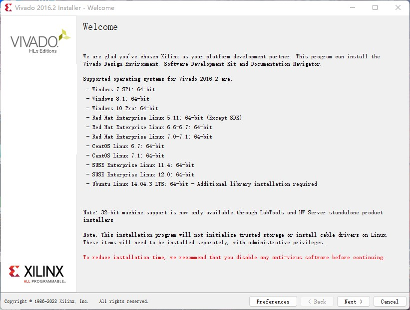
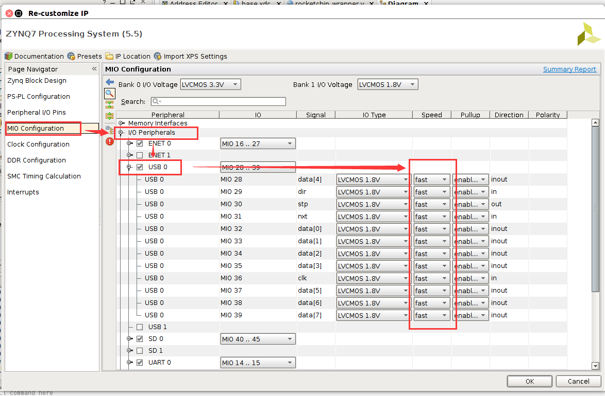

## 第七章. RISCV处理器在PYNQ上的部署和接口实验

### 目录

- [7.1 系统能力培养部分实验环境安装](#environments)  
  
  - [7.1.1 Vivado开发环境](#subsec_vivadoenvironments)
  - [7.1.2 fpga-pynq工程源码获取](#subsec_src)
  - [7.1.3 工程编译环境配置](#subsec_projectenv)
  - [7.1.4 蓝牙小车硬件组装](#subsec_hardware)
  - [7.1.5 操作系统的替换修改](#subsec_system)

- [7.2 fpga实验1：在Rocket Chip上添加uart接口](#hardware_lab1)
  
  - [实验目的](#lab1_target)
  - [实验内容](#lab1_content)
  - [实验结果](#lab1_result)

- [7.3 fpga实验2：以中断方式实现uart通信](#hardware_lab2)
  
  - [实验目的](#lab2_target)
  - [实验内容](#lab2_content)
  - [实验结果](#lab2_result)

- [7.4 fpga实验3：配置连接到PS端的USB设备](#hardware_lab3)
  
  - [实验目的](#lab3_target)
  - [实验内容](#lab3_content)
  - [实验结果](#lab3_result)

在本章中，我们将结合fpga-pynq开发板，在PYNQ上部署RISCV处理器。并带领读者对rocket chip进行一些修改，逐步为其添加uart外设支持和中断支持，并搭载PKE内核，运行小车控制程序，实现一个可以通过蓝牙控制的智能小车。读者在完成7.1节中的实验环境搭建后，便可进行7.2节、7.3节和7.4节中的相关实验。

**需要特别注意的是，本章中的三个fpga实验并不是独立设计的，而是与第八章中的实验5_1、5_2和5_3依次对应。每一个fpga实验为对应的软件实现提供硬件支持。因此，读者应该按照如下顺序来完成第七章和第八章的实验：在完成“7.2 fpga实验1”后，前往第八章，完成对应的PKE软件实验——“8.2 lab4_1_POLL”；在完成"7.3 fpga实验2"后，前往第八章，完成对应的PKE软件实验——“8.3 lab4_2_PLIC”；在完成"7.4 fpga实验3"后，前往第八章，完成对应的PKE软件实验——“8.4 lab4_3_hostdevice”。** 

<a name="environments"></a>

## 7.1 系统能力培养部分实验环境安装

<a name="subsec_vivadoenvironments"></a>

### 7.1.1 Vivado开发环境

Vivado设计套件，是FPGA厂商赛灵思公司2012年发布的集成设计环境。本实验需要使用Vivado对FPGA电路进行修改。**Vivado设计套件在Windows平台与Linux平台都可安装使用，且安装与使用过程基本相同，请根据所用平台跳转到相应章节进行Vivado环境安装：**

* [Windows平台](#subsec_vivadoenvironments_windows)
* [Linux平台（Ubuntu桌面环境）](#subsec_vivadoenvironments_linux)

<a name="subsec_vivadoenvironments_windows"></a>

#### 场景一：Windows平台

1. 下载安装程序。建议安装2016.2版本的Vivado，进入[下载页面](https://china.xilinx.com/support/download/index.html/content/xilinx/zh/downloadNav/vivado-design-tools/archive.html)下拉找到2016.2版本，下载**Windows Web Installer**，在弹出的Xilinx账号登录页面注册账号并登录后下载会自动开始。
   
   

2. 启动安装程序。**注意：安装过程需要保证网络畅通。以及30G以上的磁盘剩余空间**。
   
   双击所下载的安装包，直接运行即可。如下图窗口弹出时，点击Continue。
   
   

3. 进入欢迎页面，点击next。
   
   

4. 输入Xilinx账号密码，并选中Download and Install Now后，点击next。下载Vivado安装包时注册的账号可以在此处使用，若无账号则可以点击上方“please create one”进行注册。
   
   

5. 勾选同意用户协议后，点击next。
   
   

6. 勾选Vivado HL System Edition后，点击next。
   
   

7. 根据需要勾选安装项，点击next。
   
   

8. 选择安装位置。点击左上角的安装位置选择器右侧三点，弹出目录选择窗口，读者应在此处选择恰当的安装位置，Vivado程序将会被安装在所选目录下。
   
   **这里选择安装目录时，需要注意以下两点**：
   
   * 当前用户需要有安装目录的写入权限。
   
   * 所选安装位置剩余空间必须足够（读者可以查看左下角的Disk Space Required栏，此处会显示安装所需空间，以及磁盘剩余空间）。
   
   当这两个条件不满足时，页面中会有红字提醒（如下图所示），读者应留意查看：
   
   
   
   根据提示更换适当的安装目录（下图是选择安装目录适当时的显示）：
   
   
   
   确认无误后点击next，继续下一步安装。

9. 检查安装信息无误后，点击install。
   
   

10. 等待下载安装完成（**耗时较长，务必保证下载时网络畅通**）。
    
    
    
    安装过程中弹出相关组件的安装窗口时，按照弹窗提示点击安装（根据所选组件不同，确认安装弹窗中的软件名称可能有变，一律点击安装即可）。
    
    

11. 添加Vivado证书。读者应自行申请Vivado证书后导入。
    
    

12. 出现如下的MATLAB选择窗口时，直接点击右上角叉号关闭即可，本实验中不会用到相关功能。
    
    

13. 安装完成并导入证书后，会弹出如下窗口，表明安装成功。点击确认后安装过程结束。
    
    

<a name="subsec_vivadoenvironments_linux"></a>

#### 场景二：Linux平台（Ubuntu桌面环境）

> **注意：本方案只在具有图形界面支持的Linux桌面环境中适用（Ubuntu桌面环境或虚拟机等）。若读者在前文中选择在WSL中安装相关实验环境，则强烈建议直接参考前文的[方案一](#subsec_vivadoenvironments_windows)，在Windows系统中安装Windows版本的Vivado，不要按照本方案进行安装。**

1. 下载安装程序。建议安装2016.2版本的Vivado，进入[下载页面](https://china.xilinx.com/support/download/index.html/content/xilinx/zh/downloadNav/vivado-design-tools/archive.html)下拉找到2016.2版本，下载**Linux Web Installer**，在弹出的Xilinx账号登录页面注册账号并登录后下载会自动开始。
   
   

2. 启动安装程序。**注意：安装过程需要保证网络畅通。以及30G以上的磁盘剩余空间**。
   
   首先打开命令行，运行如下命令切换到安装包所在目录：
   
   ```bash
   $ cd [your.vivado.download.path]
   ```
   
   以上命令中，[your.vivado.download.path]指的是Vivado安装包的所在目录。接下来要为安装包添加可执行权    限，继续在命令行中执行如下命令：
   
   ```bash
   $ chmod +x Xilinx_Vivado_SDK_2016.2_0605_1_Lin64.bin
   ```
   
   上述命令执行完毕后，安装程序便具有了可执行权限，可以直接启动运行。执行如下命令：
   
   ```bash
   $ ./Xilinx_Vivado_SDK_2016.2_0605_1_Lin64.bin
   ```
   
   启动安装程序。

3. 进入欢迎页面，点击next。


4. 输入Xilinx账号密码，并选中Download and Install Now后，点击next。下载Vivado安装包时注册的账号可以在此处使用，若无账号则可以点击上方“please create one”进行注册。


5. 勾选同意用户协议后，点击next。


6. 勾选Vivado HL System Edition后，点击next。


7. 根据需要勾选安装项，点击next。


8. 选择安装位置。点击左上角的安装位置选择器右侧三点，弹出目录选择窗口，读者应在此处选择恰当的安装位置，Vivado程序将会被安装在所选目录下。
   **这里选择安装目录时，需要注意以下两点**：
   
   - 当前用户需要有安装目录的写入权限。
   
   - 所选安装位置剩余空间必须足够（读者可以查看左下角的Disk Space Required栏，此处会显示安装所需空间，以及磁盘剩余空间）。
   
   当这两个条件不满足时，页面中会有红字提醒（如下图所示），读者应留意查看：
   
   
   
   根据提示更换适当的安装目录（下图是选择安装目录适当时的显示）：
   
   
   
   确认无误后点击next，继续下一步安装。

9. 检查安装信息无误后，点击install。
   
   

10. 等待下载安装完成（**耗时较长，务必保证下载时网络畅通**）。注意，若安装时长时间卡在“generating installed device list”，如下图：
    
    
    
    可以先退出安装程序，**退出时仔细阅读弹窗内容（不要删除已经下载的文件缓存，下次运行安装程序时会自动跳过下载，节约读者安装时间）**。之后打开命令行，执行：
    
    ```bash
    $ sudo apt install libncurses5
    ```
    
    上述命令会安装缺失的ncurses库。ncurses库安装完成后，需再次执行Vivado安装程序，重做1~9步。

11. 添加Vivado证书。读者应自行申请Vivado证书后导入。
    
    

12. 出现如下的MATLAB选择窗口时，直接点击右上角叉号关闭即可，本实验中不会用到相关功能。
    
    

13. 安装完成并导入证书后，会弹出如下窗口，表明安装成功。点击确认后安装过程结束。
    
    

<a name="subsec_src"></a>

### 7.1.2 fpga-pynq工程源码获取

为了方便大家快速获取源码，已将全部源码（包括子模块）打包上传到百度网盘，可以直接下载。

> 链接：[fpga-pynq](https://pan.baidu.com/s/1mTCcKG0EiFdxq4C5HTey3w) 
> 提取码：1234

下载完成后，在命令行中执行如下命令，将源码进行解压。

```bash
$ cd 你的源码下载目录
$ cat fpga-pynq.0* > fpga-pynq.tar.gz     #组装文件
$ md5sum  fpga-pynq.tar.gz > md5   #计算MD5校验码
$ cmp md5 md5sum    #比对校验码，如果此处没有任何输出，则为正确
$ tar -zxvf fpga-pynq.tar.gz    #解压文件
```

或者从github获取源码：

```bash
$ git clone https://github.com/huozf123/fpga-pynq.git
$ cd fpga-pynq
$ git submodule update --init --recursive
```

**Windows（WSL）用户注意：选择在WSL中完成实验的读者在完成上述步骤后，还需要额外注释掉Makefrag文件的第108行，在WSL终端中继续输入以下命令：**

```bash
$ cd fpga-pynq
$ sed -i "108s/^/#/" common/Makefrag
```

<a name="subsec_projectenv"></a>

### 7.1.3 工程编译环境配置

**注意，该步骤中Linux（ubuntu桌面环境）与Windows（WSL环境）下的操作存在一些差异，读者应按照自己所用平台选择正确的步骤执行：**

* [Windows（WSL环境）](#subsec_projectenv_windows)
* [Linux（ubuntu桌面环境）](#subsec_projectenv_linux)

<a name="subsec_projectenv_linux"></a>

#### Linux（ubuntu桌面环境）：

1. 安装java jdk，首先检查电脑中是否已安装java，在中端输入以下命令：
   
   ```bash
   $ java -version
   ```

2. 若能显示java版本号则表明已安装java，可以跳过java的安装。否则，继续在终端执行如下命令安装java 1.8：
   
   ```bash
   $ sudo apt install openjdk-8-jre-headless
   ```

3. 添加Vivado相关的环境变量，在命令行中执行（替换掉“你的vivado安装目录”）：
   
   ```bash
   $ source 你的vivado安装目录/Vivado/2016.2/settings64.sh
   $ source 你的vivado安装目录/SDK/2016.2/settings64.sh
   ```
   
   建议直接将上述两行命令添加到~/.bashrc文件的末端，避免每次重新打开终端都需要重新执行。

4. 因为Vivado、SDK存在bug，所以需要继续在命令行中执行以下命令（替换“你的vivado安装目录”）：
   
   ```bash
   $ sudo apt-get install libgoogle-perftools-dev
   $ export SWT_GTK3=0
   $ sudo sed -i "11,15s/^/#/" 你的vivado安装目录/Vivado/2016.2/.settings64-Vivado.sh    #注释该文件第11-15行
   ```

5. 最后初始化子模块（若从网盘中下载源码，则此步无需执行），执行：
   
   ```bash
   $ cd $REPO/pynq-z2/
   $ make init-submodules
   ```

<a name="subsec_projectenv_windows"></a>

#### Windows（WSL环境）：

1. 安装java jdk，首先检查电脑中是否已安装java，在中端输入以下命令：
   
   ```bash
   $ java -version
   ```

2. 若能显示java版本号则表明已安装java，可以跳过java的安装。否则，继续在终端执行如下命令安装java 1.8：
   
   ```bash
   $ sudo apt install openjdk-8-jre-headless
   ```

3. 最后初始化子模块（若从网盘中下载源码，则此步无需执行），执行：
   
   ```bash
   $ cd $REPO/pynq-z2/
   $ make init-submodules
   ```

<a name="subsec_hardware"></a>

### 7.1.4 蓝牙小车硬件组装

#### 组装蓝牙小车需要的材料清单：

> pynq-z1开发板、sd卡、蓝牙模块、小车相关硬件（电机、电机驱动板、底盘、配套总线）、ttl转总线模块、以太网网线、7.4v电池、电池配套电源线、移动电源、usb供电线。

#### 蓝牙小车组装步骤：

1. 组装小车
   
   首先完成小车底盘组装（**若采用已预先组装并连线的小车进行实验，则在该步骤中只需将剩下的四个车轮装上后，即可进行第二步**）。先将小车两个前轮上的电机驱动板用一根总线连接（每个电机驱动板上有两个总线接口，功能完全相同，两个电机各自任选一个总线接口用导线连接即可），另外再准备一根总线，一端插入两个电机中任一个的余下总线接口，另一端从小车底盘上方引出备用。再将两个后轮也按相同方式连接，引出另一根总线。小车底盘全部组装完成后，上方应该有两根引出的总线待连接（一根连接两个前轮，另一根连接两个后轮）。如下图所示：
   
   

2. 将蓝牙模块连接到**PMODA**接口
   
   将蓝牙模块的VCC、GND、TXD和RXD管脚连接到pynq-z1的**PMODA**接口，分别对应**PMODA**上面一排从左往右第1、2、3和4个管脚。如下图所示：
   
   

3. ttl转总线模块连接
   
   将从小车底盘上引出的两根总线插入到ttl转总线模块上的两个总线接口（两个接口不必进行区分）。然后用跳线帽将该模块上的**ttl-zx**针脚进行短接，以便让模块工作在ttl转总线模式。之后取出与电池配套的电源线，接到ttl转总线模块的电源输入上（**注意查看电路板背面的正负极标志，红色导线接正极，黑色导线接负极**）。再将电源线上的电池插头与电池连接。
   
   取三根公对母杜邦线（下面为了叙述方便，将这三根杜邦线分别命名为线1、线2和线3，读者可通过杜邦线颜色进行区分），将线1、线2和线3的母头分别连接到ttl转总线模块上的**RXD、TXD与GND（注意，ttl转总线模块上有两排黄色的ttl接口，一排为公头，一排为母头，这里说的这三个接口是指下面一排的公头）**。ttl转总线模块连接好后的部分连接如下图所示：
   
   
   
   再将线1、线2和线3的公头连接到pynq-z1的**PMODB**接口，分别对应**PMODB**上面一排**从右往左第3、4、5个管脚**。
   
   
   
   注意，在连线过程中，三根杜邦线没有发生交叉，始终是按照线123或线321的顺序插入到接口中的。因此，在连接完成后读者可以通过检查线3的两端是否连接的都是GND（一端为ttl转总线上的GND，另一端为pynq-z1上的GND）来判断接线是否正确。连接完成后如下图：
   
   

4. 为pynq-z1供电
   
   首先应确保pynq-z1开发板处于从USB供电的状态，这需要读者使用跳线帽将电路板左下角印有*USB*标志的两个针脚短接。然后将USB供电线一端接入开发板左侧的micro USB接口，另一端接入移动电源（5V 1A）。如下图所示：
   
   

5. 将pynq-z1开发板、ttl转总线模块、电机电池以及开发板供电电源固定在小车底盘上

<a name="subsec_system"></a>

### 7.1.5 操作系统的替换修改

注意，下文中涉及到的指令较多，且需要在不同的地方进行输入。总的来说，**需要输入命令的地方大致有三处：本地终端、ssh会话、sftp会话**。读者在操作过程中，务必要留意文中类似于： **“在终端输入”（指本地计算机的终端）、“在ssh会话中输入”、在“sftp会话中输入”这样的提示**。另外，需要在这三处输入的命令可能无法避免的交替出现，因此建议读者各打开一个窗口，分别用来创建ssh连接与sftp连接（创建方式在下文需要用到的ssh与sftp的地方有说明，读者可以在遇到后再进行创建），并在实验完成前不要关闭，这样可以避免反复的进行ssh、sftp连接。若由于重启开发板或者其他原因导致连接断开，则按照相关创建步骤的说明重新创建连接即可。

1. 下载[PYNQ v2.6启动镜像（Boot Image）](https://xilinx-ax-dl.entitlenow.com/dl/ul/2020/10/22/R210391224/pynq_z1_v2.6.0.zip?hash=LpAIQVeSunXk7KU0smi8Ag&expires=1649065517&filename=pynq_z1_v2.6.0.zip)，然后解压得到.img镜像文件。

2. 把启动镜像写到sd卡中（**此步Linux（ubuntu桌面环境）与Windows（WSL环境）下操作不同**）
   
   #### Linux（ubuntu桌面环境）：
   
   - 将sd卡插入读卡器，连上电脑。
   
   - 打开终端，输入lsblk命令，找到刚刚插入的sd卡设备（可通过输出的设备所对应的容量判断），记下该设备的名称（通常为**sd***）。
   
   - 继续在终端中输入如下命令进行写入，将*镜像文件路径*替换为**第1）步**中解压得到的.img镜像文件所在路径，将*设备名称*替换为上一步中记录下的设备名称（**该命令具有一定风险，会清空指定设备上原有的所有文件（不可逆），输入该命令时务必仔细检查，正确的名称一般为sdb或sdc等，后面不带数字，且容量与插入的sd卡设备相同**）：
     
     ```
     sudo dd bs=4M if=镜像文件路径 of=/dev/设备名称
     ```
     
      该命令执行耗时较长，且在执行完成前不会有任何输出，请读者耐心等待。
   
   - 拔出sd卡。
   
   #### Windows（WSL环境）：
   
   - 在[这里](https://sourceforge.net/projects/win32diskimager/)下载Win32 Disk Imager软件并安装。
   
   - 将sd卡插入读卡器，连上电脑。
   
   - 打开Win32 Disk Imager，在**映像文件**处选择解压得到的img文件，然后在**设备**选择处选择插入的sd卡，最后点击**写入**按钮。
     
     
   
   - 拔出sd卡。

3. 将sd卡插入到pynq-z1开发板中，检查pynq-z1左上角的跳线帽是否短接了靠上面的两个针脚，这样做是为了确保pynq-z1处于从sd卡启动的状态。如下图所示：
   
   
   
   打开电源（左下方的开关），等待系统启动。系统启动耗时较长，启动完成后，开发板下方的四个蓝色led灯会在数次闪烁后保持长亮，此时表明系统已经启动完成。用网线连接电脑和开发板（开发板上的网口在左侧）。
   
   **注意：若遇到以下情况：开发板电源开关旁边的红灯闪烁或熄灭；开发板无法正常启动；开发板启动后随机发生自动重启（表现为ssh会话断开或卡死），则应该检查**：
   
   * USB电源输入是否正常
   
   * 电源开关旁的跳线帽是否连接了USB标志对应的两个针脚
   
   * 电源开关旁的跳线帽是否松动

4. 修改网卡IP地址（**此步Linux（ubuntu桌面环境）与Windows（WSL环境）下操作不同**）
   
   #### Linux（ubuntu桌面环境）：
   
   打开电脑终端，执行如下命令，需要将*有线网卡名称*替换为电脑上实际的有线网卡名称，可以通过执行*ifconfig*命令查看（通常为eth0、enp7s0等）。该命令将电脑有线网卡ip地址设置为192.168.2.13。**注意：若在所使用电脑的有线网卡中配置了自动连接的PPPOE协议等，手动指定的ip地址可能会在一段时间后就被自动覆盖导致实验失败，读者应根据自己电脑的具体情况，暂时关闭相关设置。**
   
   ```bash
   sudo ifconfig 有线网卡名称 192.168.2.13
   ```
   
   #### Windows（WSL环境）：
   
   点击左下角Windows图标，输入“控制面板”，这时会看到控制面板，点击打开控制面板。然后依次点击：网络和Internet、网络和共享中心、更改适配器设置（在窗口左侧），找到以太网，右键单击，点击“属性”，打开以太网属性设置窗口。
   
   
   
   找到*Internet协议版本4（TCP/IPv4）*，双击打开。选择“使用下面的IP地址”，并将IP地址改为192.168.2.13，子网掩码改为255.255.255.0，最后点击确定保存。
   
   

5. 下载[libfesvr.so](https://gitee.com/hustos/myriscv-fesvr/blob/modify/build/libfesvr.so)（frontend server运行需要的动态链接库）、[riscv-fesvr](https://gitee.com/hustos/myriscv-fesvr/blob/modify/build/riscv-fesvr)（frontend server）。

6. 创建一个烧写bitstream的shell脚本
   
   由于烧写bitstream的操作在之后的实验中会多次进行，读者每次在对硬件进行修改后都需要重新烧写bitstream到pynq-z1开发板中才能生效，因此可以将烧写bitstream的命令保存在一个脚本中，便于后续使用。用文本编辑器创建一个文本文件，命名为program.sh， 输入如下内容后保存：
   
   > 注意，若读者在Windows平台进行实验，**千万不要用系统自带的记事本创建此文件**！因为记事本会默认将文件保存成dos格式，会导致将脚本传输到Linux系统中执行时报错。Windows用户可以选择：
   > 
   > 1. 在WSL中创建该文件；
   > 
   > 2. 不要在Windows中创建该文件，暂时跳过这一步，当后文利用ssh协议连接到开发板后，直接在ssh会话中启动vim创建该文件；
   > 
   > 3. 若执意在Windows图形界面中创建该文件，请下载[sublime文本编辑器](http://www.sublimetext.com/)进行创建。
   
   ```bash
   #! /bin/sh
   cp rocketchip_wrapper.bit.bin /lib/firmware/
   echo 0 > /sys/class/fpga_manager/fpga0/flags
   echo rocketchip_wrapper.bit.bin > /sys/class/fpga_manager/fpga0/firmware
   ```

7. 将这三个文件通过SFTP传输到开发板的/home/xilinx目录下，需要先将[libfesvr.so所在路径]、[riscv-fesvr所在路径]与[program.sh所在路径]分别替换成前两步中libfesvr.so、riscv-fesvr与program.sh文件所在的路径。（**此步Linux（ubuntu桌面环境）与Windows（WSL环境）下操作不同**）
   
   #### Linux（ubuntu桌面环境）：
   
   创建sftp连接：
   
   ```
   sftp xilinx@192.168.2.99
   （密码输入：xilinx）
   ```
   
   在**sftp会话**中输入：
   
   ```
   put [libfesvr.so所在路径] /home/xilinx
   put [riscv-fesvr所在路径] /home/xilinx
   put [program.sh所在路径] /home/xilinx
   ```
   
   #### Windows（WSL环境）：
   
   在Windows下进行fpga实验的读者，既可以选择在WSL中执行上述Linux环境下的sftp连接命令，从而直接在WSL中完成文件的传输操作，也可以选择更加方便的带图形界面的sftp客户端程序，来完成文件的传输操作。下面介绍如何使用MobaXterm软件来完成文件传输。
   
   > 后文中的其他步骤仍然会用到sftp连接，为避免文章篇幅过长，Windows环境下图形界面的文件传输操作只会在此处介绍一次，读者在后续步骤中碰到需要使用sftp传输文件的操作时，可以参考此处的操作方式。
   
   以传输文件libfesvr.so为例，下面是具体步骤：
   
   打开MobaXterm，点击左上角的“Session”。
   
   
   
   在弹出的窗口中选择“SFTP“，然后在Remote host后填入192.168.2.99，在Username后填入xilinx，最后点击OK。
   
   
   
   输入密码xilinx后点击OK。
   
   
   
   在图中“1”处定位到libfesvr.so所在文件夹，然后在图中“2”处找到文件：libfesvr.so，将该文件用鼠标拖动到图中“3”处，等待文件传输完成即可。
   
   
   
   **以同样的方式再将riscv-fesvr文件与program.sh文件传输到pynq-z1开发板中。**

8. 用ssh远程登录192.168.2.99（开发板的ip地址），用户名密码都为xilinx。（**此步Linux（ubuntu桌面环境）与Windows（WSL环境）下操作不同**）
   
   #### Linux（ubuntu桌面环境）：
   
   在终端中输入如下命令来建立ssh连接：
   
   ```bash
   ssh xilinx@192.168.2.99
   （第一次运行时，会提示确认连接信息，输入yes后回车）
   （密码输入：xilinx）
   ```
   
   #### Windows（WSL环境）：
   
   Windows用户既可以选择在WSL中，用与上述Linux下相同的方式在终端中建立ssh连接，也可以选择用带图形界面的ssh客户端来建立ssh连接。下面介绍如何在Windows环境中使用MobaXterm软件建立ssh连接的步骤。
   
   > 后文中的其他步骤仍然会用到ssh连接，为避免文章篇幅过长，Windows环境下图形界面的ssh连接建立过程只会在此处介绍一次，读者在后续步骤中碰到需要使用ssh与pynq-z1建立连接的操作时，可以参考此处的操作方式。
   
   打开MobaXterm，点击左上角的“Session”。
   
   
   
   在弹出的窗口中选择“SSH“，然后在Remote host后填入192.168.2.99，勾选Specify username，并在其后填入xilinx，最后点击OK。
   
   
   
   输入密码xilinx后回车。

9. 在**ssh会话**中，依次执行以下命令：
   
   ```bash
   $ sudo mv libfesvr.so /usr/local/lib/ #密码输入xilinx
   $ sudo mkdir -p /lib/firmware
   $ chmod +x program.sh
   $ chmod +x riscv-fesvr
   ```

10. 修改完成，断开ssh、sftp连接。
    
    若是在图形窗口中创建的连接，则直接关闭窗口即可；若是在Linux终端或WSL中创建的连接，则输入“exit”后回车。

<a name="hardware_lab1"></a>

## 7.2 fpga实验1：在Rocket Chip上添加uart接口

<a name="lab1_target"></a>

#### 实验目的

对于前文中提到的蓝牙智能小车，在其从蓝牙设备获取用户指令，以及向电机驱动板发送电机驱动命令的过程，都需要用到uart接口与外设进行通信。因此，在本实验中，首先带领读者为Rocket Chip添加uart外设的支持。

<a name="lab1_content"></a>

#### 实验内容

**为Rocket Chip添加uart支持**

Rocket Chip相关的verilog文件主要是由Chisel自动生成的，这些verilog文件难以直接进行修改编辑。为了改变Rocket Chip的行为，正确的修改方式是对common/src/main/scala下的文件进行修改，并运行rocket chip生成器生成相关的verilog文件，再将生成的verilog文件复制到src/verilog工程目录下。其中运行rocket chip生成器以及复制文件的相关操作都已经为读者写入了make file中，并不需要手动执行，读者只需按照以下步骤修改相关配置文件，并按照说明执行编译命令即可。

为了能够在PKE中像访问普通内存一样对新增的uart外设进行访问，我们需要对Rocket Chip进行修改，为其添加MMIO的支持。然后需要在顶层verilog文件中增加MMIO接口和uart接口，其中的MMIO接口用来将Rocket Chip中的MMIO接口与block design中添加的MMIO_s_axi接口进行连接，uart接口则用来将在block design中添加的uart接口暴露出去。在完成顶层verilog文件中接口的添加后，还需修改xdc约束文件将uart接口与fpga开发板上的物理接口进行绑定，便于后续外设的连接。

**步骤一：修改工程文件**

1. 修改Rocket Chip，以增加其对MMIO（Memory-mapped I/O）的支持
   
   修改文件`$REPO/common/src/main/scala/Top.scala`。修改后的文件为[Top.scala](https://gitee.com/hustos/fpga-pynq/blob/uart-pynq/common/src/main/scala/Top.scala)，修改过的地方均有modified标识。

2. 修改工程顶层verilog文件，增加MMIO接口和uart接口的连接
   
   修改文件`$REPO/common/rocketchip_wrapper.v`。修改后的文件为[rocketchip_wrapper.v](https://gitee.com/hustos/fpga-pynq/blob/uart-pynq/common/rocketchip_wrapper.v)，修改过的地方均有modified标识。

3. 修改xdc约束文件
   
   修改文件`$REPO/pynq-z2/src/constrs/base.xdc`。为了将`$REPO/common/rocketchip_wrapper.v`中定义的uart接口与fpga开发板上的IO管脚建立链接，并定义IO管脚的电平标准，我们需要在xdc约束文件末尾加入如下四行代码映射uart接口。这四行代码将uart_out、uart_in、uart2_out和uart2_in端口依次绑定到FPGA开发板的Y16、Y17、T11和T10管脚，其中Y16与Y17管脚分别对应于：pynq-z1开发板上**PMODA**接口中**上面一排的从左往右第三、第四个接口**，这两个接口在后面会用来连接蓝牙模块的数据收发管脚，具体的安装方式在本实验末尾会进行介绍。类似的，T11和T10两个接口分别对应**PMODB**接口中**上面一排的从左往右第三、第四个接口**，用来连接电机驱动板的数据收发管脚。
   
   ```
   set_property -dict { PACKAGE_PIN Y16   IOSTANDARD LVCMOS33 }    [get_ports { uart_out }]; #IO_L7P_T1_34 Sch=ja_p[2]
   set_property -dict { PACKAGE_PIN Y17   IOSTANDARD LVCMOS33 } [get_ports { uart_in }]; #IO_L7N_T1_34 Sch=ja_n[2]
   
   set_property -dict { PACKAGE_PIN T11   IOSTANDARD LVCMOS33 } [get_ports { uart2_out }]; #IO_L1P_T0_34 Sch=jb_p[2]
   set_property -dict { PACKAGE_PIN T10   IOSTANDARD LVCMOS33 }    [get_ports { uart2_in }]; #IO_L1N_T0_34 Sch=jb_n[2]
   ```
   
   修改后的文件为[base.xdc](https://gitee.com/hustos/fpga-pynq/blob/uart-pynq/pynq-z2/src/constrs/base.xdc)。

4. 生成vivado工程
   
   **注意，该步骤中Linux（ubuntu桌面环境）与Windows（WSL环境）下的操作存在一些差异，读者应按照自己所用平台选择正确的步骤执行。**
   
   #### Linux（ubuntu桌面环境）：
   
   在命令行中执行如下命令生成并打开vivado工程：
   
   ```bash
   $ cd $REPO/pynq-z2/
   $ make project
   $ make vivado
   ```
   
   #### Windows（WSL环境）：
   
   在WSL命令行中执行如下命令：
   
   ```bash
   $ cd $REPO/pynq-z2/
   $ make project
   ```
   
   在Windows中**第一次**生成工程时还需要进行以下操作：（后续在修改Rocket Chip后重新生成时，只需要执行上述两条命令即可）
   
   按快捷键win+r打开运行窗口，输入cmd后按回车键，打开命令提示符窗口。在命令提示符窗口中执行如下命令设置vivado环境变量（替换掉“vivado安装路径”）：
   
   ```
   > [vivado安装路径]\Vivado\2016.2\settings64.bat
   ```
   
   然后切换盘符到源码所在盘，比如若源码保存在d盘，则在命令提示符窗口中输入`d:`，切换完成后继续在命令提示符窗口中输入以下命令（替换掉“源码路径”）：
   
   ```
   > cd [源码路径]\fpga-zynq\pynq-z2\
   > vivado -mode tcl -source src/tcl/pynq_rocketchip_ZynqFPGAConfig.tcl
   ```
   
   双击桌面图标打开Windows中安装好的vivado，点击Open Project，找到`[源码路径]\fpga-zynq\pynq-z2\pynq_rocketchip_ZynqFPGAConfig\pynq_rocketchip_ZynqFPGAConfig.xpr`双击打开。

**步骤二：在block design中添加uart相关的接口和IP核，并完成地址分配。**

1. 修改block design
   
   1）打开vivado工程后，在*Sourses*面板点击*rocketchip_wrapper*左边的加号，然后再双击*system_i*打开block design面板。在最左边找到*S_AXI*端口，点击选中，然后再按*ctrl+c*、*ctrl+v*，这样就复制出一个同样的端口*S_AXI1*，点击选中这个*S_AXI1*，找到左边*External Interface Properties*面板，把*Name*改为*MMIO_S_AXI*，*Clock Port*选择*ext_clk_in*；选中最左侧的*ext_clk_in*端口，找到左边*External Port Properties*面板，将Frequency（Mhz）修改为50。
   
   
   
   2）在右侧电路图面板空白处点击右键，再点击*Add IP...*，然后输入axi interconnect，然后双击出现的搜索结果把axi interconnect放入电路图中，然后双击新出现的*axi_interconnect_2*，将*Number of Master Interface*改为2，然后点击*OK*。
   
   3）在右侧电路图面板空白处点击右键，再点击*Add IP...*，然后输入axi uartlite，然后双击出现的搜索结果把axi uartlite放入电路图中，然后双击新出现的*axi_uartlite_0*，将*Baud Rate*改为115200，然后点击*OK*。*axi_uartlite_0*用来与蓝牙模块进行串口通信，其波特率需要与蓝牙模块的波特率相同，若读者使用的蓝牙模块为其他的波特率，则应该将*Baud Rate*改为蓝牙模块的实际波特率（或通过串口调试软件改变蓝牙模块的波特率）。
   
   4）重复步骤3，再添加一个axi uartlite，该IP核会被自动命名为*axi_uartlite_1*，双击*axi_uartlite_1*，同样将其*Baud Rate*改为115200，然后点击*OK*。*axi_uartlite_1*用来与电机驱动板进行串口通信，其波特率需要与电机驱动板（以串口方式进行控制）的波特率相同，在本实验用到的小车中，电机驱动板的波特率为115200。
   
   5）在右侧电路图面板空白处点击右键，再点击*Create Port...*，*Port name*为uart_in，*Direction*为Input，*Type*为Other，点击OK。
   
   6）在右侧电路图面板空白处点击右键，再点击*Create Port...*，*Port name*为uart2_in，*Direction*为Input，*Type*为Other，点击OK。
   
   7）在右侧电路图面板空白处点击右键，再点击*Create Port...*，*Port name*为uart_out，*Direction*为Output，*Type*为Other，点击OK。
   
   8）在右侧电路图面板空白处点击右键，再点击*Create Port...*，*Port name*为uart2_out，*Direction*为Output，*Type*为Other，点击OK。
   
   7）按照如图方式接好电路图(注意：uart_lite_0右侧的UART端口右边有个加号，需要点一下加号展开再进行连线)。
   
   
   
   8）点击上面的*Address Editor*，然后在未映射的单元上右键单击， 并在弹出的菜单中点击*assign address*。
   
   
   
   按照如图所示配置地址（建议先修改Range属性，再修改Offset Address属性，否则Offset Address可能修改不成功），该操作将蓝牙模块的地址映射到了0x6000_0000，将电机驱动的地址映射到了0x6000_1000。
   
   

2. 保存所有修改后的文件（也可以选择直接点击下一步中的*Generate Bitstream*，vivado会对未保存内容弹窗，提醒用户保存，读者应留意相关弹窗内容）

**步骤三：bitstream文件的生成以及打包。**

> 打包得到的rocketchip_wrapper.bit.bin文件最终是需要烧录到pynq-z1开发板中来实现相关硬件功能的。

1. 生成bitstream文件
   
   最后，点击左下角的*Generate Bitstream*生成比特流文件。（该步骤耗时较长）
   
   当弹出如下对话框时点击yes：
   
   
   
   当弹出如下对话框时表明bitstream生成完成，**点击cancel**：
   
   
   
   <a name="build_bit"></a>

2. 打包bitstream文件为bin文件
   
   **注意，该步骤中Linux（ubuntu桌面环境）与Windows（WSL环境）下的操作存在一些差异，读者应按照自己所用平台选择正确的步骤执行。**
   
   #### Linux（ubuntu桌面环境）：
   
   1）创建Full_Bitstream.bif文件
   
   该文件为纯文本文件，可以直接用记事本创建，并输入如下内容后保存：
   
   ```
   all:
   {
       rocketchip_wrapper.bit /* Bitstream file name */
   }
   ```
   
   将该文件重命名为Full_Bitstream.bif，然后将其复制到`$REPO/pynq-z2/pynq_rocketchip_ZynqFPGAConfig/pynq_rocketchip_ZynqFPGAConfig.runs/impl_1`目录下。
   
   2）生成比特流bin文件
   
   在终端执行以下命令生成bin文件：
   
   ```bash
   $ cd $REPO/pynq-z2/pynq_rocketchip_ZynqFPGAConfig/pynq_rocketchip_ZynqFPGAConfig.runs/impl_1
   $ bootgen -image Full_Bitstream.bif -arch zynq -process_bitstream bin -w on
   ```
   
   #### Windows（WSL环境）：
   
   1）创建Full_Bitstream.bif文件
   
   创建步骤与上文Linux桌面环境下基本相同，读者根据自己的习惯在WSL或者Windows图形界面中创建该文件皆可，创建完成后将其复制到`$REPO/pynq-z2/pynq_rocketchip_ZynqFPGAConfig/pynq_rocketchip_ZynqFPGAConfig.runs/impl_1`目录下。
   
   2）生成比特流bin文件
   
   按快捷键win+r打开运行窗口，输入cmd后按回车键，打开命令提示符窗口。在命令提示符窗口中执行如下命令设置vivado环境变量（替换掉“你的vivado安装目录”）：
   
   ```
   > 你的vivado安装路径\Vivado\2016.2\settings64.bat
   ```
   
   接着按照前文中所述方式切换盘符到源码所在盘，接着在命令提示符窗口中执行如下命令（替换掉“你的源码所在目录”）：
   
   ```
   > cd 你的源码所在目录\pynq-z2\pynq_rocketchip_ZynqFPGAConfig\pynq_rocketchip_ZynqFPGAConfig.runs\impl_1
   > bootgen -image Full_Bitstream.bif -arch zynq -process_bitstream bin -w on
   ```

3. 硬件组装
   
   按照前文7.1.4节的说明完成蓝牙小车的组装。

4. 操作系统的替换修改
   
    按照前文7.1.5节的说明完成操作系统的替换修改。
   
    <a name="write_bitstream"></a>

5. 烧写bitstream
   
    将`$REPO/pynq-z2/pynq_rocketchip_ZynqFPGAConfig/pynq_rocketchip_ZynqFPGAConfig.runs/impl_1`下的rocketchip_wrapper.bit.bin文件传输到pynq-z1开发板中后，执行烧录脚本即可，具体方法如下：
   
   1）将rocketchip_wrapper.bit.bin传输到pynq-z1中
   
    若使用sftp协议在命令行中传输，则在**sftp会话**中输入如下命令：
   
   ```bash
   put [rocketchip_wrapper.bit.bin所在路径] /home/xilinx
   ```
   
    Windows图形界面下的传输方法不再赘述。
   
   2） 在**ssh会话**中，执行以下命令：
   
   ```
   $ sudo ./program.sh  #密码输入xilinx
   ```

<a name="lab1_result"></a>

#### 实验结果

在完成本实验后，一个基础的蓝牙小车所需要的硬件环境就搭建完成了。接下来，读者应该前往第八章完成**lab4_1_POLL**实验，在完成**lab4_1_POLL**并将riscv_pke与小车控制程序发送到pynq-z1上执行后，小车便可以通过蓝牙app进行控制。

<a name="hardware_lab2"></a>

## 7.3 fpga实验2：以中断方式实现uart通信

**该实验以fpga实验1的修改为基础，读者可以先将fpga实验1中最后生成的`rocketchip_wrapper.bit.bin`文件复制到其他目录保存，然后直接在同一个项目文件夹下继续本实验**。

<a name="lab2_target"></a>

#### 实验目的

在上一个fpga实验中，读者已经为Rocket Chip添加了uart通信功能，但是目前在PKE中需要以轮询的方式实现uart通信（这一点读者在完成lab4_1时应该有所体会，程序需要不断读取蓝牙模块的状态寄存器，来判断IO设备是否准备好发送或接收数据）。本实验将会为uart添加中断机制，以中断方式实现uart通信。

<a name="lab2_content"></a>

#### 实验内容

**以中断方式实现uart通信**

要想在Rocket Chip上实现对uart外设的中断通信支持，一方面，需要通过修改Rocket Chip的结构来为Rocket Chip添加中断引脚，另一方面，需要修改block design，将uart产生的中断信号线连接到Rocket Chip的中断引脚。

**步骤一：修改Rocket Chip结构，为其添加外部中断接口**

1. 修改Rocket Chip结构，暴露外部中断接口
   
   修改`$REPO/common/src/main/scala/Top.scala`文件：
   
   第16行加入：
   
   ```
   val interrupt_in = Input(UInt(2.W)) //给rocket-chip增加一个位宽为2的输入端口
   ```
   
   第32行加入：
   
   ```
   io.interrupt_in <> target.interrupts //将rocket-chip内部的中断引脚和刚刚增加的端口连接起来
   ```
   
   注释掉第40行，该语句原本的作用是直接把中断引脚置为低电平以防止中断引脚悬空：
   
   ```
   //target.tieOffInterrupts()
   ```
   
   这是[修改好的rocket-chip顶层文件](https://gitee.com/hustos/fpga-pynq/blob/uart-interrupt-pynq/other-files/Top.scala)。

2. 修改`$REPO/common/rocketchip_wrapper.v`文件
   
   此处主要的改动是将block design引出的uart中断引脚连接到rocket chip对应端口。
   
   这是修改好的[rocketchip_wrapper.v](https://gitee.com/hustos/fpga-pynq/blob/uart-interrupt-pynq/common/rocketchip_wrapper.v)文件。

3. 重新生成vivado工程
   
   **上述文件修改完成后，需要删除之前编译工程时产生的临时文件，并重新编译vivado工程。只有执行该步操作，才能将上述修改引入到vivado工程中去。**
   
   在Linux终端（或WSL）中执行如下命令，重新生成vivado工程。在ubuntu桌面环境中，命令执行完成后会自动在vivado中打开项目，windows环境下则需要找到工程文件双击打开。
   
   ```
   $ cd $REPO/pynq-z2
   $ rm -f src/verilog/Top.ZynqFPGAConfig.v
   $ rm -f ../common/build/*
   $ make project
   $ make vivado
   ```

**步骤二：将block design中的两个axi uartlite IP核的中断信号引出**

1. 修改block design：
   
   1）打开vivado工程后，在*Sourses*面板点击*rocketchip_wrapper*左边的加号，然后再双击*system_i*打开block design面板。在右侧电路图面板空白处点击右键，再点击Add IP...，然后输入concat，然后双击出现的搜索结果把concat放入电路图中，然后双击新出现的xlconcat_0模块，将Number of Ports设置为2，In0 Width设置为1，In1 Width设置为1，然后点击OK。该concat IP核的作用是，将axi_uartlite_0与axi_uartlite_1两个模块产生的一位中断信号进行拼接，合并成一路位宽为2的中断信号，该信号会被连接到上文中为Rocket Chip添加的位宽为2的中断输入端口。
   
   2）右键点击空白处，点击create port，port名称填写interrupts，direction选择output，type选择interrupt，勾选create vector，填写from 1 to 0。
   
   3）按如图方式连线：
   
   

2. 保存所有修改后的文件（也可以选择直接点击下一步中的*Generate Bitstream*，vivado会对未保存内容弹窗，提醒用户保存，读者应留意相关弹窗内容）

**步骤三：重新进行bitstream文件的生成以及打包的工作**

1. 生成bitstream文件
   
   最后，点击左下角的*Generate Bitstream*生成比特流文件。（该步骤耗时较长）

2. 打包bitstream文件为bin文件
   
   见上文[fpga实验1 步骤三-2](#build_bit)。若读者选择在与fpga实验1相同的项目文件夹下继续完成本次实验，则Full_Bitstream.bif文件应该已经存在，那么可以跳过**fpga实验1 步骤三-2**中创建Full_Bitstream.bif文件的步骤。

3. 硬件连接
   
   本次实验的硬件连接与**fpga实验1**完全相同，读者同样需要按照7.1.4节的说明完成蓝牙小车的硬件组装。

4. 操作系统的替换修改
   
   若在进行本次实验时，pynq-z1开发板中插入的sd卡与**fpga实验1**中相同，且没有删除过**fpga实验1**中创建的相关文件，则该步骤可以直接跳过。否则，读者应参考7.1.5节中的说明重新为sd卡写入操作系统，并完成相关文件的替换和修改。

5. 烧写bitstream
   
    见上文[fpga实验1 步骤三-5](#write_bitstream)。

<a name="lab2_result"></a>

#### 实验结果

在完成本实验后，当蓝牙模块在收到蓝牙串口app发送的指令时，会产生一个外部中断，该中断能够在后续的PKE实验中被操作系统所捕获，并做出相应的反应（如唤醒一个处于阻塞状态的进程）。读者在完成本次fpga实验后，应该前往第八章完成PKE实验**lab4_2_PLIC**，该实验会通过中断的方式来通过外设向蓝牙小车发送控制指令。

<a name="hardware_lab3"></a>

## 7.4 fpga实验3：配置连接到PS端的USB设备

**该实验以fpga实验2的修改为基础，读者可以先将fpga实验2中最后生成的`rocketchip_wrapper.bit.bin`文件复制到其他目录保存，然后直接在同一个项目文件夹下开始本实验**。

<a name="lab3_target"></a>

#### 实验目的

读者在完成**fpga实验1**与**fpga实验2**，以及第七章中对应的PKE实验**lab4_1 POLL**和**lab4_2_PLIC**后，便能得到一个可以通过蓝牙串口助手进行控制的蓝牙小车。该蓝牙小车通过uart接口获取来自手机或其他蓝牙设备的控制指令，并根据收到的不同指令，选择做出前进、后退、左转和右转动之一。在这个控制过程中，接收控制信号的蓝牙模块和发出控制指令的电机驱动模块都是连接在PL端的设备（所谓PL端，即为pynq开发板上搭载的一块FPGA可编程芯片，在fpga实验中生成的比特流文件都需要烧录到PL端，使其能够支持riscv-pke的运行，在第八章会有关于PL端与PS端更详细的介绍）。连接在PL端的设备通常功能比较简单，可以由PKE直接进行访问控制。而其他一些功能更加复杂的外设，例如USB摄像头，则被连接到PS端。运行在PL端的PKE在访问PS端的USB设备时，需要通过HTIF协议来调用ARM端的系统调用函数，利用功能更加完整的PS端操作系统对其进行访问控制。

本实验的目的是对连接到PS端的USB设备进行一些配置，便于USB摄像头的连接。在对应的第八章**lab4_3_hostdevice**中，我们要为蓝牙小车连接一个USB摄像头，让小车根据摄像头拍摄的画面识别前方出现的障碍物，并做出自动避障动作。

<a name="lab3_content"></a>

#### 实验内容

**配置连接到PS端的USB设备**

zynq的PS端外设都被封装成了一个ZYNQ7 Processing System IP核，因此，修改PS端的USB外设连接需要通过配置该IP核进行。

**下面是具体的操作步骤：**

**该实验的操作步骤比较简单，只需要在vivado的图形界面中对PS端的USB外设进行一些配置后，重新生成bitstream文件即可**。

1. 修改block design：
   
   打开vivado工程后，在*Sourses*面板点击*rocketchip_wrapper*左边的加号，然后再双击*system_i*打开block design面板。双击processing_system7_0进入PS端ARM核的配置界面，如下图。
   
   
   
   
   
   点击该窗口左侧的*MIO Configuration*，之后我们可以在右侧的界面中将需要使用的PS端外设与复用IO相连，并配置MIO的电平标准。
   
   按如下图示点击，首先确保USB 0前的复选框处于勾选状态，然后将USB的12个管脚的speed属性由slow改为fast，修改完成后点击OK保存并关闭窗口。
   
   

2. 生成bitstream文件
   
   最后，点击左下角的*Generate Bitstream*生成比特流文件。（该步骤耗时较长）

3. 打包bitstream文件为bin文件
   
   见上文[fpga实验1 步骤三-2](#build_bit)。

4. 硬件连接
   
   在完成7.1.4节中硬件连接的基础之上，还需要将USB摄像头连接到pynq-z1开发板左上角的USB接口，并将USB摄像头固定在小车前方（指前进方向），固定时建议将摄像头略微向上倾斜。另外需要注意的是，为了与第八章中**lab4_3_hostdevice**的代码相匹配，这里连接的摄像头必须支持YUYV格式的画面输出。

5. 操作系统的替换修改
   
   若在进行本次实验时，pynq-z1开发板中插入的sd卡与**fpga实验1**中相同，且没有删除过**fpga实验1**中创建的相关文件，则该步骤可以直接跳过。否则，读者应参考7.1.5节中的说明重新为sd卡写入操作系统并完成相关文件的替换和修改。

6. 烧写bitstream
   
   见上文[fpga实验1 步骤三-5](#write_bitstream)。

<a name="lab3_result"></a>

#### 实验结果

在完成本次实验后，USB摄像头便可以正确的连接到开发板的PS端。读者接下来应该前往第八章继续完成**lab4_3_hostdevice**，在完成**lab4_3_hostdevice**中PKE相关代码的修改后，连接到PS端的USB外设便可以被运行在PL端的PKE调用，从而在此基础上进一步为蓝牙小车增添自动避障的功能。
