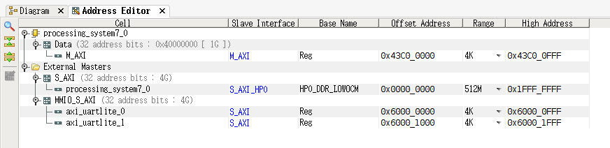

# 第八章．实验5：设备管理（基于[RISCV-on-PYNQ](https://gitee.com/hustos/fpga-pynq)）

### 目录

- [8.1 实验5的基础知识](#fundamental)  
  - [8.1.1  pynq开发板介绍](#subsec_pynq)
  - [8.1.2  内存映射I/O(MMIO)](#subsec_MMIO) 
  - [8.1.3  riscv-fesvr原理](#subsec_fesvr)
  - [8.1.4  轮询I/O控制方式](#subsec_polling)
  - [8.1.5 中断驱动I/O控制方式](#subsec_plic)  
  - [8.1.6 设备文件](#subsec_file)
- [8.2 lab5_1 POLL](#polling) 
  - [给定应用](#lab5_1_app)
  - [实验内容](#lab5_1_content)
  - [实验指导](#lab5_1_guide)
  - [答案解析](#lab5_1_ans)
- [8.3 lab5_2 PLIC](#PLIC) 
  - [给定应用](#lab5_2_app)
  - [实验内容](#lab5_2_content)
  - [实验指导](#lab5_2_guide)
  - [答案解析](#lab5_2_ans)
- [8.4 lab5_3 hostdevice](#hostdevice) 
  - [给定应用](#lab5_3_app)
  - [实验内容](#lab5_3_content)
  - [实验指导](#lab5_3_guide)
  - [答案解析](#lab5_3_ans)

<a name="fundamental"></a>

## 8.1 实验5的基础知识

完成前面所有实验后，PKE内核的整体功能已经得到完善。在实验五的设备实验中，我们将结合fpga-pynq板，在Rocket chip上增加uart模块和蓝牙模块，并搭载PKE内核，实现蓝牙通信控制智能小车，设计设备管理的相关实验。

<a name="subsec_pynq"></a>

### 8.1.1 pynq开发板介绍

本实验中，我们所使用的pynq-z1开发板上搭载两块芯片，一块为ARM架构32位芯片，称为PS端，我们能在上面运行Ubuntu操作系统；另一块为FPGA可编程芯片，称为PL端，通过烧录Rocket chip电路，使它能够运行Riscv架构的操作系统，即riscv-pke。


如上图，在开发板上运行的时候，PKE在PL端运行，一方面它可以通过Rocket Chip电路的连线访问PL端的设备（device），如蓝牙、小车电机控制器等；另一方面，在PS端运行的riscv-fesvr程序可以和PKE通过HTIF协议通信，使得PKE可以读写PS端Linux操作系统下的设备文件（host device），比如摄像头、声卡等。也就是说，PKE除了可以访问本身的设备，还可以利用PS端操作系统的功能访问更复杂的设备，这就是代理内核的特点。

实验五和前四个实验的区别如下：


可见除了部分硬件相关的操作外，PKE在Spike和开发板上的运行是完全等价的，代理内核一方面让我们可以用最简单的方法访问PL端与PS端两端的设备，另一方面在不同地方运行基本不用修改太多代码，非常优越。

<a name="subsec_MMIO"></a>

### 8.1.2 内存映射I/O(MMIO)

内存映射(Memory-Mapping I/O)是一种用于设备驱动程序和设备通信的方式，它区别于基于I/O端口控制的Port I/O方式。RICSV指令系统的CPU通常只实现一个物理地址空间，这种情况下，外设I/O端口的物理地址就被映射到CPU中单一的物理地址空间，成为内存的一部分，CPU可以像访问一个内存单元那样访问外设I/O端口，而不需要设立专门的外设I/O指令。

在MMIO中，内存和I/O设备共享同一个地址空间。MMIO是应用得最为广泛的一种IO方法，它使用相同的地址总线来处理内存和I/O设备，I/O设备的内存和寄存器被映射到与之相关联的地址。当CPU访问某个内存地址时，它可能是物理内存，也可以是某个I/O设备的内存。此时，用于访问内存的CPU指令就可以用来访问I/O设备。每个I/O设备监视CPU的地址总线，一旦CPU访问分配给它的地址，它就做出响应，将数据总线连接到需要访问的设备硬件寄存器。为了容纳I/O设备，CPU必须预留给I/O一个地址映射区域。

在本上一章节中，修改后的Rocket Chip将蓝牙控制寄存器和小车电机控制器映射到了固定的内存地址，因此可以通过对这些地址进行读写控制蓝牙和小车电机。

<a name="subsec_fesvr"></a>

### 8.1.3 riscv-fesvr原理

riscv-fesvr是PKE在PYNQ开发板上运行的重要工具，它是运行在ARM端系统上的程序，用于控制PKE的启动。除了启动功能，riscv-fesvr程序主要分为两个模块：系统调用模块负责接受PKE对ARM端的系统调用请求，在ARM端执行这些函数，并返回相应的操作结果；内存模块负责ARM端读写RISCV端的内存，和PKE交换数据。

PKE调用宿主机/开发板ARM端的系统调用函数使用的是HTIF协议。协议要求内核保留两个64位变量：tohost和fromhost，作为PKE与riscv-fesvr交换数据的地方。当PKE调用宿主机/开发板ARM端系统调用函数时，需要将系统调用函数的编号和参数按照固定格式写入tohost变量，通过该方式向宿主机/开发板ARM端系统发起系统调用。

tohost与fromhost变量的格式如下：


当通过HTIF进行系统调用时，dev与cmd固定为0，data部分是一个描述系统调用的数组指针：


例如，当通过HTIF协议调用ARM端的write函数时，需要先定义一个数组magic_mem，magic_mem[0]为write的系统调用号，magic_mem[1]为文件描述符，magic_mem[2]为缓冲区地址，magic_mem[3]为写入长度。然后将magic_mem数组的地址写入tohost变量的data部分。随后，riscv-fesvr会首先读出magic_mem里的数据，然后根据magic_mem[0]决定要调用write函数。另外需要注意magic_mem[2]里的缓冲区地址是RISCV端内存的地址，所以需要先把RISCV端内存里的这段数据读到ARM端内存，再以ARM端内存地址为参数调用write函数。

PKE在写入tohost变量发起ARM端系统调用后，需要接着对fromhost变量进行轮询。当PKE检测到fromhost变量被riscv-fesvr更新为非0值，且其dev与cmd部分都为0时，从magic_mem数组中读出系统调用返回值。

riscv-fesvr的内存模块用来读写RISCV端的内存，从而可以读取系统调用参数以及读写PKE的缓冲区。pynq开发板把RISCV端的内存抽象成设备文件/dev/mem，所以内存模块可以通过在固定偏移量读写该文件，从而实现读写RISCV端内存。

另外，控制摄像头需要用到的ioctl、mmap、munmap三个系统调用函数是原版的riscv-fesvr不支持的，所以我们对riscv-fesvr的系统调用模块进行了修改：

* ioctl系统调用的实现比较简单，可以直接用PKE传过来的参数调用ioctl系统调用。
* mmap系统调用的实现比较麻烦，因为ARM端通过mmap映射的是ARM端的内存，RISCV端无法访问。所以另外添加了readmmap系统调用，PKE可以通过HTIF调用此系统调用函数读取ARM端被映射的内存。riscv-fesvr将mmap映射的内存用数组存储映射地址，返回给PKE数组索引；读取时，PKE向readmmap传入数组索引，riscv-fesvr根据索引找到ARM端被映射地址，读取ARM端的内存数据返回给PKE。

<a name="subsec_polling"></a>

### 8.1.4  轮询I/O控制方式

在实验五中，我们设备管理的主要任务是控制设备与内存间的数据传递。具体来讲，需要将从蓝牙设备读取到的用户输入指令字符，解析为小车前进、后退、左转、右转和停止动作，并传输对应的小车控制指令给电机控制器实现对小车的控制。在前两个实验中，我们分别需要对蓝牙设备的轮询和中断访问方式进行实现。

对于轮询方式（又称程序直接控制方式），CPU需要不断对外设状态进行检查。当外设准备好CPU所需数据后，CPU会从外部设备读取一个字的数据到存储器，随后再次进行状态检查，准备从外设读取下一个字的数据，直到数据读取完毕或者程序终止。

轮询I/O控制方式流程如图：


<a name="subsec_plic"></a>

### 8.1.5  中断驱动I/O控制方式

在前一种轮询的控制方式中，由于CPU的高速性和I/O设备的低速性，导致CPU浪费绝大多数时间在等待I/O设备完成数据传输的循环测试中，会造成大量资源浪费。中断驱动的方式是，允许请求I/O的进程在设备工作时进入休眠状态，使CPU能够运行别的进程。直到设备工作完成时，再由设备发出中断，中断处理程序唤醒之前休眠的进程，使其能够接受设备返回的数据继续执行。当采用中断驱动的控制方式时，在I/O操作过程中CPU可以执行其他的进程，CPU与设备之间达到了部分并行的工作状态，从而提升了资源利用率。

RISCV包含三类中断：软中断、时钟中断和外部中断。软中断和时钟中断我们在实验一已经接触过，而设备触发的中断属于外部中断。在实验一中，我们在机器态捕获了时钟中断，然后将其转发成内核态的软中断交由中断处理程序处理。本章则直接通过设置MIDELEG寄存器，利用RISCV的中断委托机制直接将外部中断代理到内核态的中断处理程序处理，不用经过机器态的捕获。另外，RISCV架构还指定了PLIC（Priority Level Interrupt Controller）模块管理各级中断，该设备使用MMIO控制，PKE在处理中断之后通过读写指定的内存地址，来获取触发中断的设备的编号以及通知PLIC本次中断是否处理成功。

中断驱动I/O方式流程如图：


<a name="subsec_file"></a>

### 8.1.6 设备文件

用户程序访问外部设备通常有两种方式：通过特定系统调用访问和通过设备文件访问。前者即操作系统提供专门的函数控制设备，后者是操作系统把设备抽象成一个设备文件，通过通用的文件访问函数控制设备。设备文件常用的函数除了open、read、write、close，还有以下几种：

* ioctl：`int ioctl(int fd, unsigned long request, void *data);`用来设置设备参数。fd是文件描述符；request是一个常数，表示参数类型，不同的类型对应不同的常数；data通常是一个指向要设置的参数的值的指针，参数的值可以是整数，也可以是结构体等；返回值为该函数是否执行成功。如摄像头设备，我们就可以通过该函数设置摄像头的拍摄分辨率、颜色格式等；音频设备可以设置采样率、数据格式等。
* mmap：`void *mmap(void *addr, size_t length, int prot, int flags, int fd, off_t offset);`该函数原本的作用是将虚拟地址和文件进行映射，使得读写文件可以像读写内存一样方便，同时也能节省物理内存；但对于有些不支持read/write读写的设备，就必须使用mmap函数将虚拟地址和设备文件映射，才能读写设备的数据。addr参数表示映射的起始虚拟地址，通常传递NULL表示由操作系统指定；length，prot、flags分别表示映射地址空间的长度、访问权限和其他参数；fd为文件描述符；offset为文件偏移量，返回值为映射的起始虚拟地址。

在本章的第三个实验中，我们将使用PKE通过HTIF协议和PS端的riscv-fesvr进行通信，以读写PS端的摄像头设备文件，进而控制摄像头设备。另外，由于我们已经在实验四中为PKE实现了虚拟文件系统，因此在本章第三个实验中，我们会先将PS端的设备文件挂载到虚拟文件系统中，然后通过虚拟文件系统对摄像头外设进行访问控制。相应的，文件系统也需要添加上述几个设备文件访问函数的实现。

<a name="polling"></a>

## 8.2 lab5_1 poll

<a name="lab5_1_app"></a>

#### **给定应用**

- user/app_polling.c

```c
  1 /*
  2  * Below is the given application for lab5_1.
  3  * The goal of this app is to control the car via Bluetooth. 
  4  */
  5 
  6 #include "user_lib.h"
  7 #include "util/types.h"
  8 
  9 int main(void) {
 10   printu("please input the instruction through bluetooth!\n");
 11   while(1)
 12   {
 13     char temp = (char)uartgetchar();
 14     if(temp == 'q')
 15       break;
 16     car_control(temp);
 17   }
 18   exit(0);
 19   return 0;
 20 }
```

应用通过轮询的方式从蓝牙端获取指令，实现对小车的控制功能。

* （先提交lab4_3的答案，然后）切换到lab5_1，继承lab4_3中所做的修改，并make：

```bash
//切换到lab5_1
$ git checkout lab5_1_poll

//继承lab4_3以及之前的答案
$ git merge lab4_3_hardlink -m "continue to work on lab5_1"

//重新构造
$ make clean; make
```

由于本实验给出的基础代码修改了硬件相关的部分代码，所以无法在Spike上运行，需在PYNQ开发板上进行验证。读者在进行本实验之前，应该已经按照第七章中的说明完成了fpga实验1，并将rocketchip_wrapper.bit.bin文件烧录到了开发板中。

make完成后，需要将obj目录下编译生成的可执行文件传输到开发板中，然后在开发板上运行程序。具体的做法如下：

1. 首先，将make命令编译生成的两个可执行文件：obj/app_polling文件与obj/riscv-pke文件通过sftp协议传输到开发板的/home/xilinx目录下。至于如何向开发板中传送文件，在第七章中已有详细的介绍，读者可以参考之前的描述。

2. 通过ssh协议连接到开发板（连接方法在第七章中同样有详细说明），并在ssh客户端中输入如下命令执行app_polling：
   
   ```bash
   $ sudo ./program.sh # 若重启过开发板，则在执行程序前要先执行此脚本进行烧录
   $ sudo ./riscv-fesvr riscv-pke app_polling
   In m_start, hartid:0
   (Emulated) memory size: 256 MB
   Enter supervisor mode...
   PKE kernel start 0x0000000080000000, PKE kernel end: 0x0000000080011000, PKE kernel size: 0x0000000000011000 .
   free physical memory address: [0x0000000080011000, 0x00000000800fffff] 
   kernel memory manager is initializing ...
   KERN_BASE 0x0000000080000000
   physical address of _etext is: 0x0000000080009000
   kernel page table is on 
   RAMDISK0: base address of RAMDISK0 is: 0x0000000080072000
   RFS: format RAMDISK0 done!
   Switch to user mode...
   in alloc_proc. user frame 0x0000000080066000, user stack 0x000000007ffff000, user kstack 0x0000000080065000 
   FS: created a file management struct for a process.
   in alloc_proc. build proc_file_management successfully.
   User application is loading.
   Application: app_polling
   CODE_SEGMENT added at mapped info offset:4
   DATA_SEGMENT added at mapped info offset:5
   Application program entry point (virtual address): 0x00000000000100b0
   going to insert process 0 to ready queue.
   going to schedule process 0 to run.
   please input the instruction through bluetooth!
   You have to implement sys_user_uart_getchar to get data from UART using uartgetchar in lab5_1 and modify it in lab5_2.
   
   System is shutting down with exit code -1.
   ```

从直接编译运行结果上来看，蓝牙端端口获取用户输入指令的uartgetchar系统调用未完善，所以无法进行控制小车的后续操作。按照提示，我们需要实现蓝牙uart端口的获取和打印字符系统调用，以及传送驱动数据给小车电机的系统调用，实现对小车的控制。

<a name="lab4_1_content"></a>

#### **实验内容**

如输出提示所表示的那样，需要找到并完成对uart_getchar的调用，重新编译生成app_polling与riscv-pke文件，并将这两个文件传输到开发板中，在ssh会话中执行以下命令，得到预期结果：

```bash
$ sudo ./program.sh # 若重启过开发板，则在执行程序前要先执行此脚本进行烧录
$ sudo ./riscv-fesvr riscv-pke app_polling
In m_start, hartid:0
(Emulated) memory size: 256 MB
Enter supervisor mode...
PKE kernel start 0x0000000080000000, PKE kernel end: 0x0000000080011000, PKE kernel size: 0x0000000000011000 .
free physical memory address: [0x0000000080011000, 0x00000000800fffff] 
kernel memory manager is initializing ...
KERN_BASE 0x0000000080000000
physical address of _etext is: 0x0000000080009000
kernel page table is on 
RAMDISK0: base address of RAMDISK0 is: 0x0000000080072000
RFS: format RAMDISK0 done!
Switch to user mode...
in alloc_proc. user frame 0x0000000080066000, user stack 0x000000007ffff000, user kstack 0x0000000080065000 
FS: created a file management struct for a process.
in alloc_proc. build proc_file_management successfully.
User application is loading.
Application: app_polling
CODE_SEGMENT added at mapped info offset:4
DATA_SEGMENT added at mapped info offset:5
Application program entry point (virtual address): 0x00000000000100b0
going to insert process 0 to ready queue.
going to schedule process 0 to run.
please input the instruction through bluetooth!
```

当程序正确执行时，会在显示“please input the instruction through bluetooth!”后等待用户从蓝牙设备发送控制指令。保持程序运行，并按照下面的步骤通过蓝牙向小车发送指令：

1. 在手机端下载任意一种蓝牙串口通信APP（提供一个在安卓12上测试无误的软件下载：[蓝牙串口](https://www.coolapk.com/apk/com.orion.bluetoothserialtool)，下面的步骤都以此APP为例进行说明，其他蓝牙串口通信APP的使用方法与之类似）。

2. 打开手机蓝牙开关。

3. 点击蓝牙串口通信APP下方的蓝牙设备按钮，找到蓝牙模块，其名称通常是“BT04-A”，点击进行配对。若提示输入PIN码，则输入“1234”。

4. 点击蓝牙串口通信APP下方的收发数据按钮，进入收发数据界面。在下方的对话框中即可输入控制指令，具体命令如下：
   
   **注意，若软硬件都正确无误，在发送下方指令后小车会立即开始运动。请务必确保小车的运动在实验人员的控制之内！若小车上有连接用于调试的网线等设备，建议暂时使小车的四个车轮处于悬空状态。当功能全部测试无误后，可以在保持程序运行的情况下直接拔掉网线，并将小车放置在地面上移动**。

| 命令  | 效果                           |
|:---:|:----------------------------:|
| 1   | 小车前进                         |
| 2   | 小车后退                         |
| 3   | 小车左转                         |
| 4   | 小车右转                         |
| 0   | 小车停止                         |
| q   | 程序停止（在ssh会话中输入ctrl+c也可以停止程序） |

<a name="lab5_1_guide"></a>

#### **实验指导**

基于实验lab1_1，你已经了解和掌握操作系统中系统调用机制的实现原理。对于本实验的应用，我们发现user/app_poll.c文件中有三个函数调用：uart_getchar，uart_putchar和uart2_putchar。UART是一种控制设备的端口协议，但在本实验中它可以通过MMIO进行控制。对代码进行跟踪，我们发现这三个函数都在user/user_lib.c中进行了实现，对应于lab1_1的流程，我们可以在kernel/syscall.h中查看新增的系统调用以及编号：

```c
34 #define SYS_user_uart_putchar (SYS_user_base + 30)
35 #define SYS_user_uart_getchar (SYS_user_base + 31)
36 #define SYS_user_uart2_putchar (SYS_user_base + 32)
```

继续追踪，我们发现在kernel/syscall.c的do_syscall函数中新增了对应系统调用编号的实现函数，对于新增系统调用，分别有如下函数进行处理：

```c
297     case SYS_user_uart_putchar:
298       sys_user_uart_putchar(a1);return 1;
299     case SYS_user_uart_getchar:
300       return sys_user_uart_getchar();
301     case SYS_user_uart2_putchar:
302         sys_user_uart2_putchar(a1);return 1;
```

读者的任务即为在kernel/syscall.c中追踪并完善sys_user_uart_getchar。对于uart相关的函数，我们给出uart端口的地址映射如图：



图中的axi_uartlite_0对应于蓝牙设备的uart端口，aix_uartlite_1则对应于小车电机驱动板的uart端口。其中蓝牙设备的uart端口的偏移地址为0x60000000，对应写地址为0x60000004，读地址为0x60000000，同时对0x60000008的状态位进行轮询，检测到信号时进行读写操作。

在kernel/syscall.c中找到函数实现空缺，并根据注释完成sys_user_uart_getchar系统调用（由于lab5_2需要对lab5_1完成的代码进行修改，所以这里一并给出了lab5_2的提示）：

```c
227 ssize_t sys_user_uart_getchar() {
228   // TODO (lab5_1 and lab5_2): implment the syscall of sys_user_uart_getchar and modify it in lab5_2.
229   // hint (lab5_1): the functionality of sys_user_uart_getchar is to get data from UART address.
230   // therefore, we should let a pointer point, insert it in 
231   // the rear of ready queue, and finally, schedule a READY process to run.
232   // hint (lab5_2): the functionality of sys_user_uart_getchar is let process sleep
233   // and register a callback function to handle system call return value.
234   // therefore, we should call do_sleep to let process 0 sleep. 
235   // Note that the do_sleep function will never return, and the function passed to do_sleep
236   // will be called in do_wake.
237   panic( "You have to implement sys_user_uart_getchar to get data from UART using uartgetchar in lab5_1 and modify it in lab5_2.\n" );
238 }
```

**注意：编写自己的代码时千万不要修改或删去lab5_2的提示（即232行到236行），防止后面实验的合并错误！**

**实验完毕后，记得提交修改（命令行中-m后的字符串可自行确定），以便在后续实验中继承lab5_1中所做的工作**：

```
$ git commit -a -m "my work on lab5_1 is done."
```

<a name="lab4_1_ans"></a>

#### 答案解析

将kernel/syscall.c文件中的

```c
panic( "You have to implement sys_user_uart_getchar to get data from UART using uartgetchar in lab5_1 and modify it in lab5_2.\n" );
```

替换成：

```c
volatile uint32 *status = (void*)(uintptr_t)0x60000008;
volatile uint32 *rx = (void*)(uintptr_t)0x60000000;
while (!(*status & 0x00000001));
return *rx;
```

替换原因：

地址0x60000008被映射到axi uartlite IP核的状态寄存器，而该状态寄存器的最低位被用来描述接收数据FIFO的状态，该位为1时表明接收数据FIFO有数据到达。因此，在从蓝牙设备读取数据的过程中，需要通过轮询的方式不断检查状态寄存器最低位的值，直到其值为1（表明有数据到达）时停止检测，并读取接收数据FIFO中的值进行返回（接收数据FIFO寄存器的地址被映射为0x60000000）。

<a name="PLIC"></a>

## 7.3 lab5_2 PLIC

<a name="lab5_2_app"></a>

#### **给定应用**

- user/app_PLIC.c

```c
  1  /*
  2  * Below is the given application for lab5_2.
  3  * The goal of this app is to control the car via Bluetooth. 
  4  */
  5 
  6 #include "user_lib.h"
  7 #include "util/types.h"
  8 void delay(unsigned int time){
  9   unsigned int a = 0xfffff ,b = time;
 10   volatile unsigned int i,j;
 11   for(i = 0; i < a; ++i){
 12     for(j = 0; j < b; ++j){
 13       ;
 14     }
 15   }
 16 }
 17 int main(void) {
 18   printu("Hello world!\n");
 19   int i;
 20   int pid = fork();
 21   if(pid == 0)
 22   {
 23     while (1)
 24     {
 25       delay(3);
 26       printu("waiting for you!\n");
 27     }
 28 
 29   }
 30   else
 31   {
 32     while(1)
 33     {
 34       char temp = (char)uartgetchar();
 35       if(temp == 'q')
 36         break;
 37       car_control(temp);
 38     }
 39   }
 40 
 41 
 42   exit(0);
 43 
 44   return 0;
 45 }
```

应用通过中断的方式从蓝牙端获取指令，实现对小车的控制功能。在等待蓝牙的进程休眠的时候，会执行delay进程，可以看到waiting for you提示信息。

* （先提交lab5_1的答案，然后）切换到lab5_2，继承lab5_1中所做的修改，并make：

```bash
//切换到lab5_2
$ git checkout lab5_2_PLIC

//继承lab5_1以及之前的答案
$ git merge lab5_1_poll -m "continue to work on lab5_2"

//重新构造
$ make clean; make
```

编译完成后同样需要将obj/riscv-pke与obj/app_PLIC文件传输到开发板中，然后再通过ssh协议连接到开发板，在ssh会话中执行以下命令烧录并运行程序：

```bash
$ sudo ./program.sh # 若重启过开发板，则在执行程序前要先执行此脚本进行烧录
$ sudo ./riscv-fesvr riscv-pke app_PLIC
```

直接编译执行结果和完成后的lab5_1一致，一直阻塞在这里等待蓝牙数据。需要修改lab5_1所写的代码并添加中断处理，使得等待蓝牙的进程能够自动休眠，执行delay进程，直到发生外部中断后才继续执行。

<a name="lab5_2_content"></a>

#### **实验内容**

如输出提示所表示的那样，需要修改lab5_1所写的代码并添加中断处理。完成后按lab5_1的方法执行，程序在等待蓝牙的时候会不断输出waiting for you提示信息，在手机上输入控制指令后，小车应能根据指令反应。

<a name="lab5_2_guide"></a>

#### **实验指导**

在kernel/syscall.c中找到lab5_1写的代码，并根据注释进行修改：

```c
227 ssize_t sys_user_uart_getchar() {
228   // TODO (lab5_1 and lab5_2): implment the syscall of sys_user_uart_getchar and modify it in lab5_2.
229   // hint (lab5_1): the functionality of sys_user_uart_getchar is to get data from UART address.
230   // therefore, we should let a pointer point, insert it in 
231   // the rear of ready queue, and finally, schedule a READY process to run.
232   // hint (lab5_2): the functionality of sys_user_uart_getchar is let process sleep
233   // and register a callback function to handle system call return value.
234   // therefore, we should call do_sleep to let process 0 sleep. 
235   // Note that the do_sleep function will never return, and the function passed to do_sleep
236   // will be called in do_wake.
237   panic( "You have to implement sys_user_uart_getchar to get data from UART using uartgetchar in lab5_1 and modify it in lab5_2.\n" );
238 }
```

当应用程序调用uartgetchar获取蓝牙输入指令时，会首先让当前进程阻塞，并等待蓝牙数据到达。你需要在上述sys_user_uart_getchar函数中实现对当前进程的阻塞。为了完成该工作，本实验中添加了一个`do_sleep`函数（`kernel/process.c`）：

```c
312 void do_sleep(void wake_cb(void*), void* wake_cb_arg){
313   current->status = BLOCKED;
314   set_wake_callback(current->pid, wake_cb, wake_cb_arg);
315   schedule();
316 }
```

`do_sleep`除了将当前进程阻塞外，还将一个调用者提供的回调函数`wake_cb`以及它对应的参数`wake_cb_arg`注册到了当前进程中。

相应的，本实验中还提供了一个`do_wake`（`kernel/process.c`）函数，用来唤醒指定进程：

```c
320 void do_wake(uint64 pid){
321   procs[pid].status = READY;
322   current->status = READY;
323   insert_to_ready_queue(&procs[pid]);
324   insert_to_ready_queue( current );
325 
326   if (procs[pid].wake_callback)
327     procs[pid].wake_callback(procs[pid].wake_callback_arg);
328 
329   schedule();
330 }
```

`do_wake`除了会唤醒指定进程，还会使用wake_callback_arg参数调用在`do_sleep`中注册的`wake_callback`函数。

当蓝牙有数据发送时，PKE会收到外部中断，你需要完成接收到外部中断后的处理。

在kernel/strap.c中找到函数空缺，并根据注释完成中断处理函数：

```c
110     case CAUSE_MEXTERNEL_S_TRAP:
111       {
112         //reset the PLIC so that we can get the next external interrupt.
113         volatile int irq = *(uint32 *)0xc201004L;
114         *(uint32 *)0xc201004L = irq;
115         volatile int *ctrl_reg = (void *)(uintptr_t)0x6000000c;
116         *ctrl_reg = *ctrl_reg | (1 << 4);
117         // TODO (lab5_2): implment the case of CAUSE_MEXTERNEL_S_TRAP.
118         // hint: the case of CAUSE_MEXTERNEL_S_TRAP is to get data from UART address and wake 
119         // the process. therefore, you need to construct an update_uartvalue_ctx structure
120         // then store the interrupt processing process pid and the uart value in it
121         // and use this structure to update the wake callback context of the process
122         // finally call do_wake to wake up the process.
123         panic( "You have to implement CAUSE_MEXTERNEL_S_TRAP to get data from UART and wake the process 0 in lab5_2.\n" );
124 
125         break;
126       }
```

注意，由于在do_sleep函数中调用了schedule函数，而schedule最终会导致CPU切换到用户态继续执行用户代码，因此，**do_sleep函数不会返回，在它之后的代码也不会被运行（即使进程被唤醒）**。所以你无法通过在调用do_sleep函数的位置后编写代码来尝试处理uartgetchar系统调用的返回值。正确的做法是：通过在do_sleep中注册一个回调函数（该函数在基础代码中已经提供：位于`kernel/syscall.c`的`update_uartvalue`函数），并在获取到蓝牙设备输入后，将蓝牙输入注册为该回调函数的调用参数。该回调函数会在进程被唤醒时执行，可以在这里处理uartgetchar的返回值，然后CPU控制权会回到用户态程序。

**实验完毕后，记得提交修改（命令行中-m后的字符串可自行确定），以便在后续实验中继承lab5_2中所做的工作**：

```
$ git commit -a -m "my work on lab5_2 is done."
```

<a name="lab5_2_ans"></a>

#### 答案解析

将kernel/strap.c文件中的：

```c
panic( "You have to implement CAUSE_MEXTERNEL_S_TRAP to get data from UART and wake the process 0 in lab5_2.\n" );
```

替换为：

```c
volatile uint32 *rx = (void*)(uintptr_t)0x60000000;
uint32 data = *rx;

uint64 handle_intr_pid = 0;  // the pid of the process that will handle this interrupt
struct update_uartvalue_ctx *ctx = (struct update_uartvalue_ctx *)alloc_page();
ctx->uartvalue = (char)data;
ctx->pid = handle_intr_pid;
set_wake_callback(handle_intr_pid, NULL, ctx);  // add wake callback context

do_wake(handle_intr_pid);
```

替换原因：

此处的代码会在产生外部中断时被调用，而外部中断的产生则表明蓝牙设备接收到了数据。此时需要从接收数据FIFO中（映射地址0x60000000）将收到的数据读出，并构造一个update_uartvalue_ctx上下文结构体（该结构体在kernel/process.h文件中被定义），将从蓝牙设备接收到的数据暂存至该上下文中，同时存入的还有小车控制进程的id号（0），最后调用do_wake函数唤醒小车控制进程。在do_wake函数中会调用do_sleep中注册的进程唤醒回调函数update_uartvalue，该函数根据上下文信息处理uart_getchar系统调用的返回值：

```c
229 void update_uartvalue(void *ctx) {
230   struct update_uartvalue_ctx *uart_ctx = (struct update_uartvalue_ctx *)ctx;
231   char value = uart_ctx->uartvalue;
232   process *proc = &procs[uart_ctx->pid];
233 
234   // set system call return value
235   proc->trapframe->regs.a0 = (uint64)value;
236 }
```

再将kernel/syscall.c文件中的sys_user_uart_getchar函数内容替换为：

```c
do_sleep(update_uartvalue, NULL);
return 0;
```

替换原因：

当小车控制进程间接调用该函数获取蓝牙设备输入时，第一行代码会导致其被阻塞并让出CPU，在来自蓝牙设备的中断到达之前，小车控制进程会一直处于阻塞状态。当蓝牙设备接收到数据并产生中断时，do_wake会调用由do_sleep注册的回调函数update_uartvalue，处理系统调用返回值。最后，小车控制进程会被上文中添加的do_wake函数所唤醒。注意，位于do_sleep后面的语句永远不会被执行（包括return 0），因此我们需要通过注册回调函数的方式来正确处理uart_getchar系统调用的返回值。

<a name="hostdevice"></a>

## 7.4 lab5_3 hostdevice

<a name="lab5_3_app"></a>

#### **给定应用**

- user/app_host_device.c

```c
  1 #pragma pack(4)
  2 #define _SYS__TIMEVAL_H_
  3 struct timeval {
  4     unsigned int tv_sec;
  5     unsigned int tv_usec;
  6 };
  7 
  8 #include "user_lib.h"
  9 #include "videodev2.h"
 10 #define DARK 64
 11 #define RATIO 7 / 10
 12 
 13 int main() {
 14     char *info = allocate_share_page();
 15     int pid = do_fork();
 16     if (pid == 0) {
 17         int f = do_open("/dev/video0", O_RDWR), r;
 18 
 19         struct v4l2_format fmt;
 20         fmt.type = V4L2_BUF_TYPE_VIDEO_CAPTURE;
 21         fmt.fmt.pix.pixelformat = V4L2_PIX_FMT_YUYV;
 22         fmt.fmt.pix.width = 320;
 23         fmt.fmt.pix.height = 180;
 24         fmt.fmt.pix.field = V4L2_FIELD_NONE;
 25         r = do_ioctl(f, VIDIOC_S_FMT, &fmt);
 26         printu("Pass format: %d\n", r);
 27 
 28         struct v4l2_requestbuffers req;
 29         req.type = V4L2_BUF_TYPE_VIDEO_CAPTURE;
 30         req.count = 1; req.memory = V4L2_MEMORY_MMAP;
 31         r = do_ioctl(f, VIDIOC_REQBUFS, &req);
 32         printu("Pass request: %d\n", r);
 33 
 34         struct v4l2_buffer buf;
 35         buf.type = V4L2_BUF_TYPE_VIDEO_CAPTURE;
 36         buf.memory = V4L2_MEMORY_MMAP; buf.index = 0;
 37         r = do_ioctl(f, VIDIOC_QUERYBUF, &buf);
 38         printu("Pass buffer: %d\n", r);
 39 
 40         int length = buf.length;
 41         char *img = do_mmap(NULL, length, PROT_READ | PROT_WRITE, MAP_SHARED, f, buf.m.offset);
 42         unsigned int type = V4L2_BUF_TYPE_VIDEO_CAPTURE;
 43         r = do_ioctl(f, VIDIOC_STREAMON, &type);
 44         printu("Open stream: %d\n", r);
 45 
 46         char *img_data = allocate_page();
 47         for (int i = 0; i < (length + 4095) / 4096 - 1; i++)
 48             allocate_page();
 49         yield();
 50 
 51         for (;;) {
 52             if (*info == '1') {
 53                 r = do_ioctl(f, VIDIOC_QBUF, &buf);
 54                 printu("Buffer enqueue: %d\n", r);
 55                 r = do_ioctl(f, VIDIOC_DQBUF, &buf);
 56                 printu("Buffer dequeue: %d\n", r);
 57                 r = read_mmap(img_data, img, length);
 58                 int num = 0;
 59                 for (int i = 0; i < length; i += 2)
 60                     if (img_data[i] < DARK) num++;
 61                 printu("Dark num: %d > %d\n", num, length / 2 * RATIO);
 62                 if (num > length / 2 * RATIO) {
 63                     *info = '0'; car_control('0');
 64                 }
 65             } else if (*info == 'q') break;
 66         }
 67 
 68         for (char *i = img_data; i - img_data < length; i += 4096)
 69             free_page(i);
 70         r = do_ioctl(f, VIDIOC_STREAMOFF, &type);
 71         printu("Close stream: %d\n", r);
 72         do_munmap(img, length); do_close(f); exit(0);
 73     } else {
 74         yield();
 75         while(1)
 76         {
 77             char temp = (char)uartgetchar();
 78             *info = temp;
 79             if(temp == 'q')
 80                 break;
 81             car_control(temp);
 82         }
 83     }
 84     return 0;
 85 }
```

该用户程序包含两个进程，其中主进程和实验5_2类似，负责接收蓝牙发送过来的数据，根据数据控制小车行动（前进、后退、左转、右转、停止）；子进程则负责拍摄和分析，首先初始化摄像头设备，然后是个死循环判断摄像头拍摄的图像数据：如果当前小车处于前进状态，则拍摄，然后检查数据，如果判断前面有障碍物则控制车轮停转（刹车），否则如果主进程退出了，则自己进行释放文件、内存、关闭设备等操作，再退出。在用户程序操控摄像头的过程中，使用了ioctl、mmap、munmap等系统调用，你需完善其中的ioctl系统调用，对其进行完善从而实现小车的障碍识别和停止功能。 

* （先提交lab5_2的答案，然后）切换到lab5_3，继承lab5_2中所做的修改，并make：

```bash
//切换到lab5_3
$ git checkout lab5_3_hostdevice

//继承lab5_2以及之前的答案
$ git merge lab5_2_PLIC -m "continue to work on lab5_3"

//重新构造
$ make clean; make
```

编译完成后同样需要将obj/riscv-pke与obj/app_host_device文件传输到开发板中，然后再通过ssh协议连接到开发板，在ssh会话中执行以下命令烧录并运行程序：

```bash
$ sudo ./program.sh # 若重启过开发板，则在执行程序前要先执行此脚本进行烧录
$ sudo ./riscv-fesvr riscv-pke app_host_device
```

<a name="lab4_3_content"></a>

#### 实验内容

如应用提示所表示的那样，读者需要找到并完成对ioctl的调用，使得用户能够设置设备参数，从而控制摄像头实现拍照等功能；获取图片后，检查数据，从而判断前方是否出现障碍物。

在之前的文件系统实验中，我们已经为PKE实现了虚拟文件系统，并为host端的文件设计了一个hostfs，从而为PKE提供通过虚拟文件系统直接访问host端文件的能力。同样的，在本次实验中，摄像头在ARM端系统中也是作为设备文件进行管理的，它对应`/dev`目录下的`/dev/hostfs`文件。通过直接操作该设备文件的方式便可以通过文件系统接口来控制摄像头设备。

为了在PKE中操作摄像头设备，本实验修改了PKE文件系统的默认挂载方式：首先，仍然将ARM端的hostfs_root目录作为虚拟文件系统根目录进行挂载；其次，将ARM端的`/dev`目录挂载到PKE的`/dev`目录，这样便可以像访问本地设备一样访问ARM端设备文件；另外，本实验并不涉及到RFS。与上述变更相关的代码可以在`kernel/proc_file.c`中的`fs_init`函数内找到：

```c
21 void fs_init(void) {
22   // initialize the vfs
23   vfs_init();
24 
25   // register hostfs-file and mount it as the root
26   if( register_hostfs() < 0 ) panic( "fs_init: cannot register hostfs.\n" );
27   struct device *hostdev = init_host_device("HOSTDEV", "./hostfs_root");
28   vfs_mount("HOSTDEV", MOUNT_AS_ROOT);
29 
30   // register hostfs-dev and mount it as /dev
31   struct device *hostdev_dev = init_host_device("dev", "/dev");
32   vfs_mount("dev", MOUNT_DEFAULT);
33 
34   // register and mount rfs
35   if( register_rfs() < 0 ) panic( "fs_init: cannot register rfs.\n" );
36   struct device *ramdisk0 = init_rfs_device("RAMDISK0");
37   rfs_format_dev(ramdisk0);
38   vfs_mount("RAMDISK0", MOUNT_DEFAULT);
39 }
```

另外，为了让hostfs支持对给定的不同路径（`hostfs_root`、`/dev`）实例化出多个hostfs设备，并挂载到不同的虚拟文件系统目录（`/`、`/dev`），基础代码对hostfs也进行了一些改造。这部分相关代码可以在`kernel/hostfs.c`中找到，读者可以自行阅读，这里不再赘述。

为了通过ioctl操作设备文件，基础代码中还为VFS添加了文件ioctl操作的相关支持。读者在完成文件系统相关实验后，应该对文件系统相关函数的实验方式有了一定的了解，与对文件的read/write等操作的实现方式一样，ioctl同样是作为vinode的一个操作函数实现的。对ioctl实现的跟踪方式也与之前在文件系统中对文件操作函数的跟踪方式类似，通过对相关调用的跟踪，在`kernel/hostfs.c`里可以看到需要补充的函数：

```c
215 int hostfs_ioctl(struct vinode *f_inode, uint64 request, char *data) {
216   spike_file_t *pf = (spike_file_t *)f_inode->i_fs_info;
217   if (pf < 0) {
218     sprint("hostfs_write: invalid file handle!\n");
219     return -1;
220   }
221   panic( "You need to call host's ioctl by frontend_syscall in lab5_3.\n" );
222 }
```

实验预期结果：小车在前进过程中能够正常识别障碍物后并自动停车。测试时别忘记把摄像头接到USB接口，否则系统会找不到设备文件。

<a name="lab5_3_guide"></a>

#### 实验指导

##### 摄像头控制

USB摄像头最基础的控制方法是使用读写设备文件的方式。拍摄一张照片包含以下过程：

* 打开设备文件，使用open函数
* 设置设备参数，使用ioctl函数，包括设置摄像头的图像分辨率和格式、读取方式、缓冲数量和索引等
* 映射内存，由于USB摄像头对应的设备文件不支持直接用read函数进行读写，所以需要用mmap函数将文件映射到一段虚拟地址，通过虚拟地址进行读写
* 拍摄，使用ioctl函数控制，设置缓冲区的入队和出队为一个拍摄过程
* 结束和清理，包含使用ioctl函数关闭设备，使用munmap函数解映射，使用close函数关闭设备文件

##### 图片解析

在本实验的用户程序中，我们实现了一个非常简单的障碍物判断算法：计算灰度小于64的像素点个数，如果个数大于像素点总数的7/10，即认为前方是障碍物。

应用第21行可以看到，我们从摄像头获取的数据是YUYV格式，读者可进行查阅，它用灰度、蓝色色度、红色色度三个属性表示颜色，每个像素点都有灰度属性。由于我们分析障碍物只需要灰度图，所以取每个像素点的灰度属性即可。因此对于获取过来的数据删去奇数索引的数据，就可以得到灰度图。

注意：对于灰度阈值的设定可根据环境亮度进行一定的调整，可以先根据摄像头返回的图像进行分析，计算出对应障碍物的灰度值；灰度阈值越精确，小车对于障碍物的识别将越灵敏，并能在合理的距离内识别到障碍物并停车。

**虽然如此，但该算法仍不是非常精确。所以，这里给出的障碍物判断算法仅供参考，我们鼓励大家编写更高级的算法，实现更强大的功能。**

**实验完毕后，记得提交修改（命令行中-m后的字符串可自行确定），以便在后续实验中继承lab4_3中所做的工作**：

```
$ git commit -a -m "my work on lab5_3 is done."
```

<a name="lab5_3_ans"></a>

#### 答案解析

将`kernel/hostfs.c`文件中的：

```c
panic( "You need to call host's ioctl by frontend_syscall in lab5_3.\n" );
```

替换成：

```c
return frontend_syscall(HTIFSYS_ioctl, pf->kfd, request, (uint64)data, 0, 0, 0, 0);
```

替换原因：

frontend_syscall函数在spike_interface/spike_utils.c中定义，该函数会将其所有参数通过HTIF协议传给riscv-fesvr在PS端进行系统调用。注意fd参数是PKE内部的文件描述符，不是该文件在PS端操作系统里对应的文件描述符，所以需要先将fd通过spike_file_get转成spike_file_t对象，然后获取该对象的kfd属性，这个属性存储的值才是该文件在PS端操作系统里对应的文件描述符。
