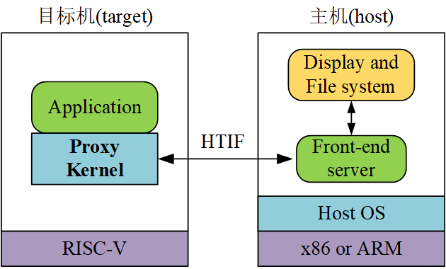

## 前言

本书的写作以及配套实验代码的设计目标，是给出一套在RISC-V平台上的一组由给定应用驱动的操作系统内核开发（操作系统部分）实验，以及和操作系统相关联的软硬协同设计（系统能力培养部分）实验。通过完成本书所给出的操作系统部分系列实验，读者能够建立与《操作系统原理》课程中所学习到的概念相对应的工程上的认识。进而，通过完成本书所给出的系统能力培养部分系列实验，读者能够从工程角度，对现代计算机的硬件（涉及《计算机组成原理》和《接口技术》等课程）和底层软件（涉及《操作系统原理》课程）所构成的整体系统建立起较为完整的认识。

RISC-V是一套新兴的开放指令集系统，采用RISC-V指令集设计的处理器由于没有指令集版权的羁绊，正在成为处理器设计者的开发首选。我们的实验将围绕64位RISC-V机器（支持RV64G指令集）展开，在操作系统实验部分，读者将在一组给定应用的驱动下，开发基于代理内核（PKE，见[riscv-pke](https://gitee.com/hustos/riscv-pke)）思想的操作系统内核；在系统能力培养实验部分，我们在FPGA开发板（PYNQ Z1）上实际部署一个RISC-V处理器软核，通过一组实验将处理器软核与外设（PL端的马达、蓝牙）进行互联，继而扩展操作系统部分开发的代理内核，通过一组实验使其能够控制连接到FPGA开发板上的设备（包括PL端的马达、蓝牙，以及PS端的设备如摄像头），并在Arduino小车上最终让所有软、硬件代码都“跑”起来！做完后的效果可以参考这个[视频](https://www.bilibili.com/video/BV1aL4y1A7RS/?vd_source=a17fc28107fa1bd622ace79a17bd6e54)。

代理内核（Proxy Kernel）是操作系统内核的一种，但区别于传统的宏内核（Monolithic kernel）和微内核（Microkernel），它的实质是和主机“伴生”的操作系统，其在计算机系统中的地位和逻辑结构如下图所示：

通过上图可以看到，代理内核仅运行在目标机（target）上，支撑目标机上应用（Application）的执行。为了完成一些跟硬件相关的功能（如显示、读取主机上的数据等），代理内核可以通过HTIF（Host-Target InterFace）接口与主机上运行的前端服务器（Front-end server）进行通讯，由后者完成所需的硬件功能。这样，**代理内核的设计就可以无需自己去实现显示、访问数据这些与具体设备相关的琐碎的功能**。同时，**代理内核的设计目标从来都不是一个完整的操作系统，而是只需要支撑所给定的应用的执行就好**！这意味着随着应用的不同，代理内核的设计可以简单也可以复杂。

总结起来，代理内核具有以下特点：

- **代码的极简化**

  **代理内核能够通过HTIF接口与主机通讯来完成简单I/O操作、以及对文件数据的访问，能够（至少在内核初始阶段）实现与设备的无关性**。这一点能够有效避免采用传统操作系统内核设计作为《操作系统原理》辅助实验的场景中，学生因为一上来就迷失在设备初始化、复杂文件系统等（这些往往需要另外的指导手册）内容中出不来，最后不得不放弃的情况。

- **系统规模随应用变化**

  **代理内核的设计，往往只需要满足给定应用的执行，所以它自身的规模与复杂度是跟应用的要求紧密联系的**。当应用相对简单时，代理内核的设计只需要很少量的代码就能够完成。例如，为了在第一个实验中支持“Hello world!”应用程序的执行，我们的PKE实验代码（[riscv-pke](https://gitee.com/hustos/riscv-pke)）只需要500行代码；即使做到支持多任务应用这种复杂场景，我们的PKE实验代码也只需要1000行代码！

- **概念和功能上的完整性**

  **代理内核在实现代码规模的极简化的同时，并未牺牲作为一个操作系统在概念和功能上的完整性**。这是因为虽然它的设计将I/O交给了HTIF和与主机进行的通讯，代理内核仍然必须考虑对处理器、内存这些计算机“核心资产”的管理。同时，在系统能力培养实验阶段，代理内核还将管理连接到目标机（target）的定制化的设备的管理。所以，代理内核的设计极大地保留了操作系统的完整性。

- **实用性**

  **代理内核实际上是用于验证所开发的处理器的重要手段**。例如，某公司开发了一款采用RISC-V指令集的处理器，为了验证该处理器是否满足它所面向的应用场景，就可以采用FPGA开发板（如我们采用的PYNQ-Z1），将所开发的处理器以软核的形式部署在开发板的PL端，以类似于本书中系统能力培养实验的方法在所开发的处理器（软核）上部署代理内核和应用，以检验系统整体的完整性。

本书所设计的实验分为两大部分，分别用于满足《操作系统原理》课程和《系统能力培养》课程的教学需要。其中，第一部分包含了PKE的前三组实验，分别涵盖了中断、内存管理，以及进程调度等《操作系统原理》课程的核心内容。第二部分采用软硬协同设计的办法构建《系统能力培养》课程实验：硬件部分指导读者在FPGA开发板上部署RISC-V处理器核，并完成的三个基础硬件实验（UART支持、中断支持和蓝牙小车集成）；软件部分则包含与硬件部分配合的第四组PKE实验（涵盖设备管理和文件访问）。无论是操作系统部分还是系统能力培养部分，每组PKE实验又包含了3个基础实验与一些挑战实验，基础实验实现操作系统的基础功能，挑战实验部分在基础实验的基础上扩展系统的功能，使得系统能够处理更复杂的问题。

从工程设计的角度来看，本书所设计的课程实验内容具有以下特点：

- **循序渐进、突出阶段性重点**

  采用代理内核的概念设计的**操作系统实验就能够做到将重点放在处理器、内存这些核心资产的管理上**，同时，在**其扩展阶段（系统能力培养实验）将重点转移到I/O设备上**，从而培养学生对作为整体的计算机系统的认识。

- **教学性和实用性并存**

  本书中代理内核的设计，**面向的运行环境为采用精简指令集RISC-V的64位机器（支持RV64G）**。通过操作系统和系统能力培养部分实际系统的设计，读者能够在64位（今天广为采用且将来不大可能过时）的基础上，了解RISC-V指令集以及采用该指令集的计算机设计相关的知识。同时，由于代理内核本身有其实际工程意义，读者能够在实验的基础上，自己“发明”更有趣的计算机系统并对其进行验证。

- **基础和挑战并存**

  **在PKE的每组实验中，我们将设计基础实验和挑战实验两个部分**。读者在完成基础试验后，可以选择自己感兴趣的挑战实验进一步加深对所学知识的理解。同时，也可以**发挥自己的想象力**，“发明”新的挑战实验，以获得更大的满足感（和更高的成绩）。

完成操作系统部分的实验，读者需要具备以下知识：C语言（熟练掌握）、汇编语言（了解基础知识）、操作系统原理（了解基础知识）、计算机系统结构（了解基础知识）、Linux的使用（了解）；完成系统能力培养部分的实验，读者还需要具备以下知识：Verilog程序设计语言（熟练掌握）、FPGA开发（了解基础知识）、计算机接口技术（了解基础知识）。

